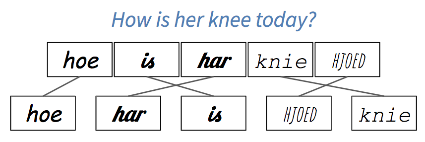

We have been talking about mental models as if they were real things,
but what actually goes on in a learner's brain when they're learning?
The short answer is that we don't know;
the longer answer is that we know a lot more than we used to.
This chapter will dig a little deeper into what brains do while they're learning
and how we can leverage that to design and deliver lessons more effectively.

## What's Going On In There? {#architecture-brain}

<figure id="f:arch-model">
  
  <figcaption>Cognitive architecture</figcaption>
</figure>

<a figure="f:arch-model"/> is a simplified model of human <span i="cognitive architecture">cognitive architecture</span>.
The core of this model is
the separation between short-term and long-term memory discussed in <a section="memory-seven-plus-or-minus"/>.
<span i="long-term memory">Long-term memory</span> is like your basement:
it stores things more or less permanently,
but you can't access its contents directly.
Instead,
you rely on your <span i="short-term memory">short-term memory</span>,
which is the cluttered kitchen table of your mind.

When you need something,
your brain retrieves it from long-term memory and puts it in short-term memory.
Conversely,
new information that arrives in short-term memory
has to be encoded to be stored in long-term memory.
If that information isn't encoded and stored,
it's not remembered and learning hasn't taken place.

Information gets into short-term memory primarily through
your <span i="verbal channel">verbal channel</span> (for speech)
and <span i="visual channel">visual channel</span>
(for images)<sup>A more complete model would also include
  your senses of touch, smell, and taste,
  but we'll ignore those for now.</sup>.
Most people rely primarily on their visual channel,
but when images and words complement each other,
the brain does a better job of remembering them both:
they are encoded together,
so recall of one later on helps trigger recall of the other.

Linguistic and visual input are processed by different parts of the human brain,
and linguistic and visual memories are stored separately as well.
This means that correlating linguistic and visual streams of information takes cognitive effort:
when someone reads something while hearing it spoken aloud,
their brain can't help but check that it's getting the same information on both channels.

Learning is therefore increased when information is presented simultaneously in two different channels,
but is reduced when that information is redundant rather than complementary,
a phenomenon called the <span g="g:split-attention-effect">split-attention effect</span> <cite>Maye2003</cite>.
For example,
people generally find it harder to learn from a video that has both narration and on-screen captions
than from one that has either the narration or the captions but not both,
because some of their attention has to be devoted to checking
that the narration and the captions agree with each other.
Two notable exceptions to this are people who do not yet speak the language well
and people with hearing impairments or other special needs,
both of whom may find that the value of the redundant information
outweighs the extra processing effort.

> ### Piece by Piece
>
> The split attention effect explains why
> it's more effective to draw a diagram piece by piece while teaching
> than to present the whole thing at once.
> If parts of the diagram appear at the same time as things are being said,
> the two will be correlated in the learner's memory.
> Pointing at part of the diagram later
> is then more likely to trigger recall of what was being said when that part was being drawn.

The split-attention effect does *not* mean
that learners shouldn't try to reconcile multiple incoming streams of information---after all,
this is what they have to do in the real world <cite>Atki2000</cite>.
Instead,
it means that instruction shouldn't require people to do it
while they are first mastering unit skills;
instead,
using multiple sources of information simultaneously should be treated as a separate learning task.

> ### Not All Graphics are Created Equal
>
> <cite>Sung2012</cite> presents an elegant study that distinguishes <span i="graphics!seductive">*seductive* graphics</span>
> (which are highly interesting but not directly relevant to the instructional goal),
> <span i="graphics!decorative">*decorative* graphics</span>
> (which are neutral but not directly relevant to the instructional goal),
> and <span i="graphics!instructive">*instructive* graphics</span>
> (which are directly relevant to the instructional goal).
> Learners who received any kind of graphic gave material higher satisfaction ratings
> than those who didn't get graphics,
>
> Similarly, <cite>Stam2013,Stam2014</cite> found that
> having more information can actually lower performance.
> They showed children pictures, pictures and numbers, or just numbers for two tasks.
> For some,
> having pictures or pictures and numbers outperformed having numbers only,
> but for others,
> having pictures outperformed pictures and numbers,
> which outperformed just having numbers.

## Cognitive Load {#architecture-load}

In <cite>Kirs2006</cite>, Kirschner, Sweller and Clark wrote:

> Although unguided or minimally guided instructional approaches
> are very popular and intuitively appealing…these approaches ignore
> both the structures that constitute human cognitive architecture
> and evidence from empirical studies over the past half-century
> that consistently indicate that minimally guided instruction is less effective and less efficient
> than instructional approaches that place a strong emphasis on guidance of the student learning process.
> The advantage of guidance begins to recede
> only when learners have sufficiently high prior knowledge to provide "internal" guidance.

Beneath the jargon,
the authors were claiming that having learners ask their own questions,
set their own goals,
and find their own path through a subject
is less effective than showing them how to do things step by step.
The "choose your own adventure" approach is known as <span g="g:inquiry-based-learning">inquiry-based learning</span>,
and is intuitively appealing:
after all,
who would argue *against* having learners use their own initiative
to solve real-world problems in realistic ways?
However,
asking learners to do this in a new domain overloads them
by requiring them to master a domain's factual content
and its problem-solving strategies
at the same time.

More specifically,
<span g="g:cognitive-load">cognitive load theory</span> proposed that
people have to deal with three things when they're learning:

<span g="g:intrinsic-load" i="cognitive load!intrinsic">Intrinsic load</span>
: is what people have to keep in mind in order to absorb new material.

<span g="g:germane-load" i="cognitive load!germane">Germane Load</span>
: is the (desirable) mental effort required to link new information to old,
  which is one of the things that distinguishes learning from memorization.

<span g="g:extraneous-load" i="cognitive load!extraneous">Extraneous Load</span>
: is anything that distracts from learning.

Cognitive load theory holds that
people have to divide a fixed amount of working memory between these three things.
Our goal as teachers is to maximize the memory available to handle intrinsic load,
which means reducing the germane load at each step and eliminating the extraneous load.

### Parsons Problems

One kind of exercise that can be explained in terms of cognitive load
is often used when teaching languages.
Suppose you ask someone to translate the sentence, "How is her knee today?" into Frisian.
To solve the problem,
they need to recall both vocabulary and grammar,
which is a double cognitive load.
If you ask them to put "hoe," "har," "is," "hjoed," and "knie" in the right order,
on the other hand,
you are allowing them to focus solely on learning grammar.
If you write these words in five different fonts or colors,
though,
you have increased the extraneous cognitive load,
because they will involuntarily (and possibly unconsciously) expend some effort
trying to figure out if the differences are meaningful
(<a figure="f:architecture-frisian"/>).

<figure id="f:architecture-frisian">
  
  <figcaption>Constructing a sentence</figcaption>
</figure>

The coding equivalent of this
is called a <span g="g:parsons-problem">Parsons Problem</span><sup>Named after one of its creators.</sup> <cite>Pars2006</cite>.
When teaching people to program,
you can give them the lines of code they need to solve a problem
and ask them to put them in the right order.
This allows them to concentrate on control flow and data dependencies
without being distracted by variable naming or trying to remember what functions to call.
Multiple studies have shown that Parsons Problems take less time for learners to do
but produce equivalent educational outcomes <cite>Eric2017</cite>.

### Faded Examples

Another type of exercise that can be explained in terms of cognitive load
is to give learners a series of <span g="g:faded-example" i="faded example">faded examples</span>.
The first example in a series presents a complete use of a particular problem-solving strategy.
The next problem is of the same type,
but has some gaps for the learner to fill in.
Each successive problem gives the learner less <span g="g:scaffolding">scaffolding</span>,
until they are asked to solve a complete problem from scratch.
When teaching high school algebra,
for example,
we might start with this:

<table>
<tr><td>(4x + 8)/2	</td><td> = </td><td>	5 </td></tr>
<tr><td>4x + 8		</td><td> = </td><td>	2 * 5 </td></tr>
<tr><td>4x + 8		</td><td> = </td><td>	10 </td></tr>
<tr><td>4x		</td><td> = </td><td>	10 - 8 </td></tr>
<tr><td>4x		</td><td> = </td><td>	2 </td></tr>
<tr><td>x		</td><td> = </td><td>	2 / 4 </td></tr>
<tr><td>x		</td><td> = </td><td>	1 / 2 </td></tr>
</table>

and then ask learners to solve this:

<table>
<tr><td>(3x - 1)*3	</td><td> = </td><td>	12 </td></tr>
<tr><td>3x - 1		</td><td> = </td><td>	_ / _ </td></tr>
<tr><td>3x - 1		</td><td> = </td><td>	4 </td></tr>
<tr><td>3x		</td><td> = </td><td>	_ </td></tr>
<tr><td>x		</td><td> = </td><td>	_ / 3 </td></tr>
<tr><td>x		</td><td> = </td><td>	_ </td></tr>
</table>

and this:

<table>
<tr><td>(5x + 1)*3	</td><td> = </td><td>	4 </td></tr>
<tr><td>5x + 1		</td><td> = </td><td>	_ </td></tr>
<tr><td>5x		</td><td> = </td><td>	_ </td></tr>
<tr><td>x		</td><td> = </td><td>	_ </td></tr>
</table>

and finally this:

<table>
<tr><td>(2x + 8)/4	</td><td> = </td><td>	1 </td></tr>
<tr><td> x		</td><td> = </td><td>	_ </td></tr>
</table>

A similar exercise for teaching <span i="Python">Python</span> might start by showing learners
how to find the total length of a list of words:

```text
# total_length(["red", "green", "blue"]) => 12
define total_length(list_of_words):
    total = 0
    for word in list_of_words:
        total = total + length(word)
    return total
```

and then ask them to fill in the blanks in this
(which focuses their attention on control structures):

```text
# word_lengths(["red", "green", "blue"]) => [3, 5, 4]
define word_lengths(list_of_words):
    list_of_lengths = []
    for ____ in ____:
        append(list_of_lengths, ____)
    return list_of_lengths
```

The next problem might be this
(which focuses their attention on updating the final result):

```text
# join_all(["red", "green", "blue"]) => "redgreenblue"
define join_all(list_of_words):
    joined_words = ____
    for ____ in ____:
        ____
    return joined_words
```

Learners would finally be asked to write an entire function on their own:

```text
# make_acronym(["red", "green", "blue"]) => "RGB"
define make_acronym(list_of_words):
    ____
```

Faded examples work because
they introduce the problem-solving strategy piece by piece:
at each step,
learners have one new problem to tackle,
which is less intimidating than a blank screen or a blank sheet of paper (<a section="classroom-practices"/>).
It also encourages learners to think about the similarities and differences between various approaches,
which helps create the linkages in their mental models that help retrieval.

The key to constructing a good faded example is
to think about the problem-solving strategy it is meant to teach.
For example,
the programming problems above all use the accumulator design pattern,
in which the results of processing items from a collection
are repeatedly added to a single variable in some way to create the final result.

> ### Cognitive Apprenticeship
>
> An alternative model of learning and instruction that also uses scaffolding and fading
> is <span g="g:cognitive-apprenticeship">cognitive apprenticeship</span>,
> which emphasizes the way in which a master passes on skills and insights to an apprentice.
> The master provides models of performance and outcomes,
> then coaches novices by explaining what they are doing and why <cite>Coll1991,Casp2007</cite>.
> The apprentice reflects on their own problem solving,
> e.g. by thinking aloud or critiquing their own work,
>
> This model tells us that
> teachers should present several examples when presenting a new idea
> so that learners can see what to generalize,
> and that we should vary the form of the problem to make it clear
> what are and aren't superficial features<sup>For a long time,
> I believed that the variable holding the value a function was going to return
> *had* to be called `result`
> because my teacher always used that name in examples.</sup>.
> Problems should be presented in real-world contexts,
> and we should encourage self-explanation to help learners organize and make sense of what they have just been taught
> (<a section="individual-strategies"/>).

### Labeled Subgoals

<span g="g:subgoal-labeling" i="labeled subgoals">Labeling subgoals</span> means
giving names to the steps in a step-by-step description of a problem-solving process.
<cite>Marg2016,Morr2016</cite> found that learners with labeled subgoals
solved Parsons Problems better than learners without,
and the same benefit is seen in other domains <cite>Marg2012</cite>.
Returning to the Python example used earlier,
the subgoals in finding the total length of a list of words or constructing an acronym are:

1. Create an empty value of the type to be returned.

1. Get the value to be added to the result from the loop variable.

1. Update the result with that value.

Labeling subgoals works because grouping related steps into named <span i="chunking">chunks</span>
(<a section="memory-seven-plus-or-minus"/>)
helps learners distinguish what's generic from what is specific to the problem at hand.
It also helps them build a mental model of that kind of problem
so that they can solve other problems of that kind,
and gives them a natural opportunity for self-explanation (<a section="individual-strategies"/>).

### Minimal Manuals

The purest application of cognitive load theory may be <span i="Carroll, John">John Carroll's</span>
<span g="g:minimal-manual">minimal manual</span> <cite>Carr1987,Carr2014</cite>.
Its starting point is a quote from a user:
"I want to do something, not learn how to do everything."
Carroll and colleagues redesigned training to present every idea as a single-page self-contained task:
a title describing what the page was about,
step-by-step instructions of how to do just one thing
(e.g. how to delete a blank line in a text editor),
and then several notes on how to recognize and debug common problems.
They found that rewriting training materials this way made them shorter overall,
and that people using them learned faster.
Later studies confirmed that this approach outperformed the traditional approach
regardless of prior experience with computers <cite>Lazo1993</cite>.
<cite>Carr2014</cite> summarized this work by saying:

> Our "minimalist" designs sought to leverage user initiative and prior knowledge,
> instead of controlling it through warnings and ordered steps.
> It emphasized that users typically bring much expertise and insight to this learning,
> for example,
> knowledge about the task domain,
> and that such knowledge could be a resource to instructional designers.
> Minimalism leveraged episodes of error recognition, diagnosis, and recovery,
> instead of attempting to merely forestall error.
> It framed troubleshooting and recovery as learning opportunities instead of as aberrations.

## Other Models of Learning {#architecture-theory}

<span i="cognitive load!criticism of">Critics of cognitive load theory</span> have sometimes argued that
any result can be justified after the fact by labeling things that hurt performance as extraneous load
and things that don't as intrinsic or germane.
However,
instruction based on cognitive load theory is undeniably effective.
For example,
<cite>Maso2016</cite> redesigned a database course to remove split attention and redundancy effects
and to provide worked examples and sub-goals.
The new course reduced the exam failure rate by 34%
and increased learner satisfaction.

A decade after the publication of <cite>Kirs2006</cite>,
a growing number of people believe that cognitive load theory and inquiry-based approaches are compatible
if viewed in the right way.
<cite>Kaly2015</cite> argues that cognitive load theory is basically micro-management of learning
within a broader context that considers things like motivation,
while <cite>Kirs2018</cite> extends cognitive load theory to include collaborative aspects of learning.
As with <cite>Mark2018</cite> (discussed in <a section="individual-strategies"/>),
researchers' perspectives may differ,
but the practical implementation of their theories often wind up being the same.

One of the challenges in educational research is that
what we mean by "learning" turns out to be complicated
once you look beyond the standardized Western classroom.
Two specific perspectives from <span g="g:educational-psychology">educational psychology</span> have influenced this book.
The one we have used so far is <span g="g:cognitivism">cognitivism</span>,
which focuses on things like pattern recognition, memory formation, and recall.
It is good at answering low-level questions,
but generally ignores larger issues like,
"What do we mean by `learning'?"
and, "Who gets to decide?"
The other is <span g="g:situated-learning">situated learning</span>,
which focuses on bringing people into a community
and recognizes that
teaching and learning are always rooted in who we are and who we aspire to be.
We will discuss it in more detail in <a section="community"/>.

The [Learning Theories website][learning-theories]
and <cite>Wibu2016</cite>
have good summaries of these and other perspectives.
Besides cognitivism,
those encountered most frequently include <span g="g:behaviorism">behaviorism</span>
(which treats education as stimulus/response conditioning),
<span g="g:constructivism">constructivism</span>
(which considers learning an active process during which learners construct knowledge for themselves),
and <span g="g:connectivism">connectivism</span>
(which holds that knowledge is distributed,
that learning is the process of navigating, growing, and pruning connections,
and which emphasizes the social aspects of learning made possible by the internet).
These perspectives can help us organize our thoughts,
but in practice,
we always have to try new methods in the class,
with actual learners,
in order to find out how well they balance the many forces in play.

## Exercises {#architecture-exercises}

### Create a Faded Example (pairs/30) {.exercise}

It's very common for programs to count how many things fall into different categories:
for example,
how many times different colors appear in an image,
or how many times different words appear in a paragraph of text.

1. Create a short example (no more than 10 lines of code) that shows people how to do this,
   and then create a second example that solves a similar problem in a similar way
   but has a couple of blanks for learners to fill in.
   How did you decide what to fade out?
   What would the next example in the series be?

1. Define the audience for your examples.
   For example,
   are these beginners who only know some basics programming concepts?
   Or are these learners with some experience in programming?

1. Show your example to a partner,
   but do *not* tell them what level you think it is for.
   Once they have filled in the blanks,
   ask them to guess the intended level.

If there are people among the trainees who don't program at all,
try to place them in different groups
and have them play the part of learners for those groups.
Alternatively,
choose a different problem domain and develop a faded example for it.

### Classifying Load (small groups/15) {.exercise}

1. Choose a short lesson that a member of your group has taught or taken recently.

1. Make a point-form list of the ideas, instructions, and explanations it contains.

1. Classify each as intrinsic, germane, or extraneous.
   What did you all agree on?
   Where did you disagree and why?

(The exercise "Noticing Your Blind Spot" in <a section="memory-exercises"/>
will give you an idea of how detailed your point-form list should be.)

### Create a Parsons Problem (pairs/20) {.exercise}

Write five or six lines of code that does something useful,
jumble them,
and ask your partner to put them in order.
If you are using an indentation-based language like Python,
do not indent any of the lines;
if you are using a curly-brace language like Java,
do not include any of the curly braces.
(If your group includes people who aren't programmers,
use a different problem domain,
such as making banana bread.)

### Minimal Manuals (individual/20) {.exercise}

Write a one-page guide to doing something that your learners might encounter in one of your classes,
such as centering text horizontally
or printing a number with a certain number of digits after the decimal point.
Try to list at least three or four incorrect behaviors or outcomes the learner might see
and include a one- or two-line explanation
of why each happens and how to correct it.

### Cognitive Apprenticeship (pairs/15) {.exercise}

Pick a coding problem that you can do in two or three minutes
and think aloud as you work through it
while your partner asks questions about what you're doing and why.
Do not just explain what you're doing,
but also why you're doing it,
how you know it's the right thing to do,
and what alternatives you've considered but discarded.
When you are done,
swap roles with your partner and repeat the exercise.

### Worked Examples (pairs/15) {.exercise}

Seeing worked examples helps people learn to program faster than just writing lots of code <cite>Skud2014</cite>,
and deconstructing code by tracing it or debugging it also increases learning <cite>Grif2016</cite>.
Working in pairs,
go through a 10--15 line piece of code and explain what every statement does
and why it is necessary.
How long does it take?
How many things do you feel you need to explain per line of code?

### Critiquing Graphics (individual/30) {.exercise}

<cite>Maye2009,Mill2016a</cite> presents six principles for good teaching graphics:

Signalling:
: visually highlight the most important points
  so that they stand out from less-critical material.

Spatial contiguity:
: place captions as close to the graphics as practical to offset the cost of shifting between the two.

Temporal contiguity:
: present spoken narration and graphics as close in time as practical.
  (Presenting both at once is better than presenting them one after another.)

Segmenting:
: when presenting a long sequence of material or when learners are inexperienced with the subject,
  break the presentation into short segments
  and let learners control how quickly they advance from to the next.

Pre-training:
: if learners don't know the major concepts and terminology used in your presentation,
  teach just those concepts and terms beforehand.

Modality:
: people learn better from pictures plus narration than from pictures plus text,
  unless they are non-native speakers
  or there are technical words or symbols.

Choose a video of a lesson or talk online that uses slides or other static presentations
and rate its graphics as "poor," "average," or "good" according to these six criteria.

## Review

<figure id="f:architecture-cognitive-load">
  
  <figcaption>Concepts: Cognitive load</figcaption>
</figure>
