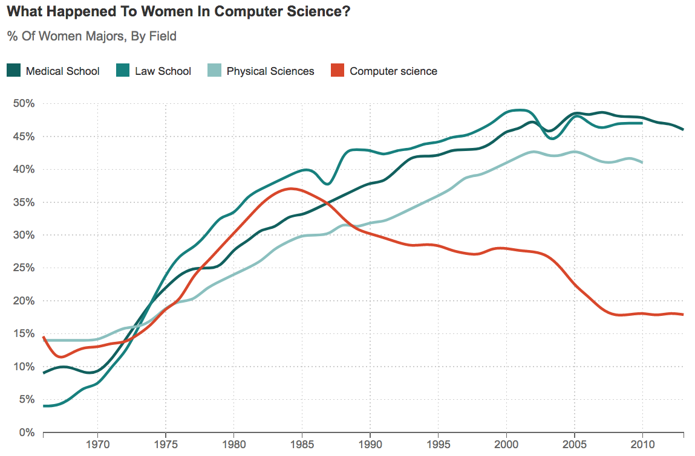

Learners need encouragement to step out into unfamiliar terrain,
so this chapter discusses ways teachers can motivate them.
More importantly,
it talks about how teachers can *demotivate* them
and how to avoid doing that.

Our starting point is the difference between
extrinsic motivation,
which we feel when we do something to avoid punishment or earn a reward,
and intrinsic motivation,
which is what we feel when we find something personally fulfilling.
Both affect most situations---for example,
people teach because they enjoy it and because they get paid---but
we learn best when we are intrinsically motivated <cite>Wlod2017</cite>.
According to [self-determination theory][self-determination],
the three drivers of intrinsic motivation are:

Competence:
: the feeling that you know what you're doing.

Autonomy:
: the feeling of being in control of your own destiny.

Relatedness:
: the feeling of being connected to others.

A well-designed lesson encourages all three.
For example,
a programming exercise can
let learners practice the tools they need to use to solve a larger problem (competence),
let them tackle the parts of that problem in whatever order they want (autonomy),
and allow them to talk to their peers (relatedness).

> ### The Problem of Grades
>
> I've never had an audience in my life. My audience is a rubric. 
> -- quoted by [Matt Tierney][tierney-matt]
>
> Grades and the way they distort learning are often used as an example of extrinsic motivation,
> but as <cite>Mill2016a</cite> observes,
> they aren't going to go away any time soon,
> so it's pointless to try to build a system that ignores them.
> Instead, <cite>Lang2013</cite> explores how courses that emphasize grades
> can incentivize learners to cheat
> and offers some tips on how to diminish this effect,
> while <cite>Covi2017</cite> looks at the larger problem of
> balancing intrinsic and extrinsic motivation in institutional education,
> and the [constructive alignment][constructive-alignment] approach
> advocated in <cite>Bigg2011</cite> seeks to bring learning activities and learning outcomes
> into line with each other.

<cite>Ambr2010</cite> contains a list of evidence-based methods to motivate learners.
None of them are surprising---it's
hard to imagine someone saying that we *shouldn't* identify and reward what we value---but
it's useful to check lessons to make sure they are doing at least a few of these things.
One strategy I particularly like is
to have learners who struggled but succeeded
come in and tell their stories to the rest of the class.
Learners are far more likely to believe stories from people like themselves <cite>Mill2016a</cite>,
and people who have been through your course
will always have advice you would never have thought of.

> ### Not Just for Learners
>
> Discussions of motivation in education often overlook the need to motivate the *teacher*.
> Learners respond to a teacher's enthusiasm,
> and teachers (particularly volunteers) need to care about a topic in order to keep teaching it.
> This is another powerful reason to co-teach (<a section="classroom-together"/>):
> just as having a running partner makes it more likely that you'll keep running,
> having a teaching partner helps get you up and going on
> those days when you have a cold
> and the projector bulb has burned out
> and nobody knows where to find a replacement
> and seriously,
> are they doing construction *again*?

Teachers can do other positive things as well.
<cite>Bark2014</cite> found three things that drove retention for all learners:
meaningful assignments,
faculty interaction with learners,
and learner collaboration on assignments.
Pace and workload relative to expectations were also significant drivers,
but primarily for male learners.
Things that *didn't* drive retention
were interactions with teaching assistants
and interactions with peers in extracurricular activities.
These results seem obvious,
but the reverse would seem obvious too:
if the study had found that extracurricular activities did drive retention,
we would also think that made sense.
Noticeably,
two of the four retention drivers (faculty interaction and learner collaboration)
take extra effort to replicate online (<a section="online"/>).

## Authentic Tasks {#motivation-authentic}

As Dylan Wiliam points out in <cite>Hend2017</cite>,
motivation doesn't always lead to achievement,
but achievement almost always leads to motivation:
learners' success motivates them far more than being told how wonderful they are.
We can use this idea in teaching
by creating a grid whose axes are "mean time to master"
and "usefulness once mastered" (<a figure="f:motivation-what"/>).

<figure id="f:motivation-what">
  
  <figcaption>What to teach</figcaption>
</figure>

Things that are quick to master and immediately useful should be taught first,
even if they aren't considered fundamental by people who are already competent practitioners,
because a few early wins will build learners' confidence in themselves and their teacher.
Conversely,
things that are hard to learn and aren't useful to your learners at their current stage of development
should be skipped entirely,
while topics along the diagonal need to be weighed against each other.

> ### Useful to Whom?
>
> If someone wants to build websites,
> foundational computer science concepts like recursion and computability
> may inhabit the lower right corner of this grid.
> That doesn't mean they aren't worth learning,
> but if our aim is to motivate people,
> they can and should be deferred.
> Conversely,
> a senior who is taking a programming class to stimulate their mind
> may prefer exploring these big ideas to doing anything practical.
> When you are making up your grid,
> you should do it with your learner personas in mind
> <a section="process-personas"/>).
> If topics wind up in very different places for different personas,
> you should think about creating different courses.

A well-studied instance of prioritizing what's useful
without sacrificing what's fundamental
is the media computation approach developed at Georgia Tech <cite>Guzd2013</cite>.
Instead of printing "hello world" or summing the first ten integers,
a learner's first program might open an image,
resize it to create a thumbnail,
and save the result.
This is an authentic task,
i.e. something that learners believe they would actually do in real life.
It also has a tangible artifact:
if the image comes out the wrong size,
learners have something in hand that can guide their debugging.
<cite>Lee2013</cite> describes an adaption of this approach from Python to MATLAB,
while others are building similar courses around data science, image processing,
and biology <cite>Dahl2018,Meys2018,Ritz2018</cite>.

There will always be tension between giving learners authentic problems
and exercising the individual skills they need to solve those problems:
after all,
programmers don't answer multiple choice questions on the job
any more than musicians play scales over and over in front of an audience.
Finding the balance is hard,
but a first step is to take out anything arbitrary or meaningless.
For example,
programming examples shouldn't use variables called `foo` and `bar`,
and if you're going to have learners sort a list,
make it a list of songs rather than strings like "aaa" and "bbb".

## Demotivation {#motivation-demotivation}

> Women aren't leaving computing because they don't know what it's like;
> they're leaving because they *do* know. 
> --- variously attributed

If you are teaching in a free-range setting,
your learners are probably volunteers,
and probably want to be in your classroom.
Motivating them is therefore less of a concern than not demotivating them.
Unfortunately,
you can easily demotivate people by accident.
For example,
<cite>Cher2009</cite> reported four studies showing that
subtle environmental clues
have a measurable difference on the interest that people of different genders have in computing:
changing objects in a Computer Science classroom from those considered stereotypical of computer science
(e.g. Star Trek posters and video games)
to objects not considered stereotypical (e.g. nature posters and phone books)
boosted female undergraduates' interest to the level of their male peers.
Similarly,
<cite>Gauc2011</cite> reports a trio of studies showing that
gendered wording commonly employed in job recruitment materials
can maintain gender inequality in traditionally male-dominated occupations.

There are three main demotivators for adult learners:

Unpredictability
: demotivates people because
  if there's no reliable connection between what they do and what outcome they achieve,
  there's no reason for them to try to do anything.

Indifference
: demotivates because
  learners who believe that the teacher or educational system doesn't care about them
  or the material won't care about it either.

Unfairness
: demotivates people who are disadvantaged for obvious reasons.
  What's surprising is that it also demotivates people who benefit from unfairness:
  consciously or unconsciously,
  they worry that
  they will some day find themselves in the disadvantaged group <cite>Wilk2011</cite>.

In extreme situations,
learners may develop learned helplessness:
when repeatedly subjected to negative feedback in a situation that they can't change,
they may learn not to even try to change the things they could.

One of the fastest and surest ways to demotivate learners is
to use language that suggests that some people are natural programmers and others aren't.
Guzdial has called this
[the biggest myth about teaching computer science][guzdial-myths],
and <cite>Pati2016</cite> backed this up by showing that
people see evidence for a "geek gene" where none exists.
They analyzed grade distributions from 778 university courses and found that only 5.8% showed signs
of being multimodal,
i.e. only one class in twenty showed signs of having two distinct populations of learners.
They then showed 53 Computer Science professors histograms of ambiguous grade distributions;
those who believed that some people are innately predisposed to be better at Computer Science
were more likely to see them as bimodal than those who didn't.

These beliefs matter because teachers act on them <cite>Brop1983</cite>.
If a teacher believes that a learner is likely to do well
they naturally (often unconsciously) focus on that learner,
who then fulfills the teacher's expectations because of the increased attention,
which in turn appears to confirm the teacher's belief.
Sadly,
there is little sign that mere evidence of the kind presented in <cite>Pati2016</cite>
is enough to break this vicious cycle…

Here are a few other specific things that will demotivate your learners:

A holier-than-thou or contemptuous attitude
: from a teacher or a fellow learner.

Telling them that their existing skills are rubbish.
: Unix users sneer at Windows,
  programmers of all kinds make jokes about Excel,
  and no matter what web application framework you already know,
  some programmer will tell you that it's out of date.
  Learners have often invested a lot of time and effort into acquiring the skills they have;
  disparaging them is a good way to guarantee that
  they won't listen to anything else you have to say.

Diving into complex or detailed technical discussion
: with the most advanced learners in the class.

Pretending that you know more than you do.
: Learners will trust you more if you are frank about the limitations of your knowledge,
  and will be more likely to ask questions and seek help.

Using the J word ("just") or feigning surprise.
: As discussed in <a section="memory"/>,
  saying things like "I can't believe you don't know X" or "you've never heard of Y?"
  signals to the learner that
  the teacher thinks their problem is trivial
  and  that they must be stupid for not being able to figure it out.

Software installation headaches.
: People's first contact with programming or with new programming tools is often demoralizing,
  and believing that something is hard to learn is a self-fulfilling prophecy.
  It isn't just the time it takes to get set up
  or the feeling that it's unfair to have to debug something that depends on
  precisely the knowledge they don't yet have.
  The real problem is that every such failure reinforces their belief that
  they would have a better chance of making next Thursday's deadline
  if they kept doing things the way they always have.

It is even easier to demotivate people online than in person,
but there are now evidence-based strategies for dealing with this.
<cite>Ford2016</cite> found that five barriers to contribution on [Stack Overflow][stack-overflow]
are seen as significantly more problematic by women than men:
lack of awareness of site features,
feeling unqualified to answer questions,
intimidating community size,
discomfort interacting with or relying on strangers,
and the feeling that searching for things online wasn't "real work."
Fear of negative feedback didn't quite make this list,
but would have been the next one added if the authors weren't quite so strict about their statistical cutoffs.
All of these factors can and should be addressed in both in-person and online settings
using methods like those in <a section="motivation-inclusivity"/>,
and doing so improves outcomes for everyone <cite>Sved2016</cite>.

> ### Productive Failure and Privilege
>
> Some recent work has explored productive failure,
> where learners are deliberately given problems that can't be solved with the knowledge they have
> and have to go out and acquire new information in order to make progress <cite>Kapu2016</cite>.
> Productive failure is superficially reminiscent of tech's "fail fast, fail often" mantra,
> but the latter is more a sign of privilege than of understanding.
> People can only afford to celebrate failure if they're sure they'll get a chance to try again;
> many of your learners,
> and many people from marginalized or underprivileged groups,
> can't be sure of that,
> and assuming that failure is an option is a great way to demotivate them.

### Impostor Syndrome

Impostor syndrome
is the belief that your achievements are lucky flukes
and an accompanying fear that someone will finally figure this out.
It is common among high achievers who undertake publicly visible work,
but disproportionately affects members of underrepresented groups:
as discussed in <a section="pck-now"/>,
<cite>Wilc2018</cite> found that
female learners with prior exposure to computing outperformed their male peers in all areas in introductory programming courses
but were consistently less confident in their abilities,
in part because society keeps signaling in subtle and not-so-subtle ways
that they don't really belong.

Traditional classrooms can fuel impostor syndrome.
Schoolwork is frequently undertaken alone or in small groups,
but the results are shared and criticized publicly.
As a result,
we rarely see how others struggle to finish their work,
which can feed the belief that everyone else finds this easy.
Members of underrepresented groups who already feel additional pressure to prove themselves
may be particularly affected.

The Ada Initiative has created some
[guidelines][impostor-syndrome]
for fighting your own impostor syndrome,
which include:

Talk about the issue with people you trust.
: When you hear from others that impostor syndrome is a common problem,
  it becomes harder to believe your feelings of being a fraud are real.

Go to an in-person impostor syndrome session.
: There's nothing like being in a room full of people you respect
  and discovering that 90% of them have impostor syndrome.

Watch your words, because they influence how you think.
: Saying things like,
  "I'm not an expert in this, but…"
  detracts from the knowledge you actually possess.

Teach others about your field.
: You will gain confidence in your own knowledge and skill
  and help others avoid some impostor syndrome shoals.

Ask questions.
: Asking questions can be intimidating if you think you should know the answer,
  but getting answers eliminates the extended agony of uncertainty and fear of failure.

Build alliances.
: Reassure and build up your friends,
  who will reassure and build you up in return.
  (If they don't, you might want to think about finding new friends…)

Own your accomplishments.
: Keep actively recording and reviewing what you have done,
  what you have built,
  and what successes you've had.

As a teacher,
you can help people with their impostor syndrome
by sharing stories of mistakes that you have made or things you struggled to learn.
This reassures the class that it's OK to find topics hard.
Being open with the group also builds trust
and gives them confidence to ask questions.
(Live coding is great for this:
as noted in <a section="performance-live"/>,
your typos show your class that you're human.)
Frequent formative assessments help as well,
particularly if learners see you adjusting what you teach or how quickly you go
based on their outcomes.

### Mindset and Stereotype Threat

Carol Dweck and others
have studied the differences of fixed mindset
and growth mindset on learning outcomes.
If people believe that competence in some area is intrinsic
(i.e. that you either "have the gene" for it or you don't),
*everyone* does worse,
including the supposedly advantaged.
The reason is that if someone doesn't do well at first,
they assume that they lack that aptitude,
which biases their future performance.
On the other hand,
if people believe that a skill is learned and can be improved,
they do better on average.

[There are concerns][growth-mindset-critique]
that growth mindset has been oversold,
or that it is much more difficult to translate research about it into practice
than its more enthusiastic advocates have implied <cite>Sisk2018</cite>.
However,
it does appear that learners with low socioeconomic status or who are academically at risk might benefit from mindset interventions.

Another widely discussed effect is stereotype threat <cite>Stee2011</cite>.
Reminding people of negative stereotypes,
even in subtle ways,
can make them anxious about the risk of confirming those stereotypes,
which in turn can reduce their performance.
Again,
there are some concerns about
[the replicability of key studies][stereotype-threat-critique],
and the issue is further clouded by the fact that the term has been used in many ways <cite>Shap2007</cite>,
but no one would argue that mentioning stereotypes in class will help learners.

## Accessibility {#motivation-accessibility}

Putting lessons and exercises out of someone's reach
is about as demotivating as it gets,
and it's very easy to do this inadvertently.
For example,
the first online programming lessons I wrote had a transcript of the narration
beside the slides,
but didn't include the actual source code:
that was in screenshots of PowerPoint slides.
Someone using a [screen reader][screen-reader]
could therefore hear what was being said about the program,
but wouldn't know what the program actually was.
It isn't always feasible to accommodate every learner's needs,
but adding description captions to images
and making navigation controls accessible to people who can't use a mouse
can make a big difference.

> ### Curb Cuts
>
> Making material accessible helps everyone,
> not just people facing challenges.
> [Curb cuts][curb-cuts]---the small sloped ramps joining a sidewalk to the street---were
> originally created to make it easier for the physically disabled to move around,
> but proved to be equally helpful to people with strollers and grocery carts.
> Similarly,
> captioning images doesn't just help the visually impaired:
> it also makes images easier for search engines to find and index.

The first and most important step in making lessons accessible is
to involve people with disabilities in decision making:
the slogan *[nihil de nobis, sine nobis][nothing-about-us-without-us]*
(literally, "nothing for us without us")
predates accessibility rights,
but is always the right place to start.
A few specific recommendations are:

Find out what you need to do.
: Each of [these posters][uk-gov-accessibility-en]
  offers do's and don'ts for people on the autistic spectrum,
  users of screen readers,
  and people with low vision,
  physical or motor disabilities,
  hearing exercises,
  and dyslexia.

Don't do everything at once.
: The enhancements described in the previous point can seem pretty daunting,
  so make one change at a time.

Do the easy things first.
: Font size,
  using a clip-on microphone so that people can hear you more easily,
  and checking your color choices are good places to start.

Know how well you're doing.
: Sites like [WebAIM][webaim] allow you to check
  how accessible your online materials are to visually impaired users.

<cite>Coom2012,Burg2015</cite> are good guides to visual design for accessibility.
Their recommendations include:

Format documents with actual headings and other landmarks
: rather than just changing font sizes and styles.

Avoid using color alone to convey meaning in text or graphics.
: Instead, use color plus different cross-hatching patterns
  (which also makes material understandable when printed in black and white).

Remove unnecessary elements
: rather than just making them invisible,
  because screen readers will still often say them aloud.

Allow self-pacing and repetition
: for people with reading or hearing issues.

Include narration of on-screen action in videos
: (and talk while you type when live coding).

### Spoons

In 2003,
Christine Miserandino started using
[spoons][spoons]
as a way to explain what it's like to live with chronic illness.
Healthy people start each day with an unlimited supply of spoons,
but people with lupus or other debilitating conditions only have a few,
and everything they do costs them one.
Getting out of bed?
That's a spoon.
Making a meal?
That's another spoon, and pretty soon, you've run out.

> You cannot simply just throw clothes on when you are sick…
> If my hands hurt that day buttons are out of the question.
> If I have bruises that day,
> I need to wear long sleeves,
> and if I have a fever I need a sweater to stay warm and so on.
> If my hair is falling out I need to spend more time to look presentable,
> and then you need to factor in another 5 minutes for feeling badly
> that it took you 2 hours to do all this.

As [Elizabeth Patitsas has argued][patitsas-essay-spoons],
people who have a lot of spoons can accumulate more,
but people whose supply is limited may struggle to get ahead.
When designing classes and exercises,
remember that some of your learners may have physical or mental obstacles that aren't obvious.
When in doubt, ask:
they almost certainly have more experience with what works and what doesn't than anyone else.

## Inclusivity {#motivation-inclusivity}

Inclusivity is a policy of
including people who might otherwise be excluded or marginalized.
In computing,
it means making a positive effort to be more welcoming to women,
underrepresented racial or ethnic groups,
people with various sexual orientations,
the elderly,
those facing physical challenges,
the formerly incarcerated,
the economically disadvantaged,
and everyone else who doesn't fit Silicon Valley's affluent white/Asian male demographic.
<a figure="f:motivation-women-in-cs"/> (from [NPR][npr])
graphically illustrates the effects of computing's exclusionary culture on women.

<figure id="f:motivation-women-in-cs">
  
  <figcaption>Female computer science majors in the US</figcaption>
</figure>

<cite>Lee2017</cite> is a brief, practical guide to doing that with references to the research literature.
The practices it describes help learners who belong to one or more marginalized or excluded groups,
but help motivate everyone else as well.
They are phrased in terms of term-long courses,
but many can be applied in workshops and other free-range settings:

Ask learners to email you before the workshop
: to explain how they believe the training could help them achieve their goals.

Review your notes
: to make sure they are free from gendered pronouns, include culturally diverse names, etc.

Emphasize that what matters is the rate at which they are learning,
: not the advantages or disadvantages they had when they started.

Encourage pair programming,
: but demonstrate it first so that learners understand the roles of driver and navigator.

Actively mitigate behavior that some learners may find intimidating,
: e.g. use of jargon or "questions" that are actually asked to display knowledge.

One way to support learners from marginalized groups is
to have people sign up for workshops in groups rather than individually.
That way,
everyone in the room knows in advance that they will be with people they trust,
which increases the chances of them actually coming.
It also helps after the workshop:
if people come with their friends or colleagues,
they can work together to use what they've learned.

More fundamentally,
lesson authors need to take everyone's entire situation into account.
For example,
<cite>DiSa2014a</cite> found that 65% of male African-American participants in a game testing program went on to study computing,
in part because the gaming aspect of the program was something their peers respected.
<cite>Lach2018</cite> explored two general strategies for creating inclusive content
and the risks associated with them:

{Community representation}
: highlights learners' social identities, histories, and community networks
  using after-school mentors or role models from learners' neighborhoods,
  or activities that use community narratives and histories
  as a foundation for a computing project.
  The major risk with this approach is shallowness,
  e.g. using computers to build slideshows rather than do any real computing.

{Computational integration}
: incorporates ideas from the learner's community,
  such as reproducing indigenous graphic designs in a visual programming environment.
  The major risk here is cultural appropriation,
  e.g. using practices without acknowledging origins.

If in doubt,
ask your learners and members of the community what they think you ought to do.
We return to this in <a section="community"/>.

> ### Conduct as Accessibility
>
> We said in <a section="classroom-coc"/> that classes should enforce a Code of Conduct like the one in <a section="conduct"/>.
> This is a form of accessibility:
> while closed captions make video accessible to people with hearing disabilities,
> a Code of Conduct makes lessons accessible to people who would otherwise be marginalized.

### Moving Past the Deficit Model

Depending on whose numbers you trust,
only 12--18% of people getting computer science degrees are women,
which is less than half the percentage seen in the mid-1980s
(<a figure="f:motivation-gender"/>, from <cite>Robe2017</cite>).
And western countries are the odd ones for having such low percentage of women in computing:
women are still often 30--40% of computer science students elsewhere <cite>Galp2002,Varm2015</cite>.

<figure id="f:motivation-gender">
  
  <figcaption>Degrees awarded and female enrollment</figcaption>
</figure>

Since it's unlikely that women have changed drastically in the last 30 years,
we have to look for structural causes to understand what's gone wrong and how to fix it.
One explanation is the way that home computers were marketed as "boys' toys" starting in the 1980s <cite>Marg2003</cite>;
another is the way that computer science departments responded to explosive growth in enrollment
in the 1980s and again in the 2000s
by changing admission requirements <cite>Robe2017</cite>.
None of these factors may seem dramatic to people who aren't affected by them,
but they act like the steady drip of water on a stone:
over time, they erode motivation, and with it, participation.

The first and most important step toward fixing this is
to stop thinking in terms of a "leaky pipeline" <cite>Mill2015</cite>.
More generally,
we need to move past a deficit model,
i.e. to stop thinking that the members of underrepresented groups lack something
and are therefore responsible for not getting ahead.
Believing that puts the burden on people who already have to do extra work to overcome structural inequities
and (not coincidentally) gives those who benefit from the current arrangements
an excuse not to look at themselves too closely.

> ### Rewriting History
>
> <cite>Abba2012</cite> describes the careers and accomplishments of
> the women who shaped the early history of computing,
> but have all too often been written out of it;
> <cite>Ensm2003,Ensm2012</cite> describes how programming was turned from a female into a male profession in the 1960s,
> while <cite>Hick2018</cite> looks at how Britain lost its early dominance in computing
> by systematically discriminating against its most qualified workers:
> women.
> (See <cite>Milt2018</cite> for a review of all three books.)
> Discussing this history makes some men in computing very uncomfortable;
> in my opinion,
> that's a good reason to do it.

Misogyny in video games,
the use of "cultural fit" in hiring to excuse conscious or unconscious bias,
a culture of silence around harassment,
and the growing inequality in society that produces preparatory privilege (<a section="classroom-mixed"/>)
are not any one person's fault,
but fixing them is everyone's responsibility.
As a teacher,
you have more power than most;
[this workshop][frameshift-workshop]
has excellent practical advice on how to be a good ally,
and its advice is probably more important than anything this book teaches you about teaching.

## Exercises {#motivation-exercises}

### Authentic Tasks (pairs/15) {.exercise}

1. In pairs,
   list half a dozen things you did this week that use the skills you teach.

1. Place your items on a 2x2 grid of "time to master" and "usefulness".
   Where do you agree and disagree?

### Core Needs (whole class/10) {.exercise}

Paloma Medina identifies [six core needs][biceps] for people at work:
belonging,
improvement (i.e. making progress),
choice,
equality,
predictability,
and significance.
After reading her description of these,
order them from most to least significant for you personally,
then compare rankings with your peers.
How do you think your rankings compare with those of your learners?

### Implement One Strategy for Inclusivity (individual/5) {.exercise}

Pick one activity or change in practice from <cite>Lee2017</cite> that you would like to work on.
Put a reminder in your calendar three months in the future
to ask yourself whether you have done something about it.

### After the Fact (think-pair-share/20) {.exercise}

1. Think back to a course that you took in the past
   and identify one thing the teacher did that demotivated you.
   Make notes about what could have been done afterward to correct the situation.

1. Pair up with your neighbor and compare stories,
   then add your comments to a set of notes shared by the whole class.

1. Review the comments in the shared notes as a group.
   Highlight and discuss a few of the things that could have been done differently.

1. Do you think that doing this will help you handle situations like these in the future?

### Walk the Route (whole class/15) {.exercise}

Find the nearest public transportation drop-off point to your building
and walk from there to your office and then to the nearest washroom,
making notes about things you think would be difficult for someone with mobility issues.
Now borrow a wheelchair and repeat the journey.
How complete was your list of exercises?
And did you notice that the first sentence in this exercise assumed you could actually walk?

### Who Decides? (whole class/15) {.exercise}

In <cite>Litt2004</cite>,
Kenneth Wesson wrote,
"If poor inner-city children consistently outscored children from wealthy suburban homes on standardized tests,
is anyone naive enough to believe that we would still insist on using these tests as indicators of success?"
Read [this article][nytimes-undiscovered]
by Cameron Cottrill,
and then describe an example from your own experience of "objective" assessments that reinforced the status quo.

### Common Stereotypes (pairs/10) {.exercise}

Some people still say, "It's so simple that even your grandmother could use it."
In pairs,
list two or three other phrases that reinforce stereotypes about computing.

### Not Being a Jerk (individual/15) {.exercise}

[This short article][open-source-not-jerk]
by Gary Bernhardt
rewrites an unnecessarily hostile message to be less rude.
Using it as a model,
find something unpleasant on [Stack Overflow][stack-overflow] or some other public discussion forum
and rewrite it to be more inclusive.

### Saving Face (individual/10) {.exercise}

Would any of your hoped-for learners be embarrassed to admit that
they don't already know some of the things you want to teach?
If so,
how can you help them save face?

### Childhood Toys (whole class/15) {.exercise}

<cite>Cutt2017</cite> surveyed adult computer users about their childhood activities
and found that the strongest correlation between confidence and computer use
were based on reading on one's own and playing with construction toys like Lego that do not having moving parts.
Survey the class and see what other activities people engaged in,
then search for these activities online.
How strongly gendered are descriptions and advertising for them?
What effect do you think this has?

### Lesson Accessibility (pairs/30) {.exercise}

In pairs,
choose a lesson whose materials are available online
and independently rank it according to the do's and don'ts in
[these posters][uk-gov-accessibility-en].
Where did you and your partner agree?
Where did you disagree?
How well did the lesson do for each of the six categories of user?

### Tracing the Cycle (small groups/15) {.exercise}

<cite>Coco2018</cite> traces a depressingly common pattern
in which good intentions are undermined by
an organization's leadership being unwilling to actually change.
Working in groups of 4--6,
write brief texts or emails that you imagine each of the parties involved would send to the other
at each stage in this cycle.

### What's the Worst Thing That Could Happen? (small groups/5) {.exercise}

Over the years,
I have had a projector catch fire,
a student go into labor,
and a fight break out in class.
I've fallen off stage twice,
fallen asleep in one of my own lectures,
and had many jokes fall flat.
In small groups,
make up a list of the worst things that have happened to you while you were teaching,
then share with the class.
Keep the list to remind yourself later that no matter how bad class was,
at least none of *that* happened.

## Review

<figure>
  
  <figcaption>Concepts: Motivation</figcaption>
</figure>
