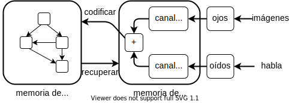
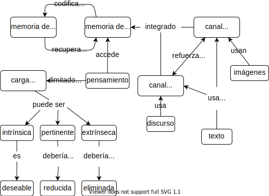

<div class="reviewers" markdown="1">

Traductora: [Patricia Loto][loto-patricia].<br/>
Revisoras: [María Dermit][dermit-maria] y [Natalia Morandeira][morandeira-natalia].

</div>

Hemos hablado acerca de modelos mentales como si fueran cosas reales,
pero ¿qué es lo que realmente sucede en el cerebro de una persona cuando está aprendiendo?
La respuesta corta es que no lo sabemos, la respuesta larga es que sabemos mucho más que antes.
Este capítulo profundizará en qué hace el cerebro mientras el aprendizaje sucede
y en cómo podemos aprovecharlo para diseñar y brindar lecciones de manera más efectiva.

## ¿Qué es lo que sucede allí? {#architecture-brain}

<figure id="f:arch-model">
  
  <figcaption>Arquitectura cognitiva</figcaption>
</figure>

La <a figure="f:arch-model"/> es un modelo simplificado de la <span i="arquitectura cognitiva">arquitectura cognitiva</span> humana. 
El núcleo de este modelo es la separación entre la memoria a corto y a largo plazo vistas en la <a section="memory-seven-plus-or-minus"/>.
La <span i="memoria a largo plazo">memoria a largo plazo</span> es como tu sótano:
almacena objetos de forma más o menos permanente
pero tu conciencia no puede acceder a ella directamente.
En cambio,
confías en tu <span i="memoria a corto plazo">memoria a corto plazo</span>,
que es como el escritorio de tu mente.

Cuando necesitas algo,
tu cerebro lo rescata de la memoria a largo plazo
y lo coloca en la memoria a corto plazo.
Por el contrario, la nueva información que llega a la memoria a corto plazo
debe codificarse para poder ser almacenada en la memoria a largo plazo.
Si esa información no está codificada y almacenada, no se recuerda y esto significa que
no se ha aprendido.

La información ingresa a la memoria a corto plazo principalmente
a través de tu <span i="canal verbal">canal verbal</span> (para el habla)
y del <span i="canal visual">canal visual</span>
(para las imágenes)<sup>
  Un modelo más completo
  también incluiría el sentido del tacto, del olfato y del gusto,
  pero por ahora los ignoraremos.</sup>.
Si bien la mayoría de las personas confía principalmente en su canal visual,
cuando las imágenes y las palabras se complementan entre sí
el cerebro hace un mejor trabajo al recordarlas:
se codifican juntas,
de modo que el recuerdo de una ayuda a activar el recuerdo de la otra.

Las entradas lingüísticas y visuales son procesadas por diferentes partes del cerebro humano
y a su vez los recuerdos lingüísticos y visuales son almacenados también de manera separada.
Esto significa que correlacionar flujos de información lingüísticos y visuales requiere esfuerzo cognitivo:
si alguien lee algo mientras lo escucha en voz alta,
su cerebro no puede evitar comprobar que obtiene la misma información por ambos canales.

Por lo tanto, el aprendizaje aumenta cuando la información se presenta de manera simultánea por dos canales diferentes,
pero se reduce cuando esa información es redundante, en lugar de ser complementaria:
tal fenómeno es conocido como <span g="split-attention-effect">efecto de atención dividida</span> <cite>Maye2003</cite>.
Por ejemplo, en general las personas encuentran más difícil aprender de un video que tiene narración y
capturas de pantalla que aprender de un video que únicamente tiene narración ó capturas (pero no ambos elementos),
porque en el primer caso parte de su atención ha sido utilizada para chequear que la narración
y las capturas se correspondan entre sí. Dos notables excepciones
son las personas que aún no hablan bien un idioma y las que tienen algún impedimento auditivo u
otras necesidades especiales, quienes quizás encuentren que el valor de la información redundante
supera el esfuerzo de procesamiento adicional.

> ### Fragmento a fragmento
>
> El efecto de la atención dividida explica por qué es más efectivo dibujar un diagrama
> fragmento a fragmento mientras enseñas, en lugar de presentar todo el gráfico de una sola vez.
> Si las partes de un diagrama aparecen al mismo tiempo en que los gráficos son explicados,
> el/la estudiante correlaciona ambos elementos en su memoria.
> Así que luego, al enfocarte en una parte del diagrama, es más probable que tu estudiante active la recuperación
> de lo que fue dicho cuando esa parte fue dibujada.

El efecto de la atención dividida *no* significa
que los/las estudiantes no deberían intentar conciliar múltiples flujos de información entrantes
—después de todo, esto es lo que tienen que hacer en el mundo real <cite>Atki2000</cite>—.
En cambio, significa que la instrucción no debería solicitar a las personas
que lo hagan mientras están incorporando habilidades por primera vez:
el uso de múltiples fuentes de información de manera simultánea debe tratarse como una tarea de aprendizaje separada.

> ### No todos los gráficos son equivalentes
>
> <cite>Sung2012</cite> presenta un elegante estudio que distingue los <span i="gráficos!seductores">gráficos *seductores*</span>
> (los cuales son altamente interesantes pero no son directamente relevantes al objetivo de la enseñanza),
> los <span i="gráficos!decorativos">gráficos *decorativos*</span>
> (los cuales son neutros pero no son directamente relevantes al objetivo de la enseñanza),
> y por último
> los <span i="gráficos!instructivos">gráficos *instructivos*</span>
> (los cuales sí son directamente relevantes al objetivo de la enseñanza).
> Los/las estudiantes que recibieron cualquier tipo de gráfico calificaron al material
> con un mayor puntaje, pero en verdad solo quienes recibieron gráficos instructivos
> obtuvieron mejores resultados.
>
> Del mismo modo, <cite>Stam2013,Stam2014</cite> descubrió que
> tener más información en realidad puede disminuir el rendimiento.
> Les mostraron a niños/as: imágenes, imágenes más números, o simplemente números,
> para que realicen dos tareas.
> Para algunos/as niños/as, recibir imágenes o bien imágenes más números fue mejor que recibir únicamente números;
> pero para otros/as, recibir imágenes superó a recibir imágenes más números,
> lo que superó a solo tener números.

## Carga cognitiva {#architecture-load}

En <cite>Kirs2006</cite>, Kirschner, Sweller y Clark escribieron:

> Aunque los enfoques educativos no guiados o mínimamente guiados son muy
> populares e intuitivamente atractivos…estos enfoques ignoran
> las estructuras que constituyen la arquitectura cognitiva humana así como
> la evidencia de estudios empíricos de los últimos cincuenta años. Dichas evidencias
> indican sistemáticamente que la instrucción guiada mínimamente es menos eficaz y
> menos eficiente que los enfoques educacionales con un fuerte énfasis
> en la orientación del proceso de aprendizaje del estudiante.
> La ventaja de la orientación disminuye sólo cuando los/las estudiantes
> tienen un conocimiento previo suficientemente elevado para proporcionar una orientación "interna".

Más allá de la jerga,
lo que estos autores afirmaban es que el hecho de que los/las estudiantes hagan sus propias preguntas,
establezcan sus propias metas y
encuentren su propio camino a través de un tema es menos efectivo que mostrarles
cómo hacer las cosas paso a paso. El enfoque "elige tu propia aventura" se conoce como <span g="inquiry-based-learning">aprendizaje basado en la indagación</span>
y es intuitivamente atractivo: después de todo,
¿quién se *opondría* a tener estudiantes que utilicen su propia iniciativa
para resolver problemas del mundo real de forma realista?
Sin embargo, pedir a los/las estudiantes que lo hagan en un nuevo dominio es una sobrecarga,
ya que les exige que dominen al mismo tiempo el contenido fáctico de un dominio y las estrategias de resolución de problemas.
Más específicamente,
la teoría de la <span g="cognitive-load" i="carga cognitiva!teoría">carga cognitiva</span> propone que
las personas tienen que lidiar con tres cosas cuando está aprendiendo:

<span g="intrinsic-load" i="carga cognitiva!intrínseca">Carga intrínseca</span>
: es lo que las personas tienen que tener en cuenta para aprender el material nuevo.

<span g="germane-load" i="carga cognitiva!pertinente">Carga pertinente</span>
: es el esfuerzo mental (deseable) requerido para vincular la nueva información con la antigua,
  que es una de las distinciones entre el aprendizaje y la memorización.

<span g="extraneous-load" i="carga cognitiva!extrínseca">Carga extrínseca</span>
: es cualquier cuestión que distraiga del aprendizaje.

La <span i="carga cognitiva!teoría">teoría de la carga cognitiva</span> sostiene que
las personas tienen que dividir una cantidad fija de memoria de trabajo entre estas tres cosas.
Nuestro objetivo como docentes es maximizar la memoria disponible para manejar la carga intrínseca,
lo cual significa reducir la carga pertinente en cada paso y eliminar la carga extrínseca.

### Problemas de Parsons

Un tipo de ejercicio que puede ser explicado en términos de carga cognitiva
se utiliza a menudo en la enseñanza de idiomas.
Supongamos que le pides a alguien que traduzca la frase
"¿Cómo está tu rodilla hoy?" de castellano a catalán.
Para resolver el problema, necesitan recordar tanto el vocabulario
como la gramática, que es una carga cognitiva doble.
Si, en lugar de traducir desde cero, les pides que pongan "com", "està", "el", "teu", "genoll" y "avui" en el orden correcto,
les permites que se centren únicamente en el aprendizaje de la gramática.
Sin embargo, si escribes estas palabras en seis fuentes o colores diferentes,
has aumentado la carga cognitiva extrínseca, porque involuntariamente
(y posiblemente de manera inconsciente) invertirán algo de esfuerzo tratando de averiguar
si las diferencias entre las palabras son significativas de acuerdo a sus colores (<a figure="f:architecture-frisian"/>).

<figure id="f:architecture-frisian">
  
  <figcaption>Construyendo una oración</figcaption>
</figure>

El equivalente en programación de este ejemplo
se llama <span g="parsons-problem">problema de Parsons</span><sup>Nombrado así debido a uno de sus creadores.</sup> <cite>Pars2006</cite>.

Cuando enseñes a programar,
puedes darles a tus estudiantes las líneas de código que necesitan para resolver un problema
y pedirles que las ordenen en el orden correcto.
Esto les permite concentrarse en el flujo de control y en las dependencias de datos,
sin distraerse con la denominación de las variables o tratando de recordar qué funciones llamar.
Múltiples estudios han demostrado que los problemas de Parsons demandan menos tiempo de resolución
y producen resultados educativos equivalentes <cite>Eric2017</cite>.

### Ejemplos desvanecidos (o con espacios en blanco)

Otro tipo de ejercicio que se puede explicar en términos de carga cognitiva
es dar a tus estudiantes una serie de <span g="faded-example" i="ejemplo desvanecido">ejemplos desvanecidos</span> (*faded examples* en inglés).
El primer ejemplo de una serie presenta un uso completo de una estrategia
particular de resolución de problemas.
El siguiente problema es del mismo tipo,
pero tiene algunas lagunas que tu estudiante debe llenar.
Cada problema sucesivo da menos <span g="scaffolding">andamiaje</span> (*scaffolding* en inglés),
hasta que se pide resolver un problema completo desde cero.
Al enseñar álgebra en la escuela secundaria,
por ejemplo,
podríamos comenzar con esto:

<table>
<tr><td>(4x + 8)/2	</td><td> = </td><td>	5 </td></tr>
<tr><td>4x + 8		</td><td> = </td><td>	2 * 5 </td></tr>
<tr><td>4x + 8		</td><td> = </td><td>	10 </td></tr>
<tr><td>4x		</td><td> = </td><td>	10 - 8 </td></tr>
<tr><td>4x		</td><td> = </td><td>	2 </td></tr>
<tr><td>x		</td><td> = </td><td>	2 / 4 </td></tr>
<tr><td>x		</td><td> = </td><td>	1 / 2 </td></tr>
</table>

y luego pedir que los/las estudiantes resuelvan esto:

<table>
<tr><td>(3x - 1)*3	</td><td> = </td><td>	12 </td></tr>
<tr><td>3x - 1		</td><td> = </td><td>	_ / _ </td></tr>
<tr><td>3x - 1		</td><td> = </td><td>	4 </td></tr>
<tr><td>3x		</td><td> = </td><td>	_ </td></tr>
<tr><td>x		</td><td> = </td><td>	_ / 3 </td></tr>
<tr><td>x		</td><td> = </td><td>	_ </td></tr>
</table>

y esto:

<table>
<tr><td>(5x + 1)*3	</td><td> = </td><td>	4 </td></tr>
<tr><td>5x + 1		</td><td> = </td><td>	_ </td></tr>
<tr><td>5x		</td><td> = </td><td>	_ </td></tr>
<tr><td>x		</td><td> = </td><td>	_ </td></tr>
</table>

y, finalmente, esto:

<table>
<tr><td>(2x + 8)/4	</td><td> = </td><td>	1 </td></tr>
<tr><td> x		</td><td> = </td><td>	_ </td></tr>
</table>

Un ejercicio similar para enseñar <span i="Python">Python</span> podría comenzar mostrando a estudiantes
cómo encontrar la longitud total de una lista de palabras:

```text
# largo_total(["rojo", "verde", "azul"]) => 12
define largo_total(lista_de_palabras):
    total = 0
    for palabra in lista_de_palabras:
        total = total + length(palabra)
    return total
```

y luego pidiendo que llenen los espacios en blanco en este otro código
(lo que centra su atención en las estructuras de control):

```text
# largo_palabra(["rojo", "verde", "azul"]) => [3, 5, 4]
define largo_palabra(lista_de_palabras):
    lista_de_longitudes = []
    for ____ in ____:
        append(lista_de_longitudes, ____)
    return lista_de_longitudes
```

El siguiente problema podría ser este
(que centra su atención en actualizar el resultado final):

```text
# juntar_todo(["rojo", "verde", "azul"]) => "rojoverdeazul"
define juntar_todo(lista_de_palabras):
    palabras_unidas = ____
    for ____ in ____:
        ____
    return palabras_unidas
```

Finalmente, los/las estudiantes tendrán que escribir una función completa por su cuenta:

```text
# generar_acronimo(["rojo", "verde", "azul"]) => "RVA"
define generar_acronimo(lista_de_palabras):
    ____
```

Los ejemplos desvanecidos funcionan porque
presentan la estrategia de resolución de problemas fragmento por fragmento.
En cada paso,
los/las estudiantes tienen un nuevo problema que abordar,
lo cual es menos intimidante que una pantalla en blanco o una hoja de papel en blanco (<a section="classroom-practices"/>).
También anima a que los/las estudiantes piensen en las similitudes y diferencias entre varios enfoques,
lo que ayuda a crear los vínculos en sus modelos mentales y de ese modo facilita la recuperación de la información.

La clave para construir un buen ejemplo desvanecido es
pensar en la estrategia de resolución de problemas que se pretende enseñar.
Por ejemplo,
los problemas de programación sobre todo utilizan el patrón de diseño acumulativo,
en el que los resultados del procesamiento de elementos de una colección
se agregan repetidamente a una sola variable de alguna manera para crear el resultado final.

> ### Aprendizaje cognitivo
>
> Un modelo alternativo de aprendizaje e instrucción que también usa andamiaje y desvanecimiento
> es el <span g="cognitive-apprenticeship">aprendizaje cognitivo</span>,
> que enfatiza la forma en que un/a docente transmite habilidades y conocimientos a un/a estudiante.
> El/la docente proporciona modelos de desempeño y resultados,
> luego entrena a las personas novatas explicando qué están haciendo y por qué <cite>Coll1991,Casp2007</cite>.
> El/la estudiante reflexiona sobre su propia resolución de problemas,
> por ejemplo, pensando en voz alta o criticando su propio trabajo,
> y finalmente explora problemas de su propia elección.
>
> Este modelo nos dice que
> los/las docentes deben presentar varios ejemplos al explicar una nueva idea
> para que los/las estudiantes puedan ver qué generalizar,
> y que deben variar la forma del problema para dejar en claro
> cuáles son y cuáles no son características superficiales<sup>Por mucho tiempo
>    creí que la variable que contenía el valor que una función iba a devolver
>    *tenía* que llamarse `resultado`,
>    porque mi docente siempre usaba ese nombre en los ejemplos.</sup>.
> Los problemas deben presentarse en contextos del mundo real,
> y debemos fomentar la autoexplicación para ayudar a los/las estudiantes
> a organizarse y dar sentido a lo que se les acaba de enseñar
> (<a section="individual-strategies"/>).

### Sub-objetivos etiquetados

<span g="subgoal-labeling" i="etiquetar sub-objetivos">Etiquetar sub-objetivos</span> significa
dar nombre a los pasos en una descripción paso a paso de un proceso de resolución de problemas.
<cite>Marg2016,Morr2016</cite> descubrieron que al etiquetar los sub-objetivos, los/las estudiantes
resolvían mejor los problemas de Parsons,
y se observa el mismo beneficio en otros dominios <cite>Marg2012</cite>.
Volviendo al ejemplo de *Python* usado anteriormente,
los objetivos secundarios para encontrar la longitud total de una lista de palabras o construir un acrónimo son:

1. Crea un valor vacío del tipo a obtener.

1. A partir de la variable del bucle, obtén el valor que se agregará al resultado.

1. Actualiza el resultado con ese valor.

Etiquetar sub-objetivos funciona porque agrupar los pasos relacionados
en <span i="fragmentos de código">fragmentos</span> con nombre (<a section="memory-seven-plus-or-minus"/>)
ayuda a tus estudiantes a distinguir lo que es genérico de lo que es específico del problema en cuestión.
También les ayuda a construir un modelo mental de ese tipo de problema,
de modo que luego pueden resolver otros problemas de ese tipo,
y les da una oportunidad natural para la auto-explicación (<a section="individual-strategies"/>).

### Manuales mínimos

La aplicación más pura de la <span i="carga cognitiva!teoría">teoría de la carga cognitiva</span> puede ser el <span g="minimal-manual">manual mínimo</span> de
<span i="Carroll, John">John Carroll</span> <cite>Carr1987,Carr2014</cite>.
Su punto de partida es una cita de un usuario: "Quiero aprender a hacer algo, no aprender a hacer todo".
Carroll y sus colegas rediseñaron la capacitación para presentar cada idea como una tarea autónoma de una sola página:
un título que describa de qué trata la página,
instrucciones paso a paso sobre cómo hacer una sola cosa
(por ejemplo, cómo eliminar una línea en blanco en un editor de texto)
y luego varias notas sobre cómo reconocer y resolver problemas comunes.
Descubrieron que reescribir los materiales de capacitación de esta manera los hacía más cortos en general
y que las personas que los usaban aprendían más rápido.
Estudios posteriores confirmaron que este enfoque superó al enfoque tradicional
independientemente de la experiencia previa con computadoras <cite>Lazo1993</cite>.
<cite>Carr2014</cite> resumieron este trabajo diciendo:

> Nuestros diseños "minimalistas" buscaban aprovechar la iniciativa de cada usuario/a y el conocimiento previo,
> en lugar de controlarlo mediante advertencias y pasos ordenados.
> Se enfatizaba que los/las usuarios/as generalmente aportan mucha experiencia y conocimiento a este aprendizaje,
> por ejemplo,
> conocimiento sobre el dominio de la tarea,
> y que dicho conocimiento podría ser un recurso para los/as diseñadores/as de instructivos.
> El minimalismo aprovechó los episodios de reconocimiento, diagnóstico y corrección de errores,
> en lugar de intentar simplemente prevenirlos. Es decir,
> enmarcó la resolución de problemas y la corrección como oportunidades de aprendizaje en lugar de aberraciones.

## Otros modelos de aprendizaje {#architecture-theory}

Quienes critican la <span i="carga cognitiva!críticas">teoría de la carga cognitiva</span> a veces han argumentado que
cualquier resultado puede justificarse *a posteriori* al etiquetar como carga extrínseca a
aquello que perjudica el rendimiento
y como carga intrínseca o pertinente a aquello que no lo perjudica.
Sin embargo,
la instrucción basada en la teoría de la carga cognitiva es innegablemente efectiva.
Por ejemplo,
<cite>Maso2016</cite> rediseñó un curso de base de datos para eliminar la atención dividida y los efectos de redundancia
y para proporcionar ejemplos prácticos y con sub-objetivos.
El nuevo curso redujo la tasa de reprobación del examen en un 34%
y aumentó la satisfacción de los/las estudiantes.

Una década después de la publicación de <cite>Kirs2006</cite>,
un número creciente de personas cree que la teoría de la carga cognitiva y los enfoques basados en la investigación son compatibles
si se ven de la manera correcta.
<cite>Kaly2015</cite> sostiene que la teoría de la carga cognitiva es básicamente una microgestión del aprendizaje
dentro de un contexto más amplio que considera cuestiones como la motivación,
mientras que <cite>Kirs2018</cite> extiende la teoría de la carga cognitiva para incluir aspectos colaborativos del aprendizaje.
Al igual que con <cite>Mark2018</cite> (discutido en la <a section="individual-strategies"/>),
las perspectivas de los/las investigadores/as pueden diferir,
pero la implementación práctica de sus teorías a menudo termina siendo la misma.

Uno de los desafíos en la investigación educativa es que
lo que queremos decir con "aprendizaje" resulta complicado
una vez que se mira más allá del aula occidental estandarizada.
Dos perspectivas específicas de la <span g="educational-psychology">psicología educacional</span> han influido en este libro.
La que hemos utilizado hasta ahora es el <span g="cognitivism">cognitivismo</span>,
que se centra en conceptos como el reconocimiento de patrones, la formación de la memoria y el recuerdo.
Es bueno para responder preguntas de bajo nivel,
pero generalmente ignora cuestiones más importantes como,
"¿Qué queremos decir con 'aprendizaje'?" y
"¿Quién tiene poder de decisión?"
La segunda perspectiva utilizada es el <span g="situated-learning">aprendizaje situado</span>,
que se centra en integrar a las personas en una comunidad
y reconoce que
la enseñanza y el aprendizaje siempre están arraigados en quiénes somos y quiénes aspiramos a ser.
Lo discutiremos con más detalle en el <a section="community"/>.

El sitio web de [Teorías de Aprendizaje][learning-theories] (*Learning Theories* en inglés)
y <cite>Wibu2016</cite>
tienen buenos resúmenes de estas y otras perspectivas.
Además del cognitivismo, las que se encuentran con mayor frecuencia incluyen el <span g="behaviorism">conductismo</span>
(que trata la educación como un condicionamiento de estímulo/respuesta),
el <span g="constructivism">constructivismo</span>
(que considera al aprendizaje como un proceso activo durante el cual los/las estudiantes construyen conocimiento por sí mismos/as)
y el <span g="connectivism">conectivismo</span>
(que sostiene que el conocimiento se distribuye,
que el aprendizaje es el proceso de navegar, crecer y podar conexiones,
y que enfatiza los aspectos sociales del aprendizaje que internet hace posible).
Estas perspectivas pueden ayudarnos a organizar nuestros pensamientos,
pero en la práctica
siempre tenemos que probar nuevos métodos en clase,
con estudiantes reales,
para descubrir qué tan bien equilibran las muchas fuerzas en juego.

## Ejercicios {#architecture-exercises}

### Crear un ejemplo desvanecido (parejas/30') {.exercise}

Es muy común que en los programas se cuenten cuántas cosas caen en diferentes categorías:
por ejemplo,
cuántas veces aparecen colores diferentes en una imagen
o cuántas veces aparecen palabras diferentes en un párrafo de texto.

1. Crea un ejemplo breve (no más de 10 líneas de código) que muestre a las personas cómo hacer esta tarea.
   Luego, crea un segundo ejemplo que resuelva un problema similar de una manera similar,
   pero que tenga un par de espacios en blanco para que los/las estudiantes los completen.
   ¿Cómo decides qué desvanecer?
   ¿Cuál sería el siguiente ejemplo de la serie?

1. Define el público de tus ejemplos.
   Por ejemplo,
   ¿son personas novatas que solo conocen algunos conceptos básicos de programación?
   ¿O son estudiantes con alguna experiencia en programación?

1. Muestra tu ejemplo a tu pareja,
   pero *no* le digas para qué nivel crees que es.
   Una vez que tu pareja haya llenado los espacios en blanco,
   pídele que adivine el nivel de estudiante previsto.

Si entre tus estudiantes hay personas que no programan en absoluto,
intenta ubicarlos en diferentes grupos
y pídeles que hagan el papel de estudiantes en sus grupos.
Alternativamente,
elige un dominio de problema diferente con el que desarrollar tu ejemplo desvanecido.

### Clasificación de carga (grupos pequeños/15') {.exercise}

1. Elige una lección corta que alguna persona de tu grupo haya enseñado o tomado recientemente.

1. Haz un listado con viñetas de las ideas, instrucciones y explicaciones que contiene la lección.

1. Clasifica cada elemento de tu listado como carga intrínseca, pertinente o extrínseca.
   ¿En qué ítems todas las personas del grupo estuvieron de acuerdo?
   ¿En cuáles estuvieron en desacuerdo y por qué?

(El ejercicio "Notar tus puntos ciegos" en la <a section="memory-exercises"/>
te dará una idea de cuán detallado debe ser tu listado de ítems).

### Crear un problema de Parsons (en parejas/20') {.exercise}

Escribe cinco o seis líneas de código que hagan algo útil,
mézclalas y pídele a tu pareja que las ponga en orden.
Si estás utilizando un lenguaje basado en indentación como *Python*,
no utilices sangría en ninguna de las líneas;
si estás utilizando un lenguaje de llaves como *Java*,
no incluyas ninguna de las llaves.
(Si tu grupo incluye personas que no programan,
usa un dominio de problema diferente,
como, por ejemplo, hacer budín de pan).

### Manuales mínimos (individual/20') {.exercise}

Escribe una guía de una página para hacer algo que tus estudiantes puedan encontrar en una de tus clases,
como centrar el texto horizontalmente
o imprimir un número con un cierto número de dígitos después del punto decimal.
Intenta enumerar al menos tres o cuatro resultados incorrectos que tu estudiante pueda obtener
e incluye una explicación de una o dos líneas
de por qué ocurre cada uno y cómo corregirlo.

### Aprendizaje cognitivo (parejas/15') {.exercise}

Elige un problema de codificación que puedas resolver en dos o tres minutos
y piensa en voz alta mientras lo resuelves,
al mismo tiempo tu pareja te hace preguntas sobre lo que estás haciendo y por qué.
No solo explica lo que estás haciendo,
sino también por qué lo estás haciendo,
cómo sabes que es lo correcto y qué alternativas has considerado pero descartado.
Cuando hayas terminado,
intercambia roles con tu pareja y repite el ejercicio.

### Ejemplos resueltos (parejas/15') {.exercise}

Ver ejemplos resueltos ayuda a las personas a aprender a programar más rápido
que simplemente escribiendo mucho código <cite>Skud2014</cite>,
y desconstruir el código rastreándolo o depurándolo también aumenta el aprendizaje <cite>Grif2016</cite>.
Trabajando en parejas, revisa un fragmento de código de 10 a 15 líneas
y explica qué hace cada declaración y por qué es necesaria.
¿Cuánto tiempo demoras?
¿Cuántas cosas crees que necesitas explicar por línea de código?

### Gráficos críticos (individual/30') {.exercise}

<cite>Maye2009,Mill2016a</cite> presentan seis principios para una buena enseñanza de gráficos:

Señalización:
: resalta visualmente los puntos más importantes
  para que se destaquen del material menos crítico.

Contigüidad espacial:
: coloca los subtítulos lo más cerca posible de los gráficos para compensar el costo de cambiar entre la imagen y el texto.

Contigüidad temporal:
: Presenta narraciones habladas y gráficos tan seguidos en el tiempo como sea práctico.
  (Presentar ambos a la vez es mejor que presentarlos uno tras otro).

Segmentación:
: Cuando presentes una secuencia larga de material o
  cuando tus estudiantes no tengan experiencia en el tema,
  divide la presentación en segmentos cortos y deja que los/las estudiantes controlen la rapidez con que avanzan al siguiente.

Pre-entrenamiento:
: Si tus estudiantes no conocen los conceptos y la terminología principales que utilizas en la presentación,
  enseña solo esos conceptos y términos de antemano.

Modalidad:
: las personas aprenden mejor de las imágenes con narración que de las imágenes con texto,
  a menos que no sean hablantes nativas del idioma de la lección o que haya palabras o símbolos técnicos.

Elige un video de una lección o charla en línea que utilice diapositivas u otras presentaciones estáticas
y califica sus gráficos como "deficientes", "promedio" o "buenos" de acuerdo con estos seis criterios.

## Revisión

<figure>
  
  <figcaption>Conceptos: Carga cognitiva</figcaption>
</figure>
