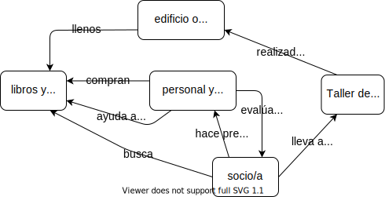

\begin{reviewer}
{Yanina Bellini Saibene}
{Laura Acion y Natalia Morandeira}
\end{reviewer}

Estos mapas conceptuales fueron creados por Amy Hodge de la Universidad de Stanford
y se reutilizan con su permiso.

<figure>
  
  <figcaption>Mapa conceptual desde el punto de vista los/las socios/as de la biblioteca</figcaption>
</figure>

<figure>
  
  <figcaption>Mapa conceptual desde el punto de vista de la dirección de la biblitoteca</figcaption>
</figure>

<figure>
  
  <figcaption>Mapa conceptual desde el punto de vista de los/las amigos/as de la biblioteca</figcaption>
</figure>