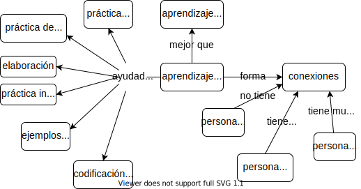

\begin{reviewer}
{Paloma Rojas}
{María Dermit y Natalia Morandeira}
\end{reviewer}

Los capítulos previos han explorado cómo las/los docentes pueden ayudar a sus estudiantes.
Este capítulo se enfoca en cómo las/los estudiantes pueden ayudarse a sí mismas/os
al cambiar sus estrategias de estudio y descansar lo necesario.

La estrategia más efectiva es hacer un cambio de aprendizaje pasivo
a aprendizaje activo <cite>Hpl2018</cite>,
ya que mejora la tasa de rendimiento y reduce la tasa de fracaso <cite>Free2014</cite>:

| **Pasivo**          | **Activo** |
| ------------------- | ---------- |
| Leer sobre un tema  | Hacer ejercicios |
| Mirar un video      | Discutir un tema |
| Asistir a una clase | Tratar de explicar un tema |

Si hacemos referencia a nuestro modelo simplificado de arquitectura cognitiva
(<a figure="f:arch-model"/>),
el aprendizaje activo es más efectivo porque retiene la información nueva en la memoria a corto plazo
por más tiempo,
lo cual aumenta la probabilidad que sea codificada con éxito y almacenada
en la memoria a largo plazo.
Al usar la nueva información a medida que llega,
tus estudiantes pueden construir y fortalecer los lazos entre la información nueva y la información que ya poseen,
lo cual a su vez incrementa las chances de que puedan recuperarla más tarde.

La otra clave para poder sacarle más provecho al aprendizaje es la metacognición
o, en otras palabras, pensar sobre lo que una/uno está pensando.
Así como las/los músicas/os escuchan lo que están tocando,
y las/los buenas/os docentes reflexionan sobre su enseñanza (<a section="performance"/>),
tus estudiantes aprenderán mejor y más rápido si hacen planes,
fijan metas
y monitorean su progreso.
Para tus estudiantes es difícil dominar estas habilidades en abstracto---no tiene
ningún efecto decirles simplemente que planifiquen---pero
las lecciones pueden diseñarse para motivar buenas prácticas de estudio.
Al hacer referencia a dichas prácticas en la clase,
ayudas a tus estudiantes a darse cuenta de que aprender es una habilidad que pueden mejorar,
como cualquier otra <cite>McGu2015,Miya2018</cite>.

El gran premio es la transferencia del aprendizaje,
que ocurre cuando algo que hemos aprendido nos ayuda a aprender algo nuevo más rápido.
Las investigaciones distinguen entre transferencia cercana,
que ocurre entre áreas similares o relacionadas como las fracciones y decimales en matemáticas,
y transferencia lejana,
que ocurre entre dominios diferentes---por ejemplo,
la idea de que aprender ajedrez ayudará al razonamiento matemático y viceversa.

La transferencia cercana ocurre indudablemente---ningún tipo de aprendizaje
más allá de la simple memorización podría ocurrir si no fuera así---y
las/los docentes la utilizan todo el tiempo
al dar a sus estudiantes ejercicios similares al material que acaba de ser presentado en la lección.
Sin embargo,
<cite>Sala2017</cite> analizó varios estudios sobre la transferencia lejana
y concluye que:

> …los resultados muestran un efecto pequeño a moderado.
> Sin embargo, el tamaño del efecto está inversamente relacionado a la calidad del diseño experimental.…
> Concluimos que la transferencia lejana raramente sucede.

Los casos en que la transferencia lejana sí sucede
parecen ocurrir solamente cuando el tema ya ha sido dominado <cite>Gick1987</cite>.
En la práctica,
esto significa que aprender a programar no ayudará a jugar ajedrez y viceversa.

## Seis estrategias {#individual-strategies}

Las/los psicólogas/os estudian el aprendizaje en una amplia variedad de formas,
pero han llegado a conclusiones similares sobre qué funciona realmente <cite>Mark2018</cite>.
Las/Los [Learning Scientists][k0034] (Científicos/as del aprendizaje)
han catalogado seis de estas estrategias y
las resumieron en [una serie de afiches para descargar][k0032]Los afiches se encuentran en español,
busca el botón *posters in other languages* en la web.
Si enseñas estas estrategias a tus estudiantes,
y las mencionas por su nombre cuando las utilices en la clase,
estarás ayudando a que aprendan cómo aprender más rápido y mejor <cite>Wein2018a,Wein2018b</cite>.

### Práctica distribuida

Diez horas de estudio repartidas en cinco días
es más efectivo que dos días de estudio con cinco horas,
y mucho mejor que un día de diez horas.
Por lo tanto, deberías crear un cronograma de estudio en el que distribuyas tus actividades de estudio a lo largo del tiempo:
reserva al menos media hora para estudiar cada tema, cada día,
en vez de amontonar todo para la noche antes del examen <cite>Kang2016</cite>.

También deberías revisar los materiales después de cada clase,
pero no inmediatamente después---toma al menos media hora de receso.
Cuando repases,
asegúrate de incluir aunque sea un pequeño porcentaje del material anterior:
por ejemplo,
utiliza veinte minutos para revisar las notas de la clase de hoy
y luego cinco minutos para revisar material de los días anteriores
y de la semana pasada.
Esto te ayudará a identificar algún vacío o errores en tus apuntes previos
cuando todavía haya tiempo para corregirlos o hacer preguntas:
es doloroso darse cuenta la noche del examen
de que no tienes idea por qué subrayaste "¡¡Evaluación no estándar!!" tres veces.

Al repasar,
haz notas sobre las cosas que te hayas olvidado:
por ejemplo,
haz una tarjeta de memoria para cada concepto que no pudiste recordar
o que recordaste incorrectamente <cite>Matt2019</cite>.
Esto te ayudará a enfocarte en aquello que necesite más atención cuando vuelvas a estudiar.

> ### El valor de las clases magistrales
>
> Según <cite>Mill2016a</cite>,
> "Las clases magistrales que predominan en los cursos presenciales son formas relativamente ineficientes de enseñar,
> pero probablemente contribuyen a distribuir el material en los momentos correctos,
> porque se desenvuelven en un cronograma pre-establecido.
> Por el contrario,
> dependiendo de cómo se organicen los cursos,
> las/los estudiantes en línea a veces pueden evitar exponerse al material por completo hasta que una tarea esté cerca."

### La práctica de recordar lo aprendido

El factor limitante de la memoria a largo plazo no es *retener* (qué se almacena)
sino *recordar* (qué puede accederse).
La habilidad de recordar una información específica puede entrenarse,
asi que para mejorar los resultados en situaciones reales
es útil hacer exámenes de práctica o resumir en detalle un tema de memoria
y luego revisar qué has recordado y qué no.
Por ejemplo,
<cite>Karp2008</cite> encontró que hacer exámenes de forma repetida mejora el recuerdo de listas de palabras, de un 35% a un 80%.

La habilidad de recordar mejora cuando en la práctica se utilizan actividades similares a las que se evalúan.
Por ejemplo,
escribir entradas en un diario personal ayuda con las preguntas de opción múltiple,
aunque menos que hacer exámenes de práctica <cite>Mill2016a</cite>.
Este fenómeno se llama
transferencia apropiada de procesamiento.

Una manera de ejercitar las habilidades para recordar es resolver un mismo problema dos veces.
La primera vez,
hacerlo completamente de memoria, sin notas o discusiones con pares.
Después de evaluar tu propio trabajo con una rúbrica de respuestas distribuidas por la/el docente,
resuelve el problema de nuevo, utilizando el material de apoyo que quieras.
La diferencia entre ambos te muestra qué tan bien pudiste recordar y aplicar el conocimiento.

Otro método (mencionado previamente) es crear tarjetas de estudio.
Las tarjetas físicas tienen una pregunta en un lado y la respuesta en el otro,
y existen muchas aplicaciones para generarlas disponibles para teléfono móvil.
Si estás estudiando en grupo,
intercambiar las tarjetas de estudio con tus colegas
te ayudará a descubrir ideas importantes que tal vez habías obviado o malinterpretado.

Leer-cubrir-recordar{leer-cubrir-recordar}
es una alternativa rápida a las tarjetas de estudio.
Mientras lees algo,
cubre los términos clave o secciones con notas adhesivas pequeñas.
Cuando hayas terminado,
vuelve a leer y ve qué tan bien puedes adivinar las palabras cubiertas por las notas adhesivas.
Independientemente del método que uses,
no sólo practiques recordar datos y definiciones:
asegúrate de evaluar la comprensión de grandes ideas
y de las conexiones entre ellas.
Una forma rápida de hacer esto es
diseñar un mapa conceptual y compararlo con tus apuntes
o con un mapa conceptual dibujado previamente.

> ### Hipercorrección
>
> Un descubrimiento poderoso en la investigación del aprendizaje es
> el fenómeno de hipercorrección <cite>Metc2016</cite>.
> A la mayoría de las personas no le gusta que le digan cuando dicen algo incorrecto,
> así que sería razonable asumir que
> mientras más confianza tenga una persona en la respuesta que da en un examen,
> más difícil será cambiar su opinión si el resultado era incorrecto.
> Y resulta que lo opuesto es cierto:
> mientras más confianza tenga una persona en que tiene la razón,
> más probable será que no repita el error si recibe una corrección.

### Práctica intercalada

Una forma de espaciar la práctica es intercalar el estudio de diferentes temas:
en vez de dominar un tema,
luego el segundo y el tercero,
alterna las sesiones de estudio.
Aún mejor,
cambia el orden:
A-B-C-B-A-C es mejor que A-B-C-A-B-C,
que a la vez es mejor que A-A-B-B-C-C <cite>Rohr2015</cite>.
Esto funciona porque intercalar permite la creación de más vínculos entre los diferentes temas,
lo cual mejora el aprendizaje.

Cuánto deberías tardar en cada ítem
depende del tema y de qué tan bien lo conozcas.
Entre 10 y 30 minutos es un tiempo suficiente para
entrar en tema (<a section="individual-time"/>)
pero no para deambular.
Al principio, intercalar el estudio parecerá más difícil que enfocarse en un único tema,
pero ese es un signo de que está funcionando.
Si usas tarjetas de estudio o haces exámenes de práctica para medir tu progreso,
deberías ver una mejora después de un par de días.

### Elaboración

Explicarte los temas a tí misma/o mientras estudias
permite entenderlos y recordarlos.
Una forma de hacer esto es complementar la respuesta en un examen práctico
con la explicación de por qué la respuesta es correcta
o, al contrario, con una explicación de por qué otras respuestas plausibles no serían correctas.
Otra alternativa es decirte a tí misma/o
cómo una nueva idea es similar o diferente a una que ya hayas visto previamente.

Si bien hablarte a tí misma/o puede parecer una forma extraña de estudiar,
 <cite>Biel1995</cite> encontró que
las personas entrenadas en auto-explicarse destacan cuando se comparan con quienes no se entrenaron.
De manera similar,
<cite>Chi1989</cite> encontró que algunas/os estudiantes simplemente frenan cuando se encuentran con un paso que no entienden
al tratar de resolver problemas.
Otras personas paran y generan una explicación de lo que está pasando:
así aprenden más rápido.
Un ejercicio para construir esta habilidad es revisar un ejemplo de programación línea por línea con una clase, de modo
que diferentes personas expliquen cada línea
y digan por qué está ahí y qué es lo que produce.

### Ejemplos concretos

Una forma particularmente útil de la estrategia de aprendizaje de elaboración es el uso de ejemplos concretos.
Cuando se tiene una definición de un principio general,
intenta proveer uno o más ejemplos de su uso
o, por el contrario, toma un problema en particular y enuncia los principios generales que representa.
<cite>Raws2014</cite> encontró que intercalar ejemplos y definiciones de esta forma
permite que las/los estudiantes puedan recordar las definiciones correctamente.

Una forma estructurada de hacer esto es con
el [método ADEPT][k0033]:

da una <strong>A</strong>nalogía,
dibuja un <strong>D</strong>iagrama,
presenta un <strong>E</strong>jemplo,
describe la idea en un lenguaje <strong>Sencillo</strong> (del inglés "<strong>P</strong>lain Language"),
y luego da los detalles <strong>T</strong>écnicos.
De nuevo,
si estás estudiando con otra persona o en grupo,
puedes intercambiar y revisar el trabajo:
ve si estás de acuerdo con el ejemplo que tus pares eligieron para representar
el principio que se está discutiendo,
o analiza qué principios se usan en un ejemplo que no hayan anotado.

Otra técnica útil es enseñar por contraste,

p.ej. mostrar a tus estudiantes cuál *no* es la solución
o cuál es la técnica que *no* resolverá un problema.
Por ejemplo,
al mostrar a las/los niñas/os cómo simplificar fracciones,
es importante darles a menos un par de ejemplos que no puedan simplificarse, como 5/7,
para que no se frustren buscando respuestas que no existen.

### Codificación Dual

La última de las seis estrategias principales
descriptas en [Learning Scientists][k0034]
es presentar palabras e imágenes juntas.
Como discutimos en la <a section="architecture-brain"/>,
diferentes subsistemas en nuestro cerebro manejan y almacenan la información lingüística y visual,
de tal manera que, si se presenta información complementaria por ambos canales,
se refuerzan mutuamente.
Sin embargo,
aprender es menos efectivo cuando la misma información se presenta de forma simultánea por dos canales diferentes,
porque el cerebro tiene que hacer un esfuerzo para comparar los canales entre sí <cite>Maye2003</cite>.

Una forma de aprovechar la codificación dual es dibujar o etiquetar líneas de tiempo,
mapas o árboles familiares,
o cualquier otro material que sea relevante.
(Personalmente, me gustan las imágenes que muestran qué funciones llaman a qué otras en un programa.)
Dibujar un diagrama *sin* etiquetas,
y después volver atrás para etiquetarlo,
es una práctica excelente para recordar.

## Gestión del tiempo {#individual-time}

Solía presumir sobre la cantidad de horas que trabajaba.
No en muchas palabras,
obviamente---tenía *algunas* habilidades sociales---pero
me presentaba en clases alrededor del mediodía,
sin rasurar y bostezando,
y casualmente mencionaba a quien sea que pudiera escuchar
que había trabajado toda la noche.

Haciendo memoria,
no puedo recordar a quién trataba de impresionar.
Pero lo que sí recuerdo es
que tuve que desechar gran parte del trabajo que hice durante esas trasnochadas
una vez que lo revisé después de dormir un poco.
Para peor, el trabajo que no descarté le hizo bastante daño a mis calificaciones.

Mi error fue confundir "trabajar" con "ser productivo."
No puedes producir software (o cualquier otra cosa) sin hacer algo de trabajo,
pero se puede hacer mucho trabajo sin producir nada de valor.
Convencer de esto a otras personas es difícil,
especialmente cuando son adolescentes o tienen alrededor de veinte años,
pero paga tremendos dividendos.

Los estudios científicos sobre el trabajo en exceso y la deprivación del sueño se remontan, al menos, a la década de 1890s---puedes ver
<cite>Robi2005</cite> para un resumen breve y legible.
Los resultados más importantes para estudiantes son:

1. Trabajar más de 8 horas al día por un periodo extendido de tiempo
   disminuye la productividad total,
   no sólo la productividad por hora ---es decir, haces menos en total (no sólo por hora)
   cuando tienes trabajo acumulado y estás cerca de una fecha límite de entrega.

1. Trabajar durante 21 horas seguidas aumenta la posibilidad de que tengas un error catastrófico
   tanto como estar legalmente en estado de ebriedad.

1. La productividad varía a lo largo de la jornada laboral,
   con la mayor productividad en las primeras 4 a 6 horas.
   Después de cierta cantidad de horas,
   la productividad disminuye a cero;
   y eventualmente se vuelve negativa.

Estos hechos se han reproducido y verificado durante más de un siglo,
y los datos detrás de ellos son tan sólidos como los que relacionan el tabaquismo con el cáncer de pulmón.
El problema es que
*las personas generalmente no notan que sus habilidades disminuyen*.
Al igual que las personas que en estado de ebriedad creen que todavía pueden conducir,
las personas que están deprivadas de sueño no se dan cuenta de que
no están terminando sus oraciones (o pensamientos).
Se ha demostrado que cinco días de 8 horas por semana maximizan la producción total a largo plazo
en todas las industrias que se han analizado;
estudiar o programar no es diferente.

Pero, ¿qué pasa con las rachas que surgen de vez en cuando,
como trabajar toda la noche para cumplir con un plazo?
Eso también se ha estudiado
y los resultados no son agradables.
La habilidad de pensar disminuye en un 25% por cada 24 horas sin dormir.
Puesto de otra forma,
el coeficiente intelectual de una persona promedio es sólo 75 después de una trasnochada,
lo que la desplaza al 5% inferior de la población.
Si haces dos trasnochadas seguidas, tu coeficiente intelectual es de 50,
que es el nivel en el que las personas suelen ser consideradas incapaces de vivir de forma independiente.

"Pero---pero---, ¡tengo tantas tareas que hacer!" dices.
"¡Y todas tienen que ser entregadas al mismo tiempo!
¡*Tengo* que trabajar horas extra para completarlas!"
No:
para ser productivas las personas tienen que priorizar tareas y enfocarse,
lo cual se les debe enseñar.
Una técnica ampliamente utilizada es hacer una lista de tareas a hacer,
organizadas por prioridad,
y luego desconectarse del correo electrónico u otras interrupciones por 30--60 minutos
y completar una de esas tareas.
Si una de las tareas de la lista lleva más de una hora,
sepárala en actividades más pequeñas y priorízalas de forma separada.

La parte más importante de esto es apagar las interrupciones.
A pesar de lo que mucha gente quiere creer,
los seres humanos no somos buenos haciendo múltiples tareas a la vez..
En lo que sí podemos volvernos buenos es en la automaticidad, es decir,
la habilidad de hacer algo de forma rutinaria de fondo,
mientras realizamos otra tarea <cite>Mill2016a</cite>.
La mayoría de las personas puede hablar mientras corta una cebolla,
o tomar café mientras lee;
con la práctica,
también podemos tomar notas mientras escuchamos,
pero no podemos estudiar de forma efectiva,
programar
o hacer otra tarea mentalmente exigente mientras prestamos atención a algo más---solo
creemos que podemos.

El objetivo de organizarse y prepararse es
entrar en el estado mental más productivo posible.
Las/los psicólogas/os lo llaman flujo <cite>Csik2008</cite>;
las/los atletas lo llaman "estar en la zona,"
y las/los músicos hablan de perderse en lo que están tocando.
Cualquiera sea el nombre que uses,
las personas producen mucho más por unidad de tiempo en este estado que en un estado normal.
La mala noticia es que
se tarda aproximadamente 10 minutos en volver a entrar en este estado después de tener una interrupción,
sin importar lo corta que haya sido la interrupción.
Lo que significa que si te interrumpieron seis veces por hora,
*nunca* llegaste al máximo de tu productividad.

> ### ¿Cómo lo supo?
>
> En su breve historia en 1961 "[Harrison Bergeron][k0035]",
> Kurt Vonnegut describió un futuro en el que las personas están obligadas a ser iguales.
> Las personas atractivas tienen que usar máscaras,
> las personas atléticas tienen que cargar pesas---y las personas inteligentes
> están obligadas a llevar radios que interrumpen sus pensamientos en intervalos aleatorios.
> A veces me pregunto si---oh, un momento, mi teléfono acaba de---perdón, ¿de qué estábamos hablando?

## Evaluación de pares {#individual-peer}

Pedirle a las personas de un equipo que evalúen a sus pares es una práctica común en la industria.
<cite>Sond2012</cite> revisaron la literatura sobre evaluación de pares,
distinguiendo entre calificar y evaluar.
Descubrieron que la evaluación de pares aumentaba la cantidad, la diversidad y la puntualidad de la retroalimentación,
ayudaba a las/los estudiantes a ejercitar el pensamiento de nivel superior,
fomentaba la práctica reflexiva,
y promovía el desarrollo de habilidades sociales.
Las preocupaciones fueron predecibles:
validez y confiabilidad,
motivación y procrastinación,
agresión, confabulación y plagio.

Sin embargo,
la evidencia muestra que estas preocupaciones no fueron significativas en la mayoría de las clases.
Por ejemplo,
<cite>Kauf2000</cite> comparó las evaluaciones y calificaciones confidenciales de pares en varios ejes
para dos cursos en licenciatura en ingeniería,
y descubrió que la auto-calificación y la evaluación de pares tuvo una concordancia estadística,
que la confabulación no fue significativa (es decir, no dieron irrespectivamente la nota más alta a todos sus pares),
que las/los estudiantes no inflaron sus auto-calificaciones
y, lo más importante,
que las calificaciones no estaban sesgadas por cuestiones de género ni por racismo.

Una forma de implementar la evaluación de pares es contribuyendo a la pedagogía estudiantil,
en la cual tus estudiantes producen artefactos para contribuir al aprendizaje de otros.
Esto puede hacerse desarrollando una lección corta y compartiéndola con la clase,
contribuir a un banco de preguntas,
o escribir notas de una lección en particular para una publicación durante la clase.
Por ejemplo,
<cite>Fran2018</cite> evidenció que las/los estudiantes que realizan videos cortos para enseñar conceptos a sus pares
tuvieron un incremento significativo de su propio aprendizaje
comparado al de aquellas personas que sólo estudiaron el material o vieron los videos.
He observado que pedir a diario a mis estudiantes que compartan a la clase un error en su código
y cómo lo solucionaron ayuda en sus habilidades analíticas y disminuye su síndrome del impostor/a.

Otra alternativa es la revisión por pares calibrada,
en la cual tus estudiantes revisan uno o más ejemplos utilizando una rúbrica
y comparan su evaluación con la evaluación del cuerpo docente <cite>Kulk2013</cite>.
Una vez que la evaluación de tu estudiante sea similar a la del cuerpo docente,
pueden empezar a evaluar el trabajo de sus pares.
Si se combinan muchas evaluaciones de pares,
este método puede ser tan preciso como la evaluación del cuerpo docente  <cite>Pare2008</cite>.

Como todo lo demás,
la evaluación es ayudada por rúbricas.
La planilla de evaluación de la <a section="checklists-teameval"/> muestra un ejemplo para que puedas empezar.
Para usarla,
evalúate y luego evalúa a tus colegas,
luego calcula y compara las notas.
Una diferencia grande generalmente indica la necesidad de más conversación.

## Ejercicios {#individual-exercises}

### Estrategias de aprendizaje (individual/20’) {.exercise}

1. ¿Cuál de las seis estrategias de aprendizaje generalmente usas?
   ¿Cuáles generalmente no usas?

1. Escribe tres conceptos generales que quieras que tus estudiantes aprendan
   y da dos ejemplos específicos para cada caso
   (practica ejemplos concretos).
   Para cada uno de estos conceptos,
   trabaja al revés: parte de uno de los ejemplos y elabora sobre el concepto que lo explica
   (elaboración).

### Conectando ideas (parejas/5’) {.exercise}

Este ejercicio es un ejemplo de utilizar la elaboración para mejorar la retención.
Tú y tu pareja deben elegir una idea de manera independiente.
Luego de contarse sus ideas,
trata de encontrar una cadena de cuatro eslabones
que las conecte.

Por ejemplo,
si las dos ideas son "Titicaca" y "estadística,"
los eslabones pueden ser:

- El lago Titicaca se encuentra en territorios de Bolivia y Perú;

- Bolivia y Perú son países;

- los países tienen gobiernos;

- los gobiernos utilizan estadísticas para analizar la opinión pública.

### Evolución convergente (parejas/15’) {.exercise}

Una práctica que no hemos abordado anteriormente son las notas guiadas.
Se trata de notas preparadas por la/el docente,
quien solicita a sus estudiantes que respondan preguntas respecto a la información clave de una clase magistral o discusión.
Estas preguntas pueden ser espacios en blancos donde tus estudiantes agregan información,
asteriscos junto a términos que deben definir,
etcétera.

Crea entre dos y cuatro tarjetas con notas guiadas para una lección que hayas enseñado recientemente
o que vas a enseñar.
Intercambia tarjetas con tu colega:
¿Qué tan fácil es entender lo que se está preguntando?
¿Cuánto tiempo te lleva completar las respuestas?
¿Qué tan bien funciona esto para ejemplos de programación?

### Cambiando de opinión (parejas/10’) {.exercise}

<cite>Kirs2013</cite> argumentan que los mitos sobre personas nativas digitales,
estilos de aprendizaje,
y personas autodidactas se derivan de una misma creencia equivocada: que
las/los estudiantes saben lo que es mejor para ellas/os.
Los autores advierten que podemos estar en una espiral descendente
en la que todos los intentos de las personas que investigan en educación para refutar estos mitos,
confirmen la creencia de sus oponentes de que la ciencia de aprendizaje es pseudociencia.
Elige algo que hayas aprendido hasta ahora en este libro,
que te haya sorprendido o haya contradecido algo que creías previamente,
y practica explicar esa idea a tu colega en 1--2 minutos.
¿Cuán convincente eres?

### Tarjetas de estudio (individual/15’) {.exercise}

Utiliza notas adhesivas, o algo similar que tengas a mano,
para hacer seis tarjetas de estudio
para un tema que recientemente hayas enseñado o aprendido.
Intercambia con tu colega y ve cuánto tiempo tardas en recordar
al 100% cada tarjeta.
Deja las tarjetas a un lado cuando termines
y vuelve media hora después para evaluar cuál es tu tasa de retención.

### Utilizando ADEPT (toda la clase/15’) {.exercise}

Elige un tema que recién hayas enseñado o aprendido,
y delinea una pequeña lección que utilice los cinco pasos del método ADEPT para introducir el tema.

### El costo de la multitarea (parejas/10’) {.exercise}

[El blog de The Learning Scientists][k0036]
describe un experimento simple que puedes hacer con solo un cronómetro
para demostrar el costo de hacer múltiples tareas a la vez.
En parejas,
mide cuánto tarda cada persona en hacer cada una de estas tres tareas:

- Contar del 1 al 26 dos veces.

- Recitar el alfabeto de la A a la Z dos veces.

- Intercalar números y letras,
  es decir, "1, A, 2, B, …"
  y continuar.

Luego, cada pareja informa sus tiempos a la clase.
Sin práctica específica,
intercalar números y letras siempre toma significativamente más tiempo que cada uno de los componentes por separado.

### Mitos en la educación de computación (toda la clase/20') {.exercise}

<cite>Guzd2015b</cite> presenta una lista de las 10 creencias erróneas más comunes sobre educación en computación,
que incluye:

1. La ausencia de mujeres en ciencias de la computación es similar a lo que ocurre
   en otras áreas de ciencias, tecnología, ingeniería y matemáticas.

1. Para tener más mujeres en las ciencias de la computación necesitamos más docentes mujeres en el área.

1. Las evaluaciones de estudiantes son la mejor forma de evaluar la enseñanza.

1. Las/los buenas/os docentes personalizan la educación a los estilos de aprendizaje de sus estudiantes.

1. Las/los buenas/os docentes en ciencias de la computación deberían modelar buenas prácticas
   de desarrollo de software porque su trabajo es producir ingenieras/os de software excelentes.

1. Algunas personas son naturalmente mejores programadoras que otras.

Cada persona de la clase es invitada a votar +1 (de acuerdo), -1 (en desacuerdo) o 0 (neutro) para cada punto.
Luego, la/el docente lee la explicación completa en [el artículo original][k0063]
y se vuelve a hacer la votación.
¿En cuáles preguntas las personas cambiaron de parecer?
¿Cuáles todavía creen que son verdad, y por qué?

### Revisión por pares calibrada (parejas/20’) {.exercise}

1. Crea una rúbrica de 5--10 puntos
   con entradas como "buenos nombres de variables," "sin código redundante," y "flujo de control propiamente anidado"
   para calificar el tipo de programa que esperarías que tus estudiantes escriban.

1. Elige o crea un pequeño programa que contenga 3--4 violaciones a estas entradas.

1. Califica el programa de acuerdo a la rúbrica.

1. Pide a tu colega que califique el mismo programa con la misma rúbrica.
   ¿Qué aceptó tu colega pero tú no aceptaste?
   ¿Qué criticó tu colega pero tú no criticaste?

## Revisión

<figure id="f:individual-concept-map">
  
  <figcaption>Conceptos: Aprendizaje activo</figcaption>
</figure>