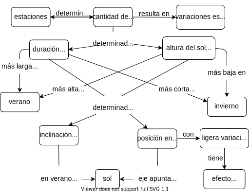

<div class="reviewers" markdown="1">

Traductora: [Mónica Alonso][alonso-monica].<br/>
Revisoras: [Natalia Morandeira][morandeira-natalia] y [Silvia Canelón][canelon-silvia].

</div>

> La memoria es el remanente del pensamiento.<br/>
>  --- <span i="Willingham, Daniel">Daniel Willingham</span>,
> *Por qué a las/los estudiantes no les gusta la escuela (Why Students Don't Like School)*

El capítulo anterior explicaba las diferencias entre personas novatas y practicantes competentes.
En este capítulo se aborda la pericia:
qué es,
cómo se puede adquirir,
y cómo puede ser tanto perjudicial como de ayuda.
Luego haremos una introducción sobre uno de los límites más importantes en el aprendizaje
y analizaremos cómo dibujar nuestros modelos mentales nos puede ayudar a convertir el conocimiento en lecciones.

Para empezar,
¿a qué nos referimos cuando decimos que alguien es una <span i="persona experta">persona experta</span>?
La respuesta habitual es que puede resolver problemas mucho más rápido que la persona que es "simplemente competente",
o que puede reconocer y entender casos donde las reglas normales no se pueden aplicar.
Es más, de alguna manera una persona experta hace que parezca que resolver ciertos problemas no requiere esfuerzo alguno:
en muchos casos,
parece saber la respuesta correcta de un vistazo <cite>Parn2017</cite>.

Pericia es más que solo conocer más hechos:
las/los practicantes competentes pueden memorizar una gran cantidad de trivialidades sin  mejorar notablemente sus desempeños.
En cambio,
imagina por un momento que almacenamos conocimiento como una red o grafo en el cual los hechos son nodos
y las relaciones son arcos<sup>Definitivamente nuestro cerebro *no* trabaja de esta manera, pero es una metáfora útil.</sup>.
La diferencia clave entre personas expertas y practicantes competentes es que
los modelos mentales de las personas expertas están mucho más densamente conectados,
es decir, es más probable que conozcan una conexión entre dos hechos cualesquiera.

La metáfora del grafo explica por qué ayudar a tus estudiantes a hacer conexiones es tan importante como presentarles los hechos:
sin esas conexiones
la gente no puede recordar y usar aquello que sabe.
Esta metáfora también explica varios aspectos observados del comportamiento experto:

- Las personas expertas pueden saltar directamente de un problema a una solución
  porque realmente existe una conexión directa entre ambas cuestiones en sus mentes.
  Mientras una/un practicante competente debería razonar
  \\(A {\rightarrow} B {\rightarrow} C {\rightarrow} D {\rightarrow} E \\),
  una persona experta puede ir de \\(A\\) a \\(E\\) en un único paso.
  Esto lo llamamos <span g="intuition">intuición</span>:
  en vez de razonar su camino hacia una solución,
  la persona experta reconoce una solución de la misma manera que reconocería una cara familiar.

- Los grafos densamente conectados son también la base para la
  <span g="fluid-representation">representación fluida</span> de las personas expertas,
  es decir, sus habilidades para cambiar una y otra vez entre distintas formas de ver un problema <cite>Petr2016</cite>.
  Por ejemplo,
  tratando de resolver un problema en matemáticas,
  una persona experta puede cambiar entre abordarlo de manera geométrica
  a representarlo como un conjunto de ecuaciones.

- Esta metáfora también explica por qué las personas expertas son mejores en diagnósticos que las/los practicantes competentes:
  mayor cantidad de conexiones entre hechos hace más fácil razonar hacia atrás, de síntomas a causas.
  (Esta es la razón por la cual durante una entrevista de trabajo de desarrollo de software es
  preferible pedirle a las/los candidatas/os que depuren un programa a pedirles que programen:
  da una impresión más precisa de su habilidad.)

- Finalmente,
  las personas expertas están muchas veces tan familiarizadas con su tema que
  no pueden imaginarse cómo es *no* ver el mundo de esa manera.
  Esto implica que muchas veces están menos capacitadas para enseñar un tema que aquellas personas con menos experiencia,
  pero que aún recuerdan cómo lo aprendieron.

El último de estos puntos se llama <span g="expert-blind-spot">punto ciego de las personas expertas</span>.
Como se definió originalmente en <cite>Nath2003</cite>,
es la tendencia de las personas expertas a organizar una explicación de acuerdo a los principios fundamentales del tema,
en lugar de guiarse por aquello que ya conocen quienes están aprendiendo.
Esto se puede superar con entrenamiento,
pero es parte de la razón por la cual no hay correlación entre
lo bien que investiga alguien en un área
y lo bien que esa misma persona enseña la temática <cite>Mars2002</cite>.

> ### La letra S
>
> Las personas expertas a menudo caen en sus puntos ciegos usando la palabra "solo,"
> como en,
> "Oh, es fácil, solo enciendes una nueva máquina virtual
> y luego solo instalas estos cuatro parches a Ubuntu
> y luego solo reescribes todo tu programa en un lenguaje funcional puro."
> Como discutimos en el <a section="motivation"/>,
> hacer esto indica que quien habla piensa que el problema es trivial
> y por lo tanto la persona que lucha con el problema debe ser estúpida:
> entonces, no tengas esta actitud.

## Mapas conceptuales {#memory-concept-maps}

La herramienta que elegimos para representar el modelo mental de alguien es un <span g="concept-map">mapa conceptual</span>,
en el cual los hechos son burbujas y las conexiones son relaciones etiquetadas.
Como ejemplos, la
<a figure="f:memory-seasons"/> muestra por qué la Tierra tiene estaciones (de [IHMC][ihmc]),
y el <a section="conceptmaps"/> presenta mapas conceptuales de una biblioteca desde tres puntos de vista distintos.

<figure id="f:memory-seasons">
  
  <figcaption>Mapa conceptual para estaciones</figcaption>
</figure>

Para mostrar cómo pueden ser usados los mapas conceptuales para enseñar programación,
considera este bucle `for` en <span i="Python">Python</span>:

```text
for letra in "abc":
    print(letra)
```

cuya salida es:

```text
a
b
c
```

Las tres "cosas" claves en este bucle se muestran al principio de la <a figure="f:memory-loop"/>,
pero son solo la mitad de la historia.
La versión ampliada en la parte derecha de la figura muestra las relaciones entre esas cosas,
las cuales son tan importantes para la comprensión como los conceptos en sí mismos.

<figure id="f:memory-loop">
  
  <figcaption>Mapa conceptual para un bucle `for` </figcaption>
</figure>

Los mapas conceptuales pueden ser usados de varias maneras:

Para ayudar a docentes a descubrir qué están tratando de enseñar.
: Un mapa conceptual separa el contenido del orden:
  en nuestra experiencia,
  las personas rara vez terminan enseñando las cosas en el orden en que las dibujaron por primera vez.

Para mejorar la comunicación entre quienes diseñan las lecciones
: Si dos docentes tienen ideas muy diferentes de aquello que están tratando de enseñar,
  es probable que arrastren a sus estudiantes en diferentes direcciones.
  Dibujar y compartir mapas conceptuales puede ayudar a prevenirlo.
  Y sí:
  personas diferentes pueden tener mapas conceptuales diferentes para el mismo tema,
  pero el mapeo conceptual hace explícitas estas diferencias.

Para mejorar la comunicación con estudiantes.
: Si bien es posible dar a tus estudiantes un mapa pre-dibujado al inicio de la lección para que puedan anotar,
  es mejor dibujarlo parte por parte mientras se está enseñando,
  para reforzar la relación entre lo que muestra el mapa y lo que tú dices.
  Volveremos a esta idea en la <a section="architecture-brain"/>.

Para evaluación.
: Hacer que las/los estudiantes dibujen lo que creen que acaban de aprender
  le muestra a quien enseña lo que se pasó por alto y lo que se comunicó mal.
  Revisar los mapas conceptuales de estudiantes insume demasiado tiempo para utilizarlo como una evaluación formativa durante las clases,
  pero es muy útil en clases semanales *una vez que tus estudiantes están familiarizadas/os con la técnica*.
  La calificación es necesaria porque
  cualquier manera nueva de hacer algo, inicialmente enlentece a la gente---si quien está aprendiendo
  intenta encontrarle el sentido a la programación básica,
  pedirle que se imagine cómo esquematizar sus pensamientos al mismo tiempo es una carga que no conviene realizar.

Algunas/os docentes son escépticas/os a que las personas novatas puedan mapear efectivamente lo que entendieron,
dado que la introspección y la explicación de lo entendido son generalmente habilidades más avanzadas que la comprensión en sí misma.
Por ejemplo,
<cite>Kepp2008</cite> observó el uso del mapeo conceptual en la enseñanza de computación.
Uno de los hallazgos fue que
"… el mapeo conceptual es problemático para muchas/os estudiantes porque
evalúa la comprensión personal en lugar del conocimiento que simplemente se aprendió de memoria."
Como alguien que valora la comprensión sobre el conocimiento de memoria,
lo considero un beneficio.

> ### Comienza por cualquier lugar
>
> Cuando se pide por primera vez dibujar un mapa conceptual, muchas personas no saben por dónde empezar.
> Si esto ocurre,
> escribe dos palabras asociadas con el tema que estás tratando de mapear,
> luego dibuja una línea entre ellas y agrega una etiqueta explicando cómo estas dos ideas están relacionadas.
> Puedes entonces preguntarte qué otras cosas están relacionadas en el mismo sentido,
> qué partes tienen esas cosas,
> o qué sucede antes o después con los conceptos que ya están en la hoja
> a fin de descubrir más nodos y arcos.
> Después de eso, casi siempre la parte más difícil está terminada.

Los mapas conceptuales son solo una forma de representar nuestro conocimiento de un tema <cite>Eppl2006</cite>;
otros incluyen diagramas de Venn, diagramas de flujo y árboles de decisión <cite>Abel2009</cite>.
Todos estos esquemas <span g="externalized-cognition" i="cognición externalizada">externalizan la cognición</span>,
es decir, hacen visibles los modelos mentales de manera que pueden ser comparados y combinados<sup>Parafraseando a
Lady Windermere, obra de <span i="Wilde, Oscar">Oscar Wilde</span></sup>
las personas a menudo no saben lo que piensan hasta que se escuchan a sí mismas decirlo.

> ### Trabajo crudo y honestidad
>
> Muchas/os diseñadoras/es de interfaces de usuaria/o creen que es mejor mostrar bocetos de sus ideas en lugar de maquetas pulidas,
> porque es más probable que las personas den una opinión honesta sobre algo que
> presumen que tiene pocos minutos de elaboración.
> Si parece que el trabajo requirió horas,
> la mayoría de las personas suavizará sus críticas.
> Al dibujar mapas conceptuales para motivar un intercambio de ideas,
> deberías entonces usar lápices y papel borrador (o marcadores y una pizarra)
> en lugar de sofisticadas herramientas de dibujo por computadora.

## Siete más o menos dos {#memory-seven-plus-or-minus}

Mientras el modelo gráfico de conocimiento es incorrecto pero útil,
otro modelo simple tiene bases fisiológicas profundas.
Como una aproximación rápida,
la memoria humana se puede dividir en dos capas distintas.
La primera,
llamada <span g="long-term-memory">memoria a largo plazo</span>
o <span g="persistent-memory">memoria persistente</span>,
es donde almacenamos cosas como los nombres de nuestra gente amiga,
nuestra dirección,
y lo que hizo un payaso en nuestra fiesta de cumpleaños de ocho que nos asustó mucho.
La capacidad de esta capa de memoria es esencialmente ilimitada,
pero es de acceso lento---demasiado lento para ayudarnos a lidiar con leones hambrientos y familiares descontentos.

La evolución entonces nos ha dado un segundo sistema
llamado <span g="short-term-memory">memoria a corto plazo</span>
o <span g="working-memory">memoria de trabajo</span>.
Es mucho más rápida,
pero también más pequeña: <cite>Mill1956</cite> estimó que la memoria de trabajo del adulto promedio solo podía contener 7 ± 2 elementos a la vez.
Esta es la razón por la cual [los números de teléfono][phone-number-length]
son de 7 u 8 dígitos de longitud:
antes los teléfonos tenían un disco en vez de teclado y
esa era la cadena de números más larga que la mayoría de los adultos podía recordar con precisión durante el tiempo que tardaba el disco en girar varias veces.

> ### Participación
>
> El tamaño de la memoria de trabajo a veces se usa para explicar por qué los equipos
> deportivos tienden a formarse con aproximadamente media docena de miembros o
> se separan en sub-grupos como delanteras/os y línea de tres cuartos en rugby.
> También se usa para explicar por qué las reuniones solo son productivas hasta un cierto número de participantes:
> si veinte personas tratan de discutir algo,
> o bien se arman tres reuniones al mismo tiempo
> o media docena de personas hablan mientras los demás escuchan.
> El argumento es que la habilidad de las personas para llevar registro de sus pares está limitada al tamaño de la memoria de trabajo,
> pero hasta donde sé,
> esta aseveración jamás fue probada.

7±2 es simplemente el número más importante al enseñar.
Quien enseña no puede colocar información directamente en la memoria a largo plazo de una/un estudiante.
En cambio,
cualquier cosa que presente se almacena primero en la memoria a corto plazo de cada estudiante
y solo se transfiere a la memoria a largo plazo después que ha sido mantenida ahí y ensayada (<a section="individual-strategies"/>).
Si quien enseña presenta demasiados contenidos y muy rápidamente,
la vieja información no llega a transferirse a tiempo antes de ser desplazada por la nueva información.

Esta es una de las maneras de usar mapas conceptuales al diseñar una lección:
sirve para asegurarse que la memoria a corto plazo de tus estudiantes no estará sobrecargada.
Con el mapa ya diseñado,
la/el docente elige un fragmento apropiado para la memoria a corto plazo,
el cual llevará a una <span i="evaluación formativa">evaluación formativa</span> (<a figure="f:memory-photosynthesis"/>);
en la próxima lección continuará con otro fragmento del mapa conceptual, y así sucesivamente.

<figure id="f:memory-photosynthesis">
  
  <figcaption>El uso de mapas conceptuales en el diseño de la lección</figcaption>
</figure>

> ### Construyendo juntos mapas conceptuales
>
> La próxima vez que tengas una reunión de equipo,
> entrega a cada persona una hoja de papel
> y pídeles que pasen unos minutos dibujando sus propios mapas conceptuales sobre el proyecto en el que están trabajando.
> A la cuenta de tres,
> haz que todos revelen sus mapas conceptuales al grupo.
> La discusión que sigue puede ayudar a las personas a comprender
> por qué han estado tropezando.

Ten en cuenta que el modelo simple de memoria presentado aquí ha sido reemplazado en gran medida por uno más sofisticado,
en el que la memoria a corto plazo se divide en varios almacenamientos
(p. ej. para memoria visual versus memoria lingüística),
cada uno de los cuales realiza un pre-procesamiento involuntario <cite>Mill2016a</cite>.
Nuestra presentación es entonces un ejemplo de un modelo mental que ayuda al aprendizaje y al trabajo diario.

### Reconocimiento de patrones

Investigaciones recientes sugieren que el tamaño real de la memoria a corto plazo
podría ser tan bajo como 4±1 elementos <cite>Dida2016</cite>.
Para manejar conjuntos de información más grandes,
nuestras mentes crean <span g="chunking" i="fragmentación">fragmentos</span>.
Por ejemplo,
en general recordamos a las palabras como elementos simples más que como secuencia de letras.
Del mismo modo,
el patrón formado por cinco puntos en cartas o dados se recuerda como un todo
en lugar de cinco piezas de información separadas.

Las personas expertas tienen más fragmentos y de mayor tamaño que las no-expertas,
p.ej. "ven" patrones más grandes y tienen más patrones con los que contrastar cosas.
Esto les permite razonar a un nivel superior
y buscar información de manera más rápida y precisa.
Sin embargo,
la fragmentación también puede engañarnos si identificamos mal las cosas:
quienes recién llegan a veces pueden ver cosas que personas expertas han visto y pasado por alto.

Dada la importancia de la fragmentación para pensar,
es tentador identificar <span i="patrones de diseño">[patrones de diseño][design-patterns-es]</span>
y enseñarlos directamente.
Estos patrones ayudan a practicantes competentes a pensar y dialogar en varios dominios (incluida la enseñanza <cite>Berg2012</cite>),
pero los catálogos de patrones son demasiado duros y abstractos para que personas novatas les encuentren sentido por su cuenta.
Dicho esto,
asignar nombres a un pequeño número de patrones parece ayudar con la enseñanza,
principalmente dando a tus estudiantes un vocabulario más rico para pensar y comunicarse <cite>Kuit2004,Byck2005,Saja2006</cite>.
Volveremos a este tema en la <a section="pck-programming"/>.

## Convirtiéndose en una persona experta {#memory-becoming-expert}

Entonces, ¿cómo se convierte alguien en una persona experta?
La idea de que hacen falta diez mil horas de práctica para conseguirlo es ampliamente citada,
pero [probablemente no sea verdad][ten-thousand-hour-rule]:
hacer lo mismo una y otra vez es más probable que fortalezca los malos hábitos a que mejore la práctica.
Lo que realmente funciona es hacer cosas similares pero sutilmente diferentes,
prestando atención a qué funciona y qué no,
y luego cambiando el comportamiento en respuesta a esta retroalimentación, para así mejorar de forma acumulativa.
Esto se llama <span g="deliberate-practice">práctica deliberada</span>
o <span g="reflective-practice">práctica reflectiva</span>,
y es común que las personas atraviesen tres etapas:

Actuar según la devolución de otros.
: Las/los estudiantes pueden escribir un ensayo sobre qué hicieron en sus vacaciones de verano
  y recibir devoluciones de una/un docente que les indique cómo mejorarlo.

Dar devoluciones sobre el trabajo de otras/os.
: Las/los estudiantes pueden realizar críticas de la evolución de un personaje en la novela de Jorge Amado *Doña Flor y sus dos maridos*.
  y recibir una devolución de una/un docente sobre esas críticas.

Darse devoluciones a sí misma/o.
: En algún punto,
  las/los estudiantes empiezan a criticar sus propios trabajos
  con las habilidades que ya han construido.
  Dado que auto-criticarse es mucho más rápido que esperar los comentarios de otras personas,
  esta aptitud comenzará a desarrollarse de un momento a otro.

> ### ¿Qué cuenta como práctica deliberada?
>
> <cite>Macn2014</cite> descubrió que
> "…la práctica deliberada explicaba el 26% de la varianza en el rendimiento de los juegos,
> 21% para música,
> 18% para deportes,
> 4% para educación,
> y menos del 1% para profesiones."
> Sin embargo, <cite>Eric2016</cite> criticó este hallazgo diciendo:
> "Resumir cada hora de cualquier tipo de práctica durante la carrera de un individuo
> implica que el impacto de todos los tipos de actividad práctica respecto a rendimiento es igual ------una suposición
> que…es inconsistente con la evidencia."
> Para ser efectiva,
> la práctica deliberada requiere tanto un objetivo de rendimiento claro
> como una devolución informativa inmediata.
> Se trata de dos cosas que las/los docentes deberían esforzarse en conseguir.

## Ejercicios {#memory-exercises}

### Mapear conceptos (parejas/30') {.exercise}

Dibuja un mapa conceptual sobre algo que puedas enseñar en cinco minutos.
Discute con tu colega y critiquen el mapa que cada cual elaboró.
¿Presentan conceptos o detalles superficiales?
¿Cuáles de las relaciones en el mapa de tu colega consideras conceptos y viceversa?

### Mapeo de conceptos (nuevamente) (grupos pequeños/20') {.exercise}

La clase se divide en grupos de 3--4 personas.
En cada grupo, cada persona diseña por su cuenta un mapa conceptual que muestre un modelo mental sobre qué sucede en un aula.
Cuando todas las personas del grupo hayan terminado,
comparen los mapas conceptuales.
¿En qué coinciden y difieren sus modelos mentales?

### Mejora de la memoria a corto plazo (individual/5') {.exercise}

<cite>Cher2007</cite> sugiere que
la razón principal por la que las personas dibujan diagramas cuando discuten cosas
es para ampliar su memoria a corto plazo:
señalar una burbuja dibujada hace unos minutos provoca el recuerdo de varios minutos de debate.
Cuando intercambiaste mapas conceptuales en el ejercicio anterior,
¿qué tan fácil fue para otras personas entender lo que significaba tu mapa?
¿qué tan fácil sería para ti si lo dejas de lado por un día o dos y luego lo miras de nuevo?

### Eso es un poco autorreferencial, ¿no? (toda la clase/30') {.exercise}

Trabajando independientemente,
dibuja un mapa conceptual sobre mapas conceptuales.
Compara tu mapa conceptual con aquellos dibujados por las demás personas.
¿Qué incluyeron la mayoría de las personas?
¿Cuáles fueron las diferencias más significativas?

### Notar tus puntos ciegos (grupos pequeños/10') {.exercise}

Elizabeth Wickes listó
[todo lo que necesitas saber para entender][wickes-python-lists]
y leer esta línea de *Python*:

```text
respuestas = ['tuatara', 'tuataras', 'bus', "lick"]
```

- Los corchetes rodeando el contenido significan que estamos trabajando con una lista
  (a diferencia de los corchetes inmediatamente a la derecha de algo,
  que es la notación utilizada para extraer datos).

- Los elementos se separan por comas fuera de las comillas
  (si las comas estuvieran dentro de las comillas, sería la cita de un texto).

- Cada elemento es una cadena de caracteres,
  y lo sabemos por las comillas.
  Aquí podríamos tener números u otro tipo de datos si quisiéramos;
  necesitamos comillas porque estamos trabajando con cadenas de caracteres.

- Estamos mezclando el uso de comillas simples y dobles;
  a *Python* no le importa eso siempre que estén balanceadas alrededor
  de las cadenas individuales (por cada comilla que abre, una comilla que cierre).

- A cada coma le sigue un espacio,
  lo cual no es obligatorio para *Python*,
  pero lo preferimos para una lectura más clara.

Cada uno de estos detalles no sería ni percibido por una persona experta.
Trabajando en grupos de  3--4 personas,
selecciona algo igualmente corto de una lección que hayas enseñado o aprendido
y divídelo a este nivel de detalle.

### Qué enseñar a continuación (individual/5') {.exercise}

Vuelve al mapa conceptual para la fotosíntesis de la <a figure="f:memory-photosynthesis"/>.
¿Cuántos conceptos y relaciones hay en los fragmentos seleccionados?
¿Qué incluirías en el próximo fragmento de la lección y por qué?

### El poder de fragmentación (individual/5') {.exercise}

Mira la <a figure="f:memory-unchunked"/> por 10 segundos,
luego mira hacia otro lado e intenta escribir tu número de teléfono
con estos símbolos<sup>Mi agradecimiento a <span i="Code, Warren">Warren Code</span> por presentarme este ejemplo.</sup>.
(Usa un espacio para '0'.)
Cuando hayas terminado,
mira la representación alternativa en el <a section="chunking"/>.
¿Cuánto más fáciles de recordar son los símbolos cuando el patrón se hace explícito?

<figure id="f:memory-unchunked">
  
  <figcaption>Representación no fragmentada</figcaption>
</figure>
