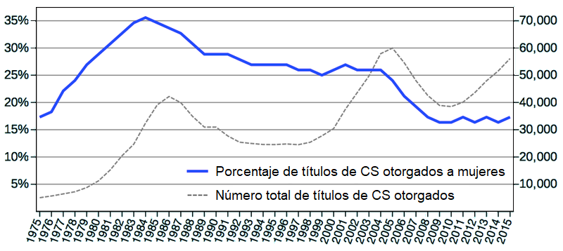

\begin{reviewer}
{Silvia Canelón}
{Yuriko Sosa y Yanina Bellini Saibene}
\end{reviewer}

Los/las estudiantes necesitan ánimo para enfrentar terreno desconocido,
así que este capítulo analiza maneras en las que el cuerpo docente puede motivarlos/las.
Y más importante,
el capítulo habla de cómo los/las docentes pueden desmotivarlos/as
y cómo evitarlo.

Nuestro punto de partida es la diferencia entre
motivación extrínseca,
lo que sentimos cuando hacemos algo para evitar un castigo o ganarnos una recompensa,
y motivación intrínseca,
lo que sentimos cuando conseguimos algo que nos satisface personalmente.
Ambos tipos de motivación nos afectan en la mayoría de las situaciones---por ejemplo,
las personas enseñan porque les gusta y porque les pagan---; pero
aprendemos mejor cuando estamos motivados/as intrínsecamente<cite>Wlod2017</cite>.
De acuerdo a la
[teoría de la autodeterminación][k0060],
los tres impulsores de motivación intrínseca son:

Competencia:
: la sensación de que sabes lo que haces. 

Autonomía:
: la sensación de estar en control de tu propio destino.

Relación:
: la sensación de estar conectado/a con las demás personas.

Una lección bien diseñada fomenta estos tres impulsores.
Por ejemplo,
un ejercicio de programación puede permitir que los/las estudiantes
practiquen con las herramientas que necesitan usar para resolver un problema mayor (competencia),
aborden las partes del problema en el orden que quieran (autonomía),
y conversen con sus pares (relación).

> ### El problema de las notas
>
>   Yo nunca he tenido un público en mi vida. Mi público es una rúbrica. 
>   -- citado por [Matt Tierney][tierney-matt]
>
> Las calificaciones y la forma en que distorsionan el aprendizaje se utilizan con frecuencia como ejemplo de motivación extrínseca,
> pero como observa <cite>Mill2016a</cite>,
> no van a desaparecer en el corto plazo,
> así que no tiene sentido intentar construir un sistema que las ignore.
> En lugar de eso, <cite>Lang2013</cite> explora cómo los cursos que enfatizan las calificaciones
> pueden incentivar a que los/las estudiantes hagan trampa
> y ofrece algunos consejos de cómo disminuir este efecto,
> mientras <cite>Covi2017</cite> observa el problema más grande de
> balancear la motivación intrínseca y extrínseca en la educación institucional,
> y el enfoque de [alineación constructiva][constructive-alignment]
> defendido en <cite>Bigg2011</cite> busca armonizar las actividades de aprendizaje con los resultados del aprendizaje.

<cite>Ambr2010</cite> contiene una lista de métodos basados en evidencia para motivar a los/las estudiantes.
Ninguno es sorprendente, es
difícil imaginar a alguien diciendo que *no debemos* identificar y recompensar lo que valoramos, pero
es útil revisar lecciones para asegurarnos de que estén haciendo al menos algunas de estas cosas.
Una estrategia en particular que me gusta es
que los/las estudiantes que hayan luchado y tenido éxito
se acerquen y cuenten sus historias al resto de la clase.
Es más probable que tus estudiantes crean historias de personas parecidas a ellos/as <cite>Mill2016a</cite>
y, además, quienes ya han pasado por tu curso
siempre tendrán consejos en los que nunca hubieras pensado.

> ### No solo para estudiantes
>
> Las discusiones sobre motivación en educación con frecuencia pasan
> por alto la necesidad de motivar al *docente*.
> Los/las estudiantes responden al entusiasmo de su docente,
> y los/las docentes (particularmente si el trabajo es voluntario) necesitan valorar un tema para seguir enseñándolo.
> Esta es otra razón poderosa para co-enseñar (<a section="classroom-together"/>):
> al igual que tener a alguien que te acompañe a correr hace que sea más probable que sigas corriendo,
> tener una persona con quien enseñar ayuda a ponerte en marcha
> esos días que tienes gripe
> y la lámpara del proyector se ha roto
> y nadie sabe donde conseguir un reemplazo
> y, ¿de verdad están construyendo *otra vez*?

Los/las docentes también pueden hacer otras cosas positivas.
<cite>Bark2014</cite> registró tres cosas que impulsaron la retención para todos los/las estudiantes:
tareas significativas,
interacción del cuerpo docente con los/las estudiantes
y colaboración entre estudiantes en las tareas.
El ritmo y la carga de trabajo relativo a las expectativas también fueron impulsores significativos,
pero principalmente para estudiantes varones.
Las cuestiones que *no* impulsaron la retención
fueron: interactuar con asistentes de la clase
e interactuar con compañeros/as en actividades extracurriculares.
Estos resultados parecen obvios,
pero lo contrario también parecería obvio:
si el estudio hubiera concluido que compartir actividades extracurriculares
impulsa la retención,
también pensaríamos que tiene sentido.
Notablemente,
replicar en línea a dos de los cuatro impulsores de retención (interacción  con el cuerpo docente y colaboración entre estudiantes)
toma un esfuerzo adicional (<a section="online"/>).

## Tareas auténticas {#motivation-authentic}

Como Dylan Wiliam menciona en <cite>Hend2017</cite>,
la motivación no siempre conduce al logro
pero el logro casi siempre conduce a la motivación:
el éxito de los/las estudiantes les motiva mucho más a que les digan lo geniales que son.
Podemos usar esta idea en la docencia
creando una cuadrícula cuyos ejes son "tiempo medio para dominar"
y "utilidad una vez dominado" (<a figure="f:motivation-what"/>).

<figure id="f:motivation-what">
  
  <figcaption>Qué enseñar</figcaption>
</figure>

Las cosas que se dominan rápido y son útiles de inmediato se deben enseñar primero,
incluso si no se consideran fundamentales para personas que ya son practicantes competentes,
porque unas pocas victorias iniciales fortalecerán la confianza de tus estudiantes en sí mismos/as y en su docente.
Por el contrario.
aquellas cosas que son difíciles de aprender y no son útiles a tus estudiantes en su etapa actual de desarrollo
deben omitirse por completo,
mientras que los temas en la diagonal se deben sopesar entre sí.

> ### ¿Útil para quién?
>
> Si alguien quiere construir sitios web,
> conceptos de ciencia de computación fundamentales como recursión y computabilidad
> pueden habitar la esquina inferior derecha de esta cuadrícula.
> Eso no quiere decir que no vale la pena aprenderlos,
> pero si nuestro objetivo es motivar a las personas,
> pueden y deben ser enseñados diferidos.
> Por lo contrario,
> un/a estudiante de último año tomando un clase de programación para estimular su mente
> puede preferir explorar estas grandes ideas en vez de hacer algo práctico.
> Cuando estás creando tu cuadrícula,
> deberías hacerlo con tus personas tipo en mente
> <a section="process-personas"/>).
> Si los temas se ordenan en lugares muy diferentes para diferentes personas tipo,
> deberías pensar en crear cursos diferentes.

Un ejemplo bien estudiado de priorizar lo que es útil
sin sacrificar lo que es fundamental
es el enfoque de computación de medios desarrollado en Georgia Tech <cite>Guzd2013</cite>.
En vez de imprimir "hola mundo" o sumar los primeros diez enteros,
el primer programa de un/a estudiante podría ser abrir una imagen,
cambiarle el tamaño para crear una versión miniatura
y guardar el resultado.
Esta es una tarea auténtica;
es decir, algo que los/las estudiantes creen que harían en la vida real.
También tiene un artefacto tangible:
si la imagen sale del tamaño incorrecto,
los/las estudiantes tienen algo a mano que puede guiar su depuración.
<cite>Lee2013</cite> describe una adaptación de este enfoque de *Python* a *MATLAB*,
mientras que otras personas están construyendo cursos similares acerca de ciencia de datos, procesamiento de imágenes
y biología <cite>Dahl2018,Meys2018,Ritz2018</cite>

Siempre habrá tensión entre darle a tus estudiantes problemas auténticos
y ejercitar las habilidades individuales que requieren para resolver esos problemas:
al fin y al cabo,
los/las programadores no contestan preguntas de opción múltiple en el trabajo
como tampoco los/las músicos/as tocan escalas una y otra vez en frente de un público.
Conseguir el balance es difícil,
pero un primer paso es eliminar cualquier cosa arbitraria o sin sentido.
Por ejemplo,
los ejemplos de programación no deben utilizar variables llamadas `foo` y `bar`,
y si vas a hacer que tus estudiantes ordenen una lista,
haz una lista de canciones en vez de cadenas de caracteres como "aaa" y "bbb".

## Desmotivación {#motivation-demotivation}

> Las mujeres no abandonan la computación porque no saben cómo es;
> se van porque *sí saben*. 
> --- atribuido a varias personas

Si enseñas en un ambiente free-range
probablemente tus estudiantes son voluntarios/as
y probablemente quieren estar en tu clase.
Por lo tanto, motivarlos/as es menos preocupante que desmotivarlos/as.
Desafortunadamente,
es fácil desmotivar a las personas accidentalmente.
Por ejemplo,
<cite>Cher2009</cite> reportaron cuatro estudios mostrando que
hay pistas ambientales sutiles con una diferencia medible en el interés que las personas de diferentes géneros tienen en la computación:
cambiar los objetos en un aula de ciencias de la computación de aquellos considerados estereotipados de ciencias de la computación
(p.ej. afiches y videojuegos de Star Trek)
a objetos no considerados estereotipados (p.ej. afiches de la naturaleza y guías telefónicas)
impulsó el interés de estudiantes universitarias al nivel de sus pares masculinos.
De manera similar,
<cite>Gauc2011</cite> reporta tres de estudios que muestran que
la redacción de género comúnmente empleada en materiales de contratación laboral
puede mantener desigualdad de género en ocupaciones tradicionalmente dominadas por hombres.

Hay tres desmotivadores principales para estudiantes adultos/as:

Imprevisibilidad:
: desmotiva a las personas porque
  si no hay una conexión confiable entre lo que hacen y el resultado que logran,
  no hay razón para que intenten hacer nada.

Indiferencia:
: desmotiva porque
  los/las estudiantes que creen que el/la docente o el sistema educativo no se preocupan por ellos/as,
  no se van a preocupar por aprender la clase.

Injusticia:
: desmotiva a las personas desfavorecidas por razones obvias.
  Lo sorprendente es que también desmotiva a las personas que se benefician de la injusticia:
  consciente o inconscientemente,
  les preocupa que
  algun dia se encuentren en el grupo desfavorecido <cite>Wilk2011</cite>.

En situaciones extremas,
los/las estudiantes pueden desarrollar indefensión aprendida:
si están repetidamente sometidos/as a comentarios negativos en una situación que no pueden cambiar,
pueden aprender a ni siquiera intentar cambiar aquello que sí podrían.

Una de las maneras más rápidas y seguras de desmotivar estudiantes es
usar un lenguaje que sugiera que algunas personas son programadoras naturales y otras no.
Guzdial lo ha llamado
[el mito más grande de enseñar ciencias de la computación][guzdial-myths],
y <cite>Pati2016</cite> respaldó esto mostrando que
la gente ve evidencia de un "gen *geek*" donde no existe uno.
Analizaron distribuciones de calificaciones de 778 cursos universitarios y encontraron que solo 5,8% mostraba signos
de ser multimodal,
es decir, solo una clase de veinte mostró signos de tener dos poblaciones distintas de estudiantes.
Luego le mostraron a 53 profesores/as de ciencias de la computación histogramas de distribuciones ambiguas de calificaciones;
aquellos/as que creían que algunas personas tienen una predisposición innata a ser mejores en las ciencias de la computación
eran más propensos/as de verlas como bimodal que aquellos/as que no.

Estas creencias son importantes porque los/las docentes actúan sobre ellas <cite>Brop1983</cite>.
Si un/a docente cree que es probable que a un/a estudiante le vaya bien
naturalmente (a menudo inconscientemente) se enfoca en ese/a estudiante,
que luego cumple con las expectativas debido a la mayor atención,
lo que a su vez parece confirmar la creencia del docente.
Lamentablemente,
hay pocas señales de que la mera evidencia del tipo presentado en <cite>Pati2016</cite>
es suficiente para romper este círculo vicioso…

Aquí hay algunas otras cosas específicas que desmotivarán a tus estudiantes:

Una actitud de superioridad moral o desdeñosa
: de un/una docente o un/una compañero/a estudiante.

Decirles que sus habilidades existentes son tonterías.
: Las personas que son usuarias de Unix se burlan de las que usan Windows,
  los/las programadores/as de todo tipo hacen chistes sobre Excel
  y sin importar qué entorno de desarrollo de aplicación web conoces,
  algún/a programador/a te dirá que está desactualizado.
  Seguramente, tus estudiantes invirtieron mucho tiempo y esfuerzo para adquirir las habilidades que tienen;
  menospreciarlas es una buena manera de garantizar que
  no escucharán nada más de lo que tengas que decir.

Sumergirse en discusiones técnicas complejas o detalladas
: con los estudiantes más avanzados de la clase.

Fingir que sabes más de lo que sabes.
: Los/las estudiantes confiarán más en ti si hablas con franqueza de los límites de tu conocimiento
  y será más probable que hagan preguntas y pidan ayuda.

Usar la letra S ("solo") o fingiendo sorpresa.
: Como se discutió en el <a section="memory"/>,
  decir cosas como "no puedo creer que no sabes X" o "¿nunca has oído de Y?"
  le señala a tus estudiantes que
  piensas que su problema es trivial
  y que deben ser estúpidos/as por no poder resolverlo.

Dolores de cabeza de instalación de software.
: El primer contacto de las personas con programación o con herramientas nuevas de programación suele a ser desmoralizador
  y creer que algo es difícil de aprender es una profecía autocumplida.
  No es solamente el tiempo que toma en configurar
  o el sentimiento de que es injusto tener que depurar algo que depende
  del conocimiento que aún no tienen.
  El problema real es que con cada falla refuerzan su creencia de que
  tendrán una mejor chance de cumplir con la fecha límite del próximo jueves
  si siguen haciendo las cosas como siempre las han hecho.

Es incluso más fácil desmotivar a las personas en línea que en persona,
pero ahora hay estrategias basadas en evidencia para lidiar con esto.
<cite>Ford2016</cite> encontraron que las siguientes cinco barreras para contribuir en [Stack Overflow][stack-overflow]
sos consideradas significativamente más problemáticas por las mujeres que por los hombres:
falta de conocimiento de las características del sitio,
sentirse incapaz de contestar preguntas,
una comunidad de tamaño intimidante,
malestar interactuando con personas extrañas o dependiendo de ellas,
y la sensación de que buscar cosas en línea no es "trabajo real."
El miedo de comentarios negativos no llegó a esta lista,
pero de seguro sería la próxima razón agregada, si los autores de la investigación no fueran tan estrictos con sus límites estadísticos.
Todos estos factores pueden y deben abordarse tanto en persona como en línea
usando métodos como los de la <a section="motivation-inclusivity"/>,
y hacerlo mejora los resultados para todas las personas <cite>Sved2016</cite>.

> ### Falla productiva y privilegio
>
> Algunos trabajos recientes han explorado la falla productiva:
> deliberadamente se les da a estudiantes problemas que no pueden ser resueltos con el conocimiento que tienen, por lo que
> deben explorar y adquirir información nueva para poder avanzar <cite>Kapu2016</cite>.
> La falla productiva recuerda superficialmente al mantra del sector tecnológico "fracasa rápido, fracasa con frecuencia"
> pero este último es más un indicador de privilegio que de comprensión.
> Las personas solo pueden darse el lujo de celebrar el fracaso si es seguro que tendrán una oportunidad de volver a intentarlo;
> muchos de tus estudiantes,
> y muchas personas de grupos marginados o desfavorecidos,
> no pueden estar seguros/as de esto,
> y asumir que la falla es una opción es una buena manera de desmotivarlos/as.

### Síndrome del impostor/a

El síndrome del impostor/a
es la creencia de que tus logros son producto de la casualidad o la suerte
y viene con el miedo de que alguien finalmente se dará cuenta.
Es muy común entre personas triunfadoras que realizan un trabajo visible públicamente,
pero afecta de manera desproporcionada a miembros de grupos subrepresentados:
como se discutió en la <a section="pck-now"/>,
<cite>Wilc2018</cite> encontró que
las estudiantes mujeres expuestas previamente a la computación superaron a sus compañeros en todas las áreas en los cursos de introducción a la programación
pero constantemente tenían menos confianza en sus habilidades,
en parte porque la sociedad sigue señalando en maneras sutiles y *no tan sutiles*
que realmente no pertenecen al mundo de la computación.

Las aulas tradicionales pueden alimentar al síndrome del impostor/a.
Las tareas escolares se realizan con frecuencia de manera individual o en grupos pequeños,
pero los resultados se comparten y critican públicamente.
Como resultado,
raramente vemos cómo el resto lucha por resolver y terminar su trabajo,
lo que puede alimentar la creencia de que la tarea es fácil para todas las otras personas.
Las personas que pertenencen a grupos subrepresentados que ya sienten una presión adicional para demostrar su valía
pueden ser particularmente afectadas.

La iniciativa Ada (*Ada Initiative*) ha creado unas 
[guías][impostor-syndrome]
para luchar con tu propio síndrome del impostor/a,
que incluyen:

Habla del problema con personas de tu confianza.
: Cuando escuchas de otras personas que el síndrome del impostor/a es un problema común,
  se vuelve más difícil creer que tus sentimientos de fraude son reales.

Ve a una sesión en persona sobre el síndrome del impostor/a.
: No hay nada como estar en un salón lleno de personas que respetas
  y descubrir que el 90% de ellas tienen síndrome del impostor/a.

Cuida tus palabras, porque influyen tu forma de pensar.
: Decir cosas como,
  "No soy experto/a en esto, pero…"
  resta valor del conocimiento que realmente posees.

Enseña a otras personas de tu campo.
: Ganarás confianza en tu propio conocimiento y habilidad
  y ayudarás a otros a evitar parte del síndrome del impostor/a en multitudes.

Haz preguntas.
: Hacer preguntas puede ser intimidante si piensas que debes saber la respuesta,
    pero obtener respuestas elimina la prolongada agonía de la incertidumbre y el miedo al fracaso.

Construye alianzas.
: Tranquiliza y fortalece a tus amistades,
  quienes te reconfortan y fortalecen.
  (y si no lo hacen, tal vez quieras pensar en conseguir amistades nuevas…)

Sé dueño/a de tus logros.
: Sigue registrando y revisando activamente lo que has hecho,
  lo que has construido,
  y los éxitos que has tenido.

Como docente,
puedes ayudar a las personas con su síndrome del impostor/a
compartiendo relatos de errores que has cometido o de cosas que te costaron aprender.
Esto le asegura a la clase que está bien encontrar que algunos temas son difíciles.
Ser abierto/a con el grupo también genera confianza
y les da confianza para hacer preguntas.
(La programación en vivo es excelente para esto:
como se indicó en la <a section="performance-live"/>,
tus errores tipográficos le muestran a tu clase que eres un ser humano.)
Las evaluaciones formativas frecuentes también ayudan,
en particular si tus estudiantes te ven ajustando tanto lo que enseñas como tu velocidad
en base a sus resultados.

### Mentalidad y amenaza de estereotipo

Carol Dweck y otros
han estudiado las diferencias de la mentalidad fija
y la mentalidad de crecimiento en resultados de aprendizaje.
Si la gente cree que la competencia en alguna área es intrínseca
(es decir, que tienes "el gen" para ella o no),
*a todos/as* les va peor,
incluyendo a quienes supuestamente están en ventaja.
La razón es que si a alguien no le va bien al principio,
asume que les falta esa aptitud,
lo que predispone su rendimiento en el futuro.
Por otro lado,
si la gente cree que una habilidad se aprende y se puede mejorar,
en promedio, les irá mejor.

[Se cuestiona][growth-mindset-critique]
que la mentalidad del crecimiento ha sido sobredimensionada,
o que traducir las investigaciones al respecto a la práctica
es mucho más difícil
de lo que sus defensores más entusiastas han insinuado <cite>Sisk2018</cite>.
Sin embargo,
sí parece que los/las estudiantes de un nivel socioeconómico bajo o que están en riesgo académico podrían beneficiarse de las intervenciones de mentalidad de crecimiento.

Otro efecto discutido ampliamente es la amenaza de estereotipo <cite>Stee2011</cite>.
Recordar a las personas de estereotipos negativos,
incluso en formas sutiles,
puede hacerlas sentirse ansiosas por el riesgo de confirmar esos estereotipos,
lo que a su vez puede reducir su rendimiento.
Otra vez,
hay preocupación sobre
[la replicabilidad de los estudios claves][stereotype-threat-critique],
y el problema se complica aún más por el hecho de que el término se ha utilizado de muchas formas <cite>Shap2007</cite>,
pero nadie argumentaría que mencionar estereotipos en clase ayudaría a los/las estudiantes.

## Accesibilidad {#motivation-accessibility}

Colocar las lecciones y los ejercicios fuera del alcance de alguien es tan desmotivador como parece,
y es muy fácil hacerlo sin darse cuenta.
Por ejemplo,
las primeras lecciones de programación en línea que escribí tenían una transcripción de la narración
al lado de las diapositivas,
pero no incluían el código fuente:
eso estaba en capturas de pantalla de diapositivas de PowerPoint.
Alguien utilizando un [lector de pantalla][k0068]
podía entonces oír lo que se decía sobre el programa,
pero no sabía qué era realmente el programa.
No siempre es factible adaptarse a las necesidades de cada estudiante,
pero agregar títulos de descripción a las imágenes
y hacer que los controles de navegación sean accesible a personas que no pueden usar el mouse
puede hacer una gran diferencia.

> ### Rampas en las veredas
>
> Hacer que el material sea accesible ayuda a todas las personas,
> no solamente a las personas con dificultades.
> [Las rampas][k0069]---los pequeños planos inclinados que unen una acera a la calle---
> fueron creados originalmente para facilitar el movimiento de personas con discapacidad física,
> pero resultaron ser igual de útiles para personas con cochecitos y carritos de supermercado.
> De forma similar,
> subtitular imágenes no solamente ayuda a las personas con discapacidad visual:
> también hace que las imágenes sean más fáciles de encontrar e indexar para los motores de búsqueda.

El primer paso y el más importante para hacer lecciones accesibles es
involucrar a las personas con discapacidades en el proceso de toma de decisiones:
el eslogan [nihil de nobis, sine nobis][nihil-de-nobis-sine-nobis]
(literalmente, "nada sobre nosotros sin nosotros")
precede a los derechos de accesibilidad,
pero siempre es un punto adecuado de partida.
Algunas recomendaciones específicas son:

Descubre lo que debes hacer.
: Cada uno de [estos afiches][uk-gov-accessibility-es]
  ofrece lo que debe y no debe hacerse para personas con autismo,
  usuarios/as de lectores de pantalla,
  y personas con baja visión,
  discapacidades físicas o motoras,
  ejercicios de escucha
  y dislexia.

No hagas todo a la vez.
: Las mejoras descriptas en el punto anterior pueden parecer bastante abrumadoras,
  así que haz un cambio a la vez.

Primero haz las cosas fáciles.
: El tamaño de fuente,
  usar un micrófono de clip para que las personas te puedan oír más fácilmente,
  y revisar tu selección de colores, son buenos puntos de partida.

Revisa qué tan bien lo estás haciendo.
: Sitios como [WebAIM][webaim] permiten que revises
  qué tan accesibles son tus materiales en línea para usuarios/as con discapacidad visual.

<cite>Coom2012,Burg2015</cite> son buenas guías de diseño visual para la accesibilidad.
Sus recomendaciones incluyen:

Asigna formato a tus documentos con encabezados reales y otros puntos de referencias
: en vez de simplemente cambiar los tamaños y estilos de fuente.

Evita usar solamente el color para transmitir significado en texto o gráficos.
: En su lugar, use el color en combinación con diferentes patrones de rayado cruzado
  (que también hace que el material sea comprensible cuando se imprime en blanco y negro).

Elimina elementos innecesarios
: en lugar de hacerlos invisibles,
  porque los lectores de pantalla los leerán igualmente.

Permite el propio-ritmo y la repetición
: para las personas con problemas de lectura o audición.

Incluye narración de la acción de pantalla en los videos
: (y habla mientras escribes cuando programas en vivo).

### Cucharas

En el 2003,
Christine Miserandino comenzó a usar las [cucharas][spoons]
como una forma de explicar cómo es vivir con una enfermedad crónica.
Las personas sanas comienzan cada día con una cantidad ilimitada de cucharas,
pero aquellas con lupus u otras condiciones debilitantes solo tienen unas pocas,
y cada cosa que hacen les cuesta una.
¿Levantarse de la cama?
Esa es una cuchara.
¿Preparar una comida?
Esa es otra cuchara, y pronto se te acaban.

> No puedes ni siquiera ponerte la ropa cuando estás enfermo/a…
> si ese día mis manos duelen, los botones están fuera de discusión.
> Si tengo moretones,
> necesito usar mangas largas,
> y si tengo fiebre necesito un abrigo para mantenerme abrigado/a, y así sucesivamente.
> Si se me cae el cabello necesito pasar más tiempo para lucir presentable,
> y luego tienes que tomar en cuenta otros 5 minutos por sentirme mal
> de que te tomó 2 horas hacer todo esto.

Como [Elizabeth Patitsas ha argumentado][patitsas-essay-spoons],
las personas que tienen muchas cucharas pueden acumular más,
pero las personas cuya cantidad es limitada pueden tener dificultades para salir adelante.
Al diseñar clases y ejercicios,
recuerda que algunos/as de tus estudiantes pueden tener obstáculos físicos o mentales que no son obvios.
En caso de duda, pregunta:
es casi seguro que tengan más experiencia con lo que funciona y lo que no que cualquier otra persona.

## Inclusión {#motivation-inclusivity}

La inclusión es una política para
incluir a las personas que de otro modo pueden quedar excluidas o marginadas.
En la computación,
requiere hacer un esfuerzo positivo para tratar mejor y generar un ambiente amigable y seguro para las mujeres,
grupos raciales o étnicos subrepresentados,
personas con diversas orientaciones sexuales,
ancianos/as,
personas con dificultades físicas,
personas que estuvieron encarceladas,
los/las desfavorecidos/as económicamente,
y todas las demás personas que no encajen en el grupo demográfico de hombres blancos/asiáticos prósperos de Silicon Valley.
<a figure="f:motivation-women-in-cs"/> (de [NPR][npr])
ilustra gráficamente los efectos de la cultura excluyente hacia las mujeres en la computación.

<figure id="f:motivation-women-in-cs">
  
  <figcaption>Estudiantes universitarias de ciencias de la computación en los EE.UU.</figcaption>
</figure>

<cite>Lee2017</cite> es una guía breve y práctica de cómo hacer esto con referencias a la literatura de investigación.
Las prácticas que describe ayudan a estudiantes que pertenecen a uno o más grupos marginados o excluidos,
pero también ayudan a motivar a todas las demás personas.
Están redactadas en términos de cursos a largo plazo,
pero muchas pueden ser aplicadas en talleres y otros ambientes free-range:

Pide a tus estudiantes que te envíen un correo electrónico antes del taller
: para explicar cómo creen que el entrenamiento puede ayudar a que logren sus metas.

Revisa tus notas
: para, por ejemplo, asegurarte de que sean libres de pronombres y marcas de género e incluyan nombres diversos culturalmente.

Enfatiza que lo que importa es la velocidad a la que están aprendiendo,
: no las ventajas o desventajas que tenían cuando comenzaron.

Fomenta la programación en pareja,
: pero demuéstralo primero para que los/las estudiantes entiendan las funciones de quien conduce y quien navega.

Mitiga activamente el comportamiento que puede resultar intimidante para algunos/as estudiantes
: por ejemplo el uso de jerga o "preguntas" que se hacen para mostrar conocimiento.

Una forma de apoyar a estudiantes de grupos marginados es
que las personas se inscriban en los talleres en grupos en lugar de individualmente.
De esa manera,
todas las personas de la sala saben por adelantado que estarán con personas en las que confían,
lo que aumenta la probabilidad de que realmente vengan.
También ayuda después del taller:
si las personas vienen con sus amistades o colegas,
pueden trabajar en conjunto para utilizar lo que aprendieron.

Lo más fundamental es que quienes diseñen lecciones
consideren la situación completa de cada persona.
Por ejemplo,
<cite>DiSa2014a</cite> encontró que el 65% de los hombres afroamericanos en un programa de prueba de juegos estudiaron computación,
en parte porque el aspecto de juego del programa era algo que sus compañeros respetaban.
<cite>Lach2018</cite> exploró dos estrategias generales para crear contenido inclusivo y los riesgos asociados con ellas:

{Representación comunitaria:}
: resalta las identidades sociales, las historias y las redes comunitarias de los/las estudiantes
  utilizando mentores/as extracurriculares o modelos a seguir de sus vecindarios,
  o actividades que utilizan narrativas e historias comunitarias
  como base para un proyecto de computación.
  El riesgo más grande de este enfoque es la poca profundidad,
  p.ej. utilizar computadoras para construir presentaciones con diapositivas en lugar de hacer cualquier actividad real de computación.

{Integración computacional:}
: incorpora ideas de la comunidad de los/las estudiantes,
  tales como reproducir diseños de gráficos de pueblos originarios en un ambiente de programación visual.
  El riesgo más grande aquí es la apropiación cultural,
  p.ej. utilizar prácticas sin reconocer los orígenes.

En caso de duda,
pregunta a tus estudiantes e integrantes de la comunidad qué creen que deberías hacer.
Volvemos a esto en el <a section="community"/>.

> ### El Código de Conducta como accesibilidad
>
> Dijimos en la <a section="classroom-coc"/> que las clases deberían hacer cumplir
> un Código de Conducta como el del <a section="conduct"/>.
> Esta es una forma de accesibilidad:
> mientras que los subtítulos hacen que el video sea accesible a personas con discapacidades auditivas,
> un Código de Conducta hace que las lecciones sean accesibles a personas que de otro modo serían marginadas.

### Pasando el modelo del déficit

Dependiendo a quién le creas,
solo entre el 12 y 18% de las personas que obtienen un título en ciencias de la computación son mujeres.
Esta cifra es menos de la mitad del porcentaje observado a mediados de la década de 1980
(<a figure="f:motivation-gender"/>, de <cite>Robe2017</cite>).
Los países occidentales son los únicos que tienen un porcentaje tan bajo de mujeres en computación;
las mujeres siguen siendo a menudo entre el 30 y el 40% de las estudiantes de ciencias de la computación en el resto del mundo <cite>Galp2002,Varm2015</cite>.

<figure id="f:motivation-gender">
  
  <figcaption>Títulos otorgados y matrícula femenina</figcaption>
</figure>

Dado que es poco probable que las mujeres hayan cambiado drásticamente en los últimos 30 años,
tenemos que buscar causas estructurales para comprender qué salió mal y cómo solucionarlo.
Una explicación es la manera en que las computadoras domésticas se comercializaron como "juguetes para niños" a partir de la década de 1980 <cite>Marg2003</cite>;
otra es la manera en la que los departamentos de ciencias de la computación respondieron al crecimiento explosivo de la matrícula
en la década de 1980 y nuevamente en la de 2000
cambiando los requisitos de admisión <cite>Robe2017</cite>.
Ninguno de estos factores puede parecer dramático para las personas que se ven afectadas por ellos,
pero actúan como el goteo constante del agua sobre una piedra:
a medida que pasa el tiempo, erosionan la motivación y, con ella, la participación.

El primer paso y el más importante para solucionar esto es
dejar de pensar en términos de una "tubería con fugas" <cite>Mill2015</cite>.
Más generalmente,
tenemos que superar el modelo deficitario,
es decir, dejar de pensar que las personas que son parte de un grupo subrepresentado carecen de algo
y por lo tanto son responsables de no salir adelante.
Creer esto coloca la carga en las personas que ya tienen que hacer un trabajo adicional para superar las desigualdades estructurales
y (no por casualidad) da a quienes se benefician de los acuerdos actuales
una excusa para no mirarse con mucho cuidado.

> ### Reescritura de la historia
>
> <cite>Abba2012</cite> describe las carreras y logros de
> las mujeres que le dieron forma a la historia temprana de la computación,
> pero que con demasiada frecuencia han sido eliminadas de ella;
> <cite>Ensm2003,Ensm2012</cite> describe cómo la programación pasó de ser una profesión femenina a una masculina en la década de 1960,
> mientras <cite>Hick2018</cite> examina cómo Gran Bretaña perdió su dominio inicial en la computación
> discriminando sistemáticamente en contra de sus trabajadores más cualificados:
> las mujeres.
> (Mira <cite>Milt2018</cite> para obtener una reseña de los tres libros.)
> Hablar de esta historia hace que algunos hombres en computación se sientan incómodos;
> en mi opinión,
> esa es una buena razón para hacerlo.

La misoginia en los videojuegos,
el uso de "encaje cultural" en la contratación para excusar prejuicios conscientes o inconscientes,
una cultura de silencio en torno al acoso
y la creciente desigualdad en la sociedad que produce privilegios preparatorios (<a section="classroom-mixed"/>)
no son culpa de una persona en particular,
pero solucionarlos es responsabilidad de todos/as.
Como docente,
tienes más poder que la mayoría;
[este taller][frameshift-workshop]
tiene excelentes consejos prácticos sobre cómo ser un/a buen/a aliado/a,
y su consejo probablemente es más importante que cualquier cosa que te enseñe este libro sobre la enseñanza.

## Ejercicios {#motivation-exercises}

### Tareas auténticas (parejas/15’) {.exercise}

1. En pares,
   enumeren media docena de cosas que hicieron esta semana que utilizan las habilidades que enseñan.

1. Coloquen sus artículos en una cuadrícula de 2x2 de "tiempo para dominar" y "utilidad".
   ¿En qué están de acuerdo y en qué en desacuerdo?

### Necesidades básicas (toda la clase/10’) {.exercise}

Paloma Medina identifica [seis necesidades básicas][biceps] para las personas en el trabajo:
pertenencia,
progreso,
elección,
igualdad,
previsibilidad
y significado.
Luego de leer las descripciones de cada una,
ordénalas de mayor a menor importancia para ti personalmente,
luego compara la clasificación con tus pares.
¿Cómo crees que tu clasificación se compara con la de tus estudiantes?

### Implementa una estrategia para la inclusión (individual/5’) {.exercise}

Escoje una actividad o cambio en práctica de <cite>Lee2017</cite> en la que te gustaría trabajar.
Pon un recordatorio en tu calendario de aquí a tres meses
para preguntarte si has hecho algo al respecto.

### Después de los hechos (piensa-empareja-comparte/20’) {.exercise}

1. Piensa en un curso que has tomado en el pasado
   e identifica una cosa que el/la docente hizo que te desmotivó.
   Toma notas de lo que se pudo hacer después para corregir la situación.

1. Emparéjate con tu vecino y compara las historias,
   y luego agrega tus comentarios a un conjunto de notas compartidas por toda la clase.

1. Revisa los comentarios en el conjunto de notas como grupo.
   Resalta y analiza algunas de las cosas que podrían haberse hecho de manera diferente.

1. ¿Crees que hacer esto te ayudará a manejar situaciones parecidas en el futuro?

### Camina la ruta (toda la clase/15’) {.exercise}

Encuentra el punto de partida de transporte público más cercano a tu edificio
y camina desde allí a tu oficina y luego al baño más cercano,
toma notas de las cosas que crees que serían difíciles para alguien con dificultades de movilidad.
Ahora toma prestada una silla de ruedas.
¿Qué tan completa fue tu lista de ejercicios?
¿Y te diste cuenta que la primera oración de este ejercicio asumía que podías caminar?

### ¿Quién decide? (toda la clase/15’) {.exercise}

En <cite>Litt2004</cite>,
Kenneth Wesson escribió,
"Si los/las niños/as de los barrios marginales pobres superaran sistemáticamente
a los/as niños/as de hogares suburbanos ricos en las pruebas estandarizadas,
¿alguien es lo suficientemente ingenuo como para creer que todavía insistiríamos en usar estas pruebas como indicadores de éxito?"
Lee [este artículo][nytimes-undiscovered]
de Cameron Cottrill
y luego describe un ejemplo de tu propia experiencia de evaluaciones "objetivas" que reforzaron el status quo.

### Estereotipos comunes (parejas/10’) {.exercise}

Algunas personas todavía dicen "Es tan simple que incluso tu abuela podría usarlo."
En parejas,
enumeren otras dos o tres frases que refuerzan estereotipos sobre la computación.

### No ser un idiota (individual/15’) {.exercise}

[Este artículo corto][open-source-not-jerk]
de Gary Bernhardt
reescribe un mensaje innecesariamente hostil para ser menos grosero.
Utilizándolo como un modelo,
encuentra algo desagradable en [Stack Overflow][stack-overflow] o en algún otro foro público de discusión.
y reescríbelo para que sea más inclusivo.

### Salvar las apariencias (individual/10’) {.exercise}

¿Alguno de tus posibles estudiantes se avergonzaría de admitir que
todavía no saben algunas de las cosas que quieres enseñar?
Si es así,
¿cómo puedes ayudarles a salvar las apariencias?

### Juguetes infantiles (toda la clase/15’) {.exercise}

<cite>Cutt2017</cite> encuestó a usuarios/as adultos/as de computadoras acerca de sus actividades infantiles.
Encontró que la correlación más fuerte entre la confianza y el uso de la computadora
se basaba en leer por uno/a mismo/a y jugar con juguetes de construcción como Lego que no tienen partes móviles.
Se realiza una encuesta a la clase para observar en qué otras actividades participan las personas. Luego,
se buscan estas actividades en línea.
¿Qué tan sesgadas con respecto al género son las descripciones y las propagandas para ellas?
¿Qué efecto crees que tiene esto?

### Accesibilidad de la lección (parejas/30’) {.exercise}

En parejas,
escojan una lección cuyos materiales están disponibles en línea
e independientemente asignen un puntaje a esos materiales de acuerdo a lo que se debe y no se debe hacer según
[estos afiches][uk-gov-accessibility-es].
¿En qué estuvieron de acuerdo tu pareja y tú?
¿En qué estuvieron en desacuerdo?
¿Qué tan bien fue la lección para cada una de las seis categorías de usuarios/as?

### Siguiendo el ciclo (grupos pequeños/15’) {.exercise}

<cite>Coco2018</cite> sigue un patrón deprimentemente común
en que las buenas intenciones se ven socavadas por
el liderazgo de una organización que no está dispuesta a cambiar realmente.
Trabajando en grupos de 4--6 personas,
escriban textos o correos electrónicos breves que imaginas que cada una de las partes involucradas enviaría a la otra
en cada etapa de este ciclo.

### ¿Qué es lo peor que podría pasar? (grupos pequeños/5’) {.exercise}

A través de los años,
se me ha incendiado un proyector,
una estudiante ha tenido un parto
y una pelea entre estudiantes estalló en clase.
Me he caído del escenario dos veces,
me he quedado dormido en una de mis propias charlas,
y he hecho muchos chistes que fracasaron.
En grupos pequeños,
hagan una lista de las peores cosas que les han pasado mientras enseñaban,
y luego compártanla con la clase.
Guarda la lista para recordarte más tarde que no importa qué tan mala sea la clase:
al menos nada de *eso* sucedió.

## Revisa

<figure id="f:motivation-concepts">
  
  <figcaption>Conceptos: Motivación</figcaption>
</figure>