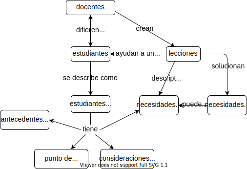

\begin{reviewer}
{Zulemma Bazurto}
{Roxana Villafañe y Natalia Morandeira}
\end{reviewer}

La mayoría de las personas diseñan lecciones de esta manera:

1. Alguien te pide que enseñes algo que sabes muy poco o que no has pensado en años.

1. Empiezas escribiendo diapositivas para explicar lo que sabes sobre el tema.

1. Después de dos o tres semanas,
   preparas una tarea basada en lo que has enseñado hasta ahora.

1. Repites el tercer paso varias veces.

1. Permaneces sin dormir hasta altas horas de la mañana
   para crear un examen final
   y te prometes que la próxima vez serás más organizado/a.

Un método más efectivo es similar en esencia a una práctica de programación
llamada desarrollo impulsado por pruebas (*Test Driver Development (TDD)* en inglés).
Los/las programadores/as que usan desarrollo impulsado por pruebas no escriben software
y luego prueban que funcione correctamente.
En su lugar,
escriben la prueba primero,
luego escriben suficiente software nuevo para que esas pruebas pasen.

Este método de programación funciona porque escribir pruebas obliga a
tener más precisión acerca de lo que están intentando lograr y cómo se ve "finalizado".
El desarrollo impulsado por pruebas también evita el pulido sin fin:
cuando pasan las pruebas, dejas de programar.
Finalmente,
esto reduce el riesgo de sesgo de confirmación:
una persona que aún no ha escrito un fragmento de software
será más objetiva que alguien que acaba de dedicar varias horas al trabajo duro y realmente quiere terminar.

Un método similar denominado reingeniería funciona muy bien para el diseño de lecciones.
Este método fue desarrollado en forma independiente en  <cite>Wigg2005,Bigg2011,Fink2013</cite> y está resumido en <cite>McTi2013</cite>.
En forma simplificada, sus pasos son:

1. Crea o recicla personas tipo (concepto discutido en la siguiente sección)
   para imaginar a quiénes estás intentando ayudar y qué les atraerá.

1. Haz una tormenta de ideas para tener una idea aproximada de lo que quieres cubrir,
   cómo lo vas a hacer,
   qué problemas o conceptos erróneos esperas encontrar,
   qué *no* no se va a incluir, etcétera.
   Dibujar mapas conceptuales puede ayudar mucho en esta etapa (<a section="memory-concept-maps"/>).

1. Crea una evaluación sumativa (<a section="models-formative-assessment"/>)
   para definir tu objetivo general.
   Dicha evaluación puede ser el examen final para un curso
   o el proyecto final para un taller de un día.
   Independientemente de su forma o extensión,
   la evaluación sumativa te mostrará lo lejos que esperas llegar
   más claramente que una lista puntual de objetivos.

1. Crea evaluaciones formativas,
   lo cual le dará a tus estudiantes una oportunidad para practicar lo que están aprendiendo.
   Las evaluaciones formativas también te dirán a ti (y a tus estudiantes) si están progresando
   y dónde deben centrar su atención.
   El mejor camino para hacer esto es listar los conocimientos y las habilidades
   involucradas en la evaluación sumativa que desarrollaste en el paso anterior:
   luego, deberás crear una evaluación formativa para cada ítem.

1. Ordena las evaluaciones formativas para crear un esquema del curso
   en función de su complejidad,
   sus dependencias,
   y cuán bien los temas motivarán a tus estudiantes (<a section="motivation-authentic"/>).

1. Escribe material para conseguir que tus estudiantes pasen de una evaluación formativa a la siguiente.
   Cada hora de instrucción debe constar de tres a cinco de estos episodios.

1. Escribe una descripción resumida del curso
   para ayudar a que tu público objetivo lo encuentre
   y averigue si es el curso adecuado.

Este método ayuda a mantener la enseñanza enfocada en sus objetivos.
También asegura que tus estudiantes no se enfrenten al final del curso
a nada para lo que no tengan preparación.

> ### Incentivos perversos
>
> La reingeniería *no* es lo mismo que enseñar para el examen.
> Cuando se usa reingeniería,
> los/las docentes establecen objetivos para ayudar en el diseño de sus lecciones:
> es posible que nunca den el examen final que preparan durante este proceso.
> En muchos sistemas escolares,
> por otro lado,
> una autoridad externa define los criterios de evaluación para todos/as los/las estudiantes,
> independientemente de sus situaciones individuales.
> Los resultados de esas evaluaciones sumativas afectan directamente los salarios y las promociones de los/las docentes,
> lo que significa que el plantel docente tiene un incentivo para que sus estudiantes pasen las pruebas, y no en ayudarles a aprender.
>
> <cite>Gree2014</cite> argumenta que,
> si bien enfocarse en las evaluaciones y la medición es atractivo para quienes tienen el poder de establecer las pruebas,
> es poco probable mejorar así los resultados del curso---salvo que las evaluaciones se acompañen
> con apoyo para que los/las docentes realicen mejoras basadas en los resultados de las pruebas.
> Sin embargo, este tipo de apoyo no suele ocurrir ya que
> las grandes organizaciones usualmente valoran la uniformidad por sobre la productividad  <cite>Scot1998</cite>.

El diseño inverso (o diseño en retrospectiva) se describe como una secuencia,
pero casi nunca se hace de esa manera.
Podemos,
por ejemplo, cambiar nuestra opinión acerca de lo que queremos enseñar
en base a algo que se nos ocurre mientras estamos escribiendo preguntas de opción múltiple,
o re-evaluar a quién estamos intentando ayudar una vez que tengamos un esqueleto de la lección.
Sin embargo,
las notas que elaboremos deben presentar las tareas desarrolladas en el orden descripto anteriormente,
para que quien tenga que usar o mantener la lección pueda seguir nuestros razonamientos <cite>Parn1986</cite>.

## Personas tipo {#process-personas}

El primer paso en el proceso de diseño inverso es averiguar quién es tu público.
Una manera para hacer esto es escribir dos o tres
personas tipo
como los de la <a section="intro-audience"/>.
Esta técnica es tomada de diseñadores/as de experiencia de usuario/a,
quienes crean perfiles breves de usuarios/as típicos/as
para ayudarse a pensar en su público.
Una persona tipo consiste en:

1. antecedentes generales de la persona;

1. lo que ya sabe;

1. lo que quiere hacer;
   y

1. cualquier necesidad especial que tenga.

Las personas en la <a section="intro-audience"/> tienen los cuatro puntos listados anteriormente,
junto con un breve resumen de cómo este libro las ayudará.
Una persona tipo para un grupo de voluntarios/as que realiza talleres de *Python* los fines de semana sería:

1. Jorge se acaba de mudar de Costa Rica a Canadá para estudiar ingeniería agrícola.
   Se ha unido al equipo de fútbol de la universidad
   y espera aprender a jugar hockey sobre hielo.

1. Aparte de usar Excel, Word e internet,
   la experiencia previa más significativa de Jorge con computadoras
   es ayudar a su hermana a construir un sitio en WordPress
   para su negocio familiar.

1. Jorge quiere medir las propiedades del suelo en granjas cercanas
   usando un dispositivo de mano que envía datos a su computadora.
   Por el momento, Jorge tiene que abrir cada archivo de datos en Excel,
   eliminar la primera y la última columna
   y calcular algunas estadísticas de los datos restantes.
   Recopilará al menos 600 mediciones en los próximos meses
   y realmente no quiere tener que hacer estos pasos a mano mes a mes.

1. Jorge puede leer en inglés,
   pero a veces le cuesta sostener una conversación hablada que involucre mucha jerga.

En lugar de escribir nuevas personas tipo para cada lección o curso,
los/las docentes usualmente crean y comparten una media docena de personas tipo,
que cubren a todas las personas a las que probablemente enseñan.
Luego, eligen a algunas de esas personas tipo para describir al público de un material en particular.
Las personas tipo utilizadas de esta manera se convierten en un atajo conveniente para los problemas de diseño:
al hablar entre docentes,
se pueden pensar en términos del estilo
"¿Jorge entendería por qué estamos haciendo esto?"
o
"¿Qué problemas de instalación enfrentaría Jorge?"

> ### Sus metas, no las tuyas
>
> Las personas tipo deberían siempre describir lo que cada estudiante quiere hacer
> en lugar de lo que tú crees que necesitan.
> Pregúntate lo que tus estudiantes están buscando en línea;
> probablemente no incluirá jerga que no conocen aún,
> así que parte de lo que tienes que hacer al diseñar lecciones es
> descubrir cómo hacer que tu curso sea visible y pueda ser encontrado por tu público.

## Objetivos de aprendizaje {#process-objectives}

Las evaluaciones formativas y sumativas ayudan a los/las docentes a descubrir qué van a enseñar,
pero comunicarle eso a sus estudiantes y a otro conjunto de docentes
implica tener también una descripción del curso.
Los objetivos de aprendizaje
ayudan a asegurar que
todos/as tus estudiantes tengan el mismo entendimiento de lo que se supone que una lección debe lograr.
Por ejemplo,
el enunciado "Entender Git" podría significar cualquiera de los siguientes ítems:

- Los/las estudiantes pueden describir tres cuestiones
  en las cuales los sistemas de versión de control como *Git* son mejores que herramientas para compartir archivos como Dropbox
  y dos cuestiones en que son peores.

- Los/las estudiantes pueden hacer *commit* a un archivo modificado en un repositorio de Git
  usando un software con interfaz gráfica instalado en su computadora.

- Los/las estudiantes pueden explicar qué es un *HEAD* por separado
  y recuperarlo usando operaciones de línea de comandos.

> ### Objetivos versus resultados
>
> Un objetivo de aprendizaje es lo que una lección se esmera por lograr.
> Un resultado de aprendizaje es lo que realmente se logra,
> es decir, lo que tus estudiantes realmente se llevan.
> El rol de la evaluación sumativa es, por lo tanto,
> comparar resultados de aprendizajes con objetivos de aprendizajes.

Un objetivo de aprendizaje describe cómo tu estudiante demostrará lo que ha aprendido
una vez que ha completado exitosamente una lección.
Más específicamente,
un objetivo tiene un *verbo medible o verificable* que establece lo que cada estudiante hará
y especifica los *criterios aceptables de rendimiento*.
Escribir estos objetivos puede inicialmente parecer restrictivo,
pero a largo plazo te hará más feliz a ti,
a tus colegas docentes
y a tus estudiantes:
terminarás con guías claras tanto para la enseñanza como para la evaluación,
y tus estudiantes apreciarán tener expectativas claras.

Una forma de comprender lo que constituye un buen objetivo de aprendizaje
es ver cómo se puede mejorar uno pobre:

- *El/la estudiante tendrá oportunidad para aprender buenas prácticas de programación.*
  Este enunciado describe el contenido de la lección,
  no los atributos de éxito de tus estudiantes.

- *El/la estudiante tendrá una mejor apreciación de las buenas prácticas de programación.*
  Este enunciado no empieza con un verbo activo ni define el nivel de aprendizaje.
  El tema de aprendizaje no tiene contexto y no es específico.

- *El/la estudiante comprenderá cómo programar en R.*
  Si bien aquí se comienza con un verbo activo,
  no se define el nivel de aprendizaje,
  y el tema de aprendizaje es todavía demasiado vago para una evaluación.

- *El/la estudiante escribirá scripts de análisis de datos para leer, filtrar y resumir datos tabulares usando R.*
  Este objetivo comienza con un verbo activo,
  define el nivel de aprendizaje
  y provee contexto para asegurar que los resultados puedan evaluarse.

Cuando se trata de elegir verbos,
la mayoría de los/las docentes usan la taxonomía de Bloom.
Publicada por primera vez en 1956 y actualizada a principios de siglo  <cite>Ande2001</cite>,
es un marco ampliamente usado para discutir los niveles de comprensión.
Su forma más reciente tiene seis categorías;
la lista a continuación da algunos de los verbos típicamente usados en los objetivos de aprendizaje escritos para cada uno:

Recordar:
: Exhibir memoria del  material previamente aprendido
  recordando hechos, términos,
  conceptos básicos y respuestas.
  *(reconocer, listar, describir, nombrar, encontrar.)*

Comprender:
: Demostrar comprensión de los hechos e ideas
  organizando, comparando, traduciendo, interpretando, dando descripciones y estableciendo ideas principales.
  *(interpretar, resumir, parafrasear, clasificar, explicar)*

Aplicar:
: Resolver problemas nuevos aplicando de forma diferente los conocimientos,
  hechos, técnicas y reglas adquiridos.
  *(construir, identificar, usar, planificar, seleccionar)*

Analizar:
: Examinar y dividir la información en partes identificando motivos o causas,
  hacer inferencias y encontrar evidencia para apoyar generalizaciones.
  *(comparar, contrastar, simplificar)*

Evaluar:
: Presentar y defender opiniones emitiendo juicios sobre información,
  validez de las ideas
  o calidad del trabajo, en base a un conjunto de criterios.
  *(comprobar, elegir, criticar, probar, calificar)*

Crear:
: Recopilar información de forma diferente
  combinando elementos en un nuevo patrón o proponiendo soluciones alternativas.
  *(diseñar, construir, mejorar, adaptar, maximizar, resolver)*

La taxonomía de Bloom aparece en casi todos los libros de texto sobre educación,
pero  <cite>Masa2018</cite> encontró que
incluso los/las educadores/as con mucha experiencia tienen problemas para ponerse de acuerdo
en cómo clasificar cuestiones específicas.
Sin embargo, los verbos siguen siendo útiles, al igual que
la noción de desarrollar la comprensión por pasos:
como ha dicho Daniel Willingham, 
la gente no puede pensar si no tiene algo en qué pensar  <cite>Will2010</cite>,
y esta taxonomía puede ayudar a los/las docentes a asegurarse
que sus estudiantes tienen esas cosas en qué pensar cuando las necesiten.

Otra manera de conceptualizar los objetivos de aprendizaje proviene de  <cite>Fink2013</cite>,
el cual define aprendizaje en términos del cambio que se supone que debe producirse en el/la estudiante.
La taxonomía de Fink también tiene seis categorías,
pero a diferencia de las de Bloom ellas son complementarias y no jerárquicas:

Conocimiento fundamental:
: comprender y recordar información e ideas.
  *(recordar, comprender, identificar)*

Aplicación:
: habilidades, pensamiento crítico, gestión de proyectos.
  *(usar, resolver, calcular, crear)*

Integración:
: conectar ideas, experiencias de aprendizaje y vida real.
  *(conectar, relatar, comparar)*

Dimensión humana:
: aprender sobre sí mismo/a y sobre otras personas.
  *(llegar a verse a sí mismo/a, entender a las demás personas en términos de, decidir transformarse en)*

Cuidado:
: desarrollar nuevos sentimientos, intereses y valores.
  *(emocionarse, estar preparado/a para, valorar)*

Aprendiendo a aprender:
: convertirse en mejor estudiante.
  *(identificar la fuente de información para, enmarcar preguntas útiles sobre)*

Un conjunto de objetivos de aprendizaje basados en la taxonomía de Fink para un curso introductorio sobre *HTML* y *CSS* sería:

- Explicar qué son las propiedades de *CSS* y cómo funcionan los selectores de *CSS*.

- Diseñar una página web usando etiquetas comunes y propiedades de *CSS*.

- Comparar y contrastar escribir en *HTML* y *CSS*
  con escribir con herramientas de escritorio de edición y publicación.

- Identificar y corregir problemas en páginas web de muestra
  que dificultarían la interacción de las personas con discapacidad visual.

- Describir las características de los sitios web favoritos
  cuyo diseño te atraiga de forma particular
  y explicar el por qué.

- Describir tus dos fuentes de información en línea favoritas sobre
  *CSS* y explicar qué te gusta de ellas.

## Mantenimiento {#process-maintainability}

Una vez que una lección ha sido creada alguien debe mantenerla
y hacerlo es mucho más fácil si se ha construido de manera que se pueda mantener.
Pero, ¿qué significa exactamente "mantenible"? 
La respuesta corta es que una lección es mantenible
si es más barato actualizarla que reemplazarla.
Esta ecuación depende de cuatro factores:

Qué tan bien documentado está el diseño del curso
: Si la persona que realiza el mantenimiento no conoce (o no recuerda)
  lo que se supone que la lección debe lograr
  o por qué los temas son presentados en un orden en particular,
  le llevará más tiempo actualizarla.
  Una razón para usar el diseño inverso
  es captar decisiones sobre por qué cada curso es como es.

Qué tan fácil es para los/las colaboradores ayudar
: Los/las docentes suelen compartir material enviándose por correo archivos de PowerPoint o dejándolos en una unidad compartida.
  Herramientas de escritura colaborativa como [Google Docs][google-docs] y wikis
  son una gran mejora,
  ya que permiten que muchas personas actualicen el mismo documento
  y comenten las actualizaciones de otras personas.
  Los sistemas de control de versiones usados por programadores/as,
  tales como [GitHub][github],
  son otro enfoque.
  Permiten que cualquier número de personas trabaje de forma independiente,
  para luego unir sus cambios en forma controlada y revisable.
  Desafortunadamente,
  los sistemas de control de versión tienen una curva de aprendizaje pronunciada
   y no manejan formatos de documentos de oficina comunes.

Qué tan dispuestas están las personas a colaborar.
: Las herramientas necesarias para construir una Wikipedia para lecciones
  existen hacen veinte años,
  pero la mayoría de los/las docentes no escriben ni comparten sus lecciones
  de la misma manera en que escriben y comparten las entradas de enciclopedias.

Qué tan útil es compartir en realidad.
: La paradoja de la reusabilidad establece que
  cuanto más reutilizable es un objeto de aprendizaje,
  menos efectivo pedagógicamente es  <cite>Wile2002</cite>.
  La razón es que una buena lección se parece más a una novela que a un programa:
  sus partes están estrechamente acopladas en lugar de ser cajas negras independientes.
  Por lo tanto, la reutilización directa de las lecciones puede ser un objetivo equivocado;
  podríamos llegar más lejos tratando de hacerlas más fáciles de combinar.

Si la paradoja de la reusabilidad es cierta,
la colaboración será más probable
si las cosas en las que se colabora son pequeñas.
Esto se ajusta a la teoría de Mike Caulfield  de las
[explicaciones corales][choral-explanations],
que sostiene que sitios como
[Stack Overflow][stack-overflow] tienen éxito porque
proporcionan un coro de respuestas para cada pregunta,
cada una de las cuales es más adecuada para
una persona que pregunta y que es ligeramente diferente a las demás personas que preguntan.
Si esto es correcto,
las lecciones del futuro pueden ser visitas guiadas de repositorios
de preguntas y respuestas seleccionados por la comunidad,
diseñados para estudiantes en niveles muy diferentes.

## Ejercicios {#process-exercises}

### Crear personas tipo (grupos pequeños/30') {.exercise}

Trabajando en grupos pequeños,
crea una persona tipo descripta con cuatro puntos que reseñe a un/a de tus estudiantes típicos.

### Clasificar objetivos de aprendizaje (parejas/10') {.exercise}

Mira el ejemplo de los objetivos de aprendizaje
para un curso introductorio sobre *HTML* y *CSS*
en la <a section="process-objectives"/>
y clasifica cada uno de acuerdo a la taxonomía de Bloom.
Compara tus respuestas con las de tu pareja.
¿En qué estuvieron de acuerdo y en qué en desacuerdo?

### Escribir objetivos de aprendizaje (parejas/20') {.exercise}

Escribe uno o más objetivos de aprendizaje
para un tema que actualmente enseñes o planees enseñar
utilizando la taxonomía de Bloom.
Con tu pareja,
critica y mejora los objetivos.
¿Cada objetivo tiene un verbo verificable y establece claramente
los criterios para evaluar el desempeño aceptable?

### Escribir más objetivos de aprendizaje (parejas/20') {.exercise}

Escribe uno o más objetivos de aprendizaje
para algo que actualmente enseñes o planees enseñar
utilizando la taxonomía de Fink.
Con tu pareja,
critica y mejora los objetivos.

### Ayúdame a hacerlo por mi cuenta (grupos pequeños/15') {.exercise}

El teórico de la educación Lev Vygotsky introdujo la noción de una
zona de desarrollo próximo,
la cual incluye los problemas que las personas no pueden resolver aún por sí mismas
pero que son capaces de resolver con la ayuda de un mentor/a.
Se trata de problemas que resulta fructífero abordar a corto plazo,
ya que aún están fuera del alcance de tu estudiante pero son alcanzables.

Trabajando en grupos pequeños,
escoge una persona tipo que hayas desarrollado
y describe dos o tres problemas que se encuentran en su zona de desarrollo próximo.

### Restar complejidad al construir lecciones (individual/20') {.exercise}

Una forma para construir una lección de programación
es escribir el programa que deseas que tus estudiantes terminen,
luego eliminar la parte más compleja que deseas que escriban
y convertirla en el último ejercicio.
A continuación puedes eliminar la siguiente parte más compleja que deseas que escriban
y convertirla en el penúltimo ejercicio, etcétera.
Todo lo que quede después de haber retirado los ejercicios,
como cargar librerias o leer datos,
se convierte en el código que les das al inicio.
 Elige un programa o página web que desees que
tus estudiantes puedan crear
y trabaja hacia atrás para dividirlo en fragmentos que se asimilen.
¿Cuántos fragmentos hay?
¿Qué idea clave introduce cada uno?

### Rareza no esencial (individual/15') {.exercise}

Betsy Leondar-Wright acuñó la frase
"[rareza no esencial][inessential-weirdness]"
para describir cosas que hacen los grupos
que no son realmente necesarias y
que alienan a personas que aún no son integrantes de ese grupo.
Sumana Harihareswara luego usó esta noción
como base para una charla sobre
[rarezas no esenciales en el software de código abierto][inessential-weirdness-open-source],
lo que incluye, por ejemplo, el uso de herramientas de línea de comandos con nombres crípticos.
Toma unos minutos para leer estos artículos,
luego haz una lista de las rarezas no esenciales que crees
que tus estudiantes podrían encontrar
cuando les enseñes por primera vez
¿Cuántas de estas rarezas no esenciales puedes evitar?

### Un patrón: problema, ejemplo, teoría y elaboración (individual/15') {.exercise}

Un patrón que trabaja bien para lecciones de programación es:
presentar un *problema*,
trabajar a través de un *ejemplo*,
explicar la *teoría*,
y luego *elaborar* un segundo ejemplo
para que los/las estudiantes puedan ver qué es específico en cada caso
y qué se aplica a todos los casos. (En inglés se lo conoce por su sigla PETE:
<strong>P</strong>roblem, <strong>E</strong>xample, <strong>T</strong>heory, <strong>E</strong>laborate.)
Elige algo que ya hayas enseñado o les hayan enseñado
y delinea una pequeña lección que siga estos cuatro pasos.

### Otro patrón: predecir, ejecutar, investigar, modificar y crear (individual/15') {.exercise}

Otro patrón de lección es  <cite>Sent2019</cite>:
*predecir* el comportamiento o salida de un programa,
*ejecutar* el programa para ver lo que realmente hace,
*investigar* por qué lo hace, pasando a través del mismo en un depurador o dibujando el flujo de control,
*modificar* el programa (o sus entradas),
y luego *crear* algo similar desde cero.
(En inglés se lo conoce por su sigla PRIMM:
<strong>P</strong>redict, <strong>R</strong>un, <strong>I</strong>nvestigate, <strong>M</strong>odify, <strong>M</strong>ake.)
Elige algo que hayas enseñado o te hayan enseñado recientemente
y bosqueja una breve lección que siga estos cinco pasos.

### Concreto-representativo-abstracto (parejas/15') {.exercise}

*[Concreto-representativo-abstracto][c-r-a]*
(abreviado *CRA*) es un enfoque para introducir nuevas ideas
usado principalmente con estudiantes más jóvenes:
manipular físicamente un objeto *concreto*,
*representar* el objeto con una imagen,
luego realizar las mismas operaciones
usando números, símbolos o algo *abstracto*.

1. Escribe cada uno de los números 2, 7, 5, 10, 6 en una nota adhesiva diferente.

1. Simula un bucle que encuentre el valor más grande buscando cada uno por turno (concreto).

1. Dibuja un diagrama del proceso que usaste etiquetando cada paso (representativo).

1. Escribe instrucciones que alguien más podría seguir por medio de los pasos (abstracto).

Compara tus materiales representativos y abstractos con los de tu colega.

### Evaluación de un repositorio de lecciones (grupos pequeños/10') {.exercise}

<cite>Leak2017</cite> explora por qué los/las docentes de ciencias de la computación
no utilizan sitios para compartir lecciones y recomienda formas para hacerlas más atractivas:

1. La página de destino debe permitir a quienes visitan el sitio
   identificar sus antecedentes y sus intereses.
   Los sitios deben hacer dos preguntas:
   "¿Cuál es tu rol actual? " y
   "¿En qué curso y nivel tienes interés? "

1. Los sitios deben mostrar los recursos de aprendizaje
   en el marco de un curso completo para que los/las usuarios/as potenciales puedan comprender
   el contexto en que se prevé usar el material.

1. A muchos/as docentes les preocupa que sus pares
   juzguen su (falta de) conocimiento si publican en foros de discusión
   en línea.
   Por tanto, estos foros deberían permitir publicaciones anónimas.

En grupos pequeños,
discute si estas tres características serían
suficientes para convencerte de usar un sitio para compartir lecciones. Si no fueran suficientes, ¿qué te convencería?

## Revisión

<figure id="f:process-personas">
  
  <figcaption>Concepto: Personas tipo</figcaption>
</figure>