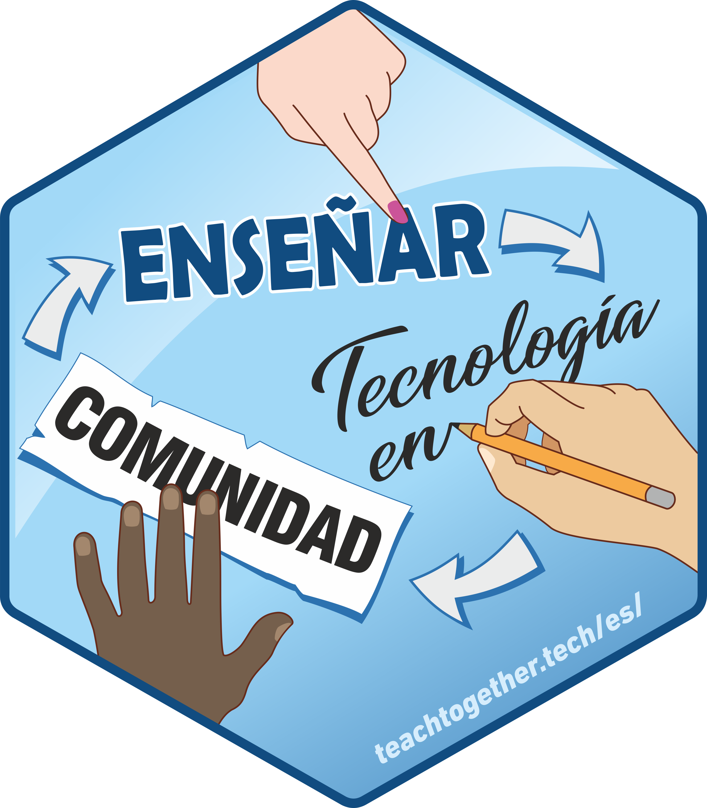

# Orientaciones para la traducción 

## A. Organización del trabajo
Cada capítulo tiene asignada una persona a cargo de la traducción, que es responsable de que esta se lleve a cabo. Se realizarán al menos dos revisiones de cada capítulo y una edición final de todo el libro en su conjunto. Se buscó que el idioma de las traductoras y revisoras tuviera origen en diferentes países para poder considerar las diferentes y hermosas formas en que hablamos español en todo el mundo (ver la tabla al final de estas orientaciones con las personas responsables).  

La fuente del libro está en LaTeX, para dudas sobre la sintaxis podemos consultar [esta guía](https://sites.google.com/site/guiadelatex/home) y [esta otra](http://nokyotsu.com/latex/guia.html), ambas en español.

## B. Aspectos a tener en cuenta para la traducción del texto

__1. Usar una voz conversacional en lugar de una voz formal o académica.__

__2. Al traducir buscamos generar una versión de cómo diríamos en español lo que en el capítulo está escrito en inglés.__ En algunos casos eso puede implicar alterar el orden de los elementos de una oración o agregar palabras que no estaban en el original. Lo importante es que la traducción se lea lo más natural posible en español, respetando el contenido que se quiso transmitir en el original.

__3. La variedad dialectal del español que usaremos en la traducción es la de Latinoamérica__ (porque el posible público destinatario que la habla es más amplio además de ser la variedad que hablan y escriben la mayoría de las traductoras). Intentaremos generar una versión lo más neutra posible, por lo que:

* Evitaremos expresiones o usos locales/regionales, es decir, que no están extendidos en toda Latinoamérica.
* No utilizaremos el voseo (_vos/vosotros_). T3 está dirigido a una segunda persona, así que para mantener lo mas posible la neutralidad la traduciremos como _tú_ (... _If you are using this material_ > ... _si estás usando este material_; _Who do you most want to teach_ > ... _¿Qué es lo que más quieres enseñar?_).

__4. Género gramatical.__ A diferencia del inglés, el español tiene género gramatical (masculino, femenino y muy pocos neutros), por lo que deberemos tomar deciciones respecto de cómo manejar este tema cuando aparezcan en el texto. 

* En principio, intentaremos ajustar la redacción para evitar tener que asignar un género: por ejemplo, en esta frase: “... _their founders and teachers”_.  se podría traducir como: _las personas que la fundaron y aquellas que enseñan_.  

* Si no podemos evitar usar marca de género, lo más aceptado por el momento es el desdoblamiento, femenino-masculino o masculino-femenino, que puede ser de dos maneras, por ejemplo: las/los estudiantes, los/las estudiantes; o bien los y las estudiantes, las y los estudiantes, etc.  En esta traducción, al desdoblar:

   a. Vamos a utilizar *los/las* ó *las/los* privilegiando la agilidad y fluidez del texto, que el mismo se entienda y que sea claro el mensaje

   b. Para que haya coherencia a lo largo del texto y mostrar que no hay una determinada jerarquía alternaremos el uso del femenino masculino primero, entre capítulos y el uso será consistente durante todo el capítulo (en la tabla de la sección *G* se detalla que desdoblamiento le toca a cada capítulo).
   
   c. Acuerdos: el uso de las barras puede entorpecer la lectura, aquí algunas opciones a tener en cuenta que pueden darle más fluidez al texto y respetar el lenguaje no sexista:
   
| Opción         | Alternativa  |
| ---------------|----------------|
| del/de la estudiante | de tus estudiantes|
| del/de la docente |del cuerpo docente|
| al/a la aprendiz |a tus estudiantes |
| al/a la docente |al conjunto de docentes |
   
   d. La lectura del lenguaje no sexista con las conjunciones "al" y "del" es complicada.  
      
   - Caso de capítulo los/las: "al/a la docente" "del/de la docente": dejar el masculino en la conjunción, pero no en el sustantivo si este tiene marca de género: "Al usuario/a".
      
   - Caso de capítulo las/los: "a la/al docente" "de la/del docente": dejar el femenino en el artículo, pero no en el sustantivo si este tiene marca de género: "A la usuaria/o".
   
   e. Cuando terminemos de realizar la traducción y las dos revisiones, la traductora volverá a realizar una lectura del capítulo y como práctica final hacer una búsqueda de las barras "/" (Ctrl+F) e intentar cambiar la mayor cantidad a lenguaje neutro.
   
   f. Para resolver más dudas utilizaremos [esta guía](https://www4.hcdn.gob.ar/dependencias/dprensa/guia_lenguaje_igualitario.pdf) como fuente y agregaremos los ejemplos correspondientes en estas orientaciones. 

__5. El español es una lengua menos repetitiva que el inglés.__ Como los verbos tienen marca de persona, género y número, tenemos la flexibilidad de poder omitir el sujeto, ya que por contexto se suele entender a qué nos estamos refiriendo.

Ejemplo:
*TODO: buscar un ejemplo en T3.*

En todos los casos, hay que tratar de pensar cómo suena más natural/normal en español y cómo queda más claro para quien lee.

__6. Hay regularidades que no siempre se cumplen.__ Por ejemplo, en inglés las palabras con función adjetiva se anteponen a los sustantivos, ej: *simple model*, *correct answer*, etc., mientras que en español suele ser al revés: ponemos los adjetivos después del sustantivo: *modelo simple*, *respuesta correcta*, etc.
Sin embargo, hay casos en que en español la forma _“no marcada”_, es decir, la que nos suena más natural, es con el adjetivo al principio:

Ejemplo:
> ...There’s a better way... > ...Hay una mejor manera...

En general, ante dudas de este tipo, pensar en qué es lo que suena más natural/normal en español.

__7. El español tiene más modos y tiempos verbales que el inglés__
Al traducir, por lo tanto, se debe priorizar la forma verbal que sea mejor para expresar el sentido del fragmento en español, no la que parezca ser literal del inglés.

Ejemplo:*TODO: buscar un ejemplo en T3*

__8. Las expresiones idiomáticas no son traducibles de manera literal.__
En caso de que las hubiere, hay que proponer una traducción que permita entender el sentido de ella.

Ejemplo: 

> ... but take three breaths and it's gone.  > ... pero se pasa en un suspiro.

__9. Toma distancia para revisar.__ Cuando trabajamos mucho rato en un texto cuesta identificar errores de tipeo. Como sugerencia, una vez que termines la traducción del capítulo deja pasar un tiempo (algunas horas o un día) antes de hacer la última lectura y enviarla. Eso hace más fácil que salten a la vista este tipo de detalles y permite que quienes hagan la revisión se concentren en la calidad de la traducción más que en correcciones ortotipográficas. También es útil revisar el texto en una versión con formato (compilada como pdf o html), ya que seguramente algunos errores serán más visibles que en la versión cruda (ver la sección G de este Readme con algunas instrucciones para compilar).

## C. Traducción (o no) de términos técnicos
Hay términos técnicos que será necesario traducir y otros que no. El criterio suele estar en si existe una versión en español extendida (o entendible), o si se suele utilizar la versión original en inglés. En el caso de los últimos, hay que determinar qué género gramatical asignarle y si ofreceremos una traducción explicativa la primera vez que los utilicemos.
A medida que avancemos con la traducción, la idea es ir discutiendo este punto. A partir de lo que se acuerde, iremos completando las listas de términos.

#### 1. Términos técnicos que se mantienen
Estos términos deberían ir en un formato especial (utilizar cursiva, para poner cursiva en LaTeX utilizar _\emph{}_). De ser pertinente, se debe ofrecer una posible traducción al español, ya que en algunos casos permite entender mejor el concepto que está detrás.   

| No traducir    | Observaciones  |
| ---------------|----------------|
| commits        | contexto: git  |
| fuzz testing |contexto: desarrollo de software|
| hardware |
| issues         | contexto: git  |
| pipes | contexto: consola unix, R |
| marketing |
| ranking ||
| Python | lenguaje de programación|
| Scratch| lenguaje de programación|
| HTML | lenguaje de marcado |
| CSS | hojas de estilos en cascada|
| Git ||
|pull requests| contexto: git |

#### 2. Términos técnicos que se traducen

En este sitio se puede acceder a una aplicación web con el glosario completo de T3 en Español e Inglés: https://yabellini.shinyapps.io/T3Glossary/

Recordar que la primera aparición puede acompañarse con la palabra en inglés entre paréntesis para ayudar a entender el contexto y el significado:

Ejemplo:
> ... the term "crispy" to refer ... > ...utilizamos el término "crujiente" (_crispy en inglés_)...

| Inglés                | Español                           |
| ----------------------|-----------------------------------|
| bootcamp | entrenamiento intensivo |
| burnout/burning out | síndrome de desgaste ocupacional  |
| competent practitioners| practicantes competentes, personas competentes |
| call stack | pila de llamada |
| chunking | particionar, fragmentar |
| commons        | Los comunes |
| crispy                | crujiente                         |
| elevator pitch   | discurso breve de presentación |
| expert                | expertos/as, personas expertas |
| expert blind spot     |punto ciego de las personas expertas|
| expertise | dependiendo del contexto y si no es un término pedagógico: habilidad, pericia, conocimiento |
| expertise reversal effect | efecto inverso de la experiencia * |
| extraneous-load       | carga extrínseca                  |
| feedback       | devolución, retroalimentación|
| flash cards |tarjetas de estudio|
| germane-load          | carga pertinente                  |
| heap | cola de montículo|
| live coding | programación en vivo |
| loop | bucle |
| novice                | novatos/as, personas novatas |
| novice-competent-expert classification |clasificacion de los tres niveles de habilidades |
| novice-competent-expert model of skill development | el modelo de desarrollo de habilidades |
| outreach | difusión |
| pair programming | programación en parejas |
| path | ruta de acceso |
| post-mortem  | autopsia |
| postits | notas adhesivas |
| screencasting | grabación de pantalla |
| school board | junta escolar |
| situated learning | aprendizaje situado |
| split-attention effect| efecto de atención dividida       |
| stack | pila |
| stack frame | marco de pila |
| summative assessment  |evaluación sumativa |
| unchunked representation | representación no fragmentada |

* Se debe rechequear esta traducción

| Latin | Español |
|-------|---------|
|i.e. (id est) | "es decir" |
|e.g. (exempli gratia) | por ejemplo, abreviatura "p. ej." |

#### 3. Material referenciado en el libro

Cuando se encuentre una referencia a la denominación de material mencionado en el libro, como títulos de libros, nombres de instituciones, sitios web, guías, etc.  Se deja el título/nombre original en Inglés con la letra en cursiva (utilizar _\emph{}_ para lograr la cursiva) y se aclara entre parentesis una traducción del título/nombre en español.

Cuando se encuentre una referencia a una entrada en Wikipedia se buscará la versión en Español para agregar ese link.  En caso que no exista se dejará la referencia en Inglés.

Cuando se encuentre una referencia a una lección de The Carpetries se buscará la versión en Español para agregar ese link.  En caso que no exista se dejará la referencia en Inglés.

#### 4. Uniformidad para traducir los ejercicios

Los ejercicios en cada capítulo indican la cantidad de personas que deben participar y la cantidad de minutos que lleva realizarlo.

Para la cantidad de personas traduciremos:
|Inglés | Español |
| ---------------|----------------|
|Individual | Individual|
|Pairs | Parejas|
|Small groups | Grupos pequeños|
|Whole class | Toda la clase |
|think-pair-share | pensar-parejas-compartir|

Para indicar los minutos agregaremos una comilla simple (') a la derecha del número, por ejemplo: 15**'** 

#### 5. Uso de nombres regionales

El libro presenta una serie de personas ficticias. Se decidió cambiar a nombres regionales para que sean mas representativos y
mantener coherencia con el cambio de ejemplos también a temas regionales.

* Capítulo:  Introducción

|Nombre original  | Nombre regional |
|-----------------|---------|
|Emily | Emilia |
|Moshe | David |
|Samira | Samira |
|Gene | René |
|Jorge | Jorge |

* Capítulo: Construyendo una comunidad de práctica

|Nombre original  | Nombre regional |
|-----------------|---------|
|Anna  | Ana |
|Catherine | Catalina |
|Frank | Fernando |
|Hediyeh | Cristian |
|Ken | Roberto |
|Melissa | Melisa |
|Raj | Juan José |

* Capítulo:  En el salon de clase  

|Nombre original  | Nombre regional |
|-----------------|---------|
| Jane | Andrea |

#### 6. Material para consultar

El primer lugar de consulta son las [slides del curso de Instructores de RStudio en Español](https://drive.google.com/drive/folders/1qwTEMqoqphF9qu7f0lSCSTmikIf5chBi) para chequear como fueron traducidos los términos en ese material.

[The Carpentries](https://github.com/Carpentries-ES/board/blob/master/Convenciones_Traduccion.md) y [R para Ciencia de Datos](https://github.com/cienciadedatos/documentacion-traduccion-r4ds) tienen algunas convenciones que podemos ir revisando y ver si se adecuan al propósito de esta traducción.

Para algunos términos educativos tener en cuenta traducción oficial de las estrategias de aprendizaje de [Learning Scientists](https://bit.ly/3mGJseE)

## D. Aspectos de ortografía / gramática del español

* Ni los demostrativos ni el adverbio "solo" se tildan.
* Días y meses se escriben con minúscula en español.
* Los títulos llevan mayúscula solo en la palabra inicial (salvo que incluyan un nombre propio).
* Para consultar la forma convencional de una abreviatura en español, revisar este [enlace](http://www.rae.es/diccionario-panhispanico-de-dudas/apendices/abreviaturas). Hasta el momento ha aparecido _por ejemplo_ > _p. ej._.

## E. Aspectos de puntuación del español

* Uso de las comas antes del _y_: no usarla, excepto que: 
  
  a) sea necesario para darle claridad al texto;
  
  b) sea necesario luego de una enumeración anterior, según este ejemplo: 
  
    _- "Preparé el examen y tomé un café":_ va sin coma
    
    _- "Preparé el examen y la clase de la semana siguiente, y tomé un café":_ va con coma para distinguir del "y" de la primera parte de la oración.

Fuente: punto 2 de https://www.rae.es/dpd/coma

*  Punto y paréntesis:

    * Si hay una oración completa dentro del paréntesis, el punto va adentro. (Por ejemplo si acá sigue un comentario extra sobre algo que decidió poner en una oración aparte, creo que lo hace con acotaciones.)
    * Si el paréntesis es una aclaración dentro de la oración, el punto va afuera (este caso).

## F. ¿Dudas durante el proceso?

Cualquier duda que surja la resolvemos en el canal del Slack. 

## G. Cómo compilar el libro como pdf

Durante el proceso de revisión de la traducción, es útil leer el libro en un formato amigable. Una posibilidad es compilarlo como pdf.

__Algunas configuraciones que debes hacer por única vez__

Si ya has usado Latex, en SO Linux es necesario instalar al menos estas librerías extra:

* texlive-lang-spanish
* texlive-fonts-extra
* texlive-science
* texlive-bibtex-extra
* biber
* libfontenc-dev

Si no has usado Latex aún, probablemente requieras otras librerías (puedes instalar un editor de Latex para garantizar que tienes las librerías más comunes, por ejemplo Kile en Linux).

Por otro lado, dentro de la carpeta _/es_ del repositorio, en el archivo _book.tex_, chequea si está la línea:
_\usepackage[utf8]{inputenc}_

Si no está, debes agregarla después de _\documentclass_ pero antes de _\begin{document}_. Esto resuelve un problema de compilación en Linux y no afecta la compilación en Windows.

__Para compilar el libro como pdf__

Ve a la consola o terminal. Navega hasta la carpeta _/es_ de tu copia local del repositorio y ejecuta _make pdf_

¡Listo! Se genera el archivo _book.pdf_ con el libro compilado en pdf. Este archivo sólo quedará en tu copia local del repositorio, ya que está listado en .gitignore.

Si eso no funciona, puedes probar de ejecutar, en vez de _make pdf_, los siguientes comandos (sí, algunos se repiten) y de paso revisar los errores por si señalan la falta de alguna librería más:

	pdflatex --shell-escape book
	biber book
	makeindex book
	pdflatex --shell-escape book
	pdflatex --shell-escape book
	pdflatex --shell-escape book 

## H. Cómo compilar el libro como html

Revisa las instrucciones en el archivo _Makefile_. Seguramente debas instalar librerías.

## I. Responsables y progreso de la traducción

### 1. Secciones

| Secciones      |Traductor/a |Revisor/a 1|Revisor/a 2|1ra versión|1ra revisión|2da revisión|Marca de género|
| ---------------|------------|-----------|-----------|-----------|------------|------------|---------------|
| Dedication| Yanina Bellini |Alejandra Bellini |Mónica Alonso|Lista|Lista|Lista|las/los
| The Rules| Laura Acion | Yanina Bellini | Yara Terrazas-Carafa| Lista | Lista | Lista|los/las
| Introduction| Natalia Morandeira|Yanina Bellini|Zulemma Bazurto|Lista|Lista|Lista|las/los
| Mental Models and Formative Assessment|Natalia Morandeira|Ruth Chirinos|Alejandra Bellini|Lista|Lista|Lista|los/las
| Expertise and Memory|Mónica Alonso|Natalia Morandeira|Silvia Canelón|Lista|Lista|Lista|las/los
| Cognitive Architecture|Patricia Loto|María Dermit|Natalia Morandeira|Lista|Lista|Lista|los/las
| Individual Learning|Paloma Rojas|María Dermit|Natalia Morandeira|Lista|Lista|Lista|las/los
| A Lesson Design Process|Zulemma Bazurto|Roxana Villafañe|Natalia Morandeira|Lista|Lista|Lista|los/las
| Pedagogical Content Knowledge| Paola Corrales|Ana Laura Diedrichs|Juliana Benitez|Lista|Lista|Lista|las/los
| Teaching as a Performance Art| Paola Corrales|Yuriko Sosa|Yanina Bellini|Lista|Lista|Lista|los/las
| In the Classroom|Lupe Canaviri Maydana|María Dermit|Yuriko Sosa|Lista|Lista|Lista|las/los
| Motivation and Demotivation|Silvia Canelón|Yuriko Sosa|Yanina Bellini |Lista|Lista|Lista|los/las
| Teaching Online|Yanina Bellini|María Dermit|Yuriko Sosa|Lista|Lista|Lista|las/los
| Exercise Types|Priscilla Minotti|Roxana Villafañe|Natalie Stroud|Lista|Lista|Lista|los/las
| Building a Community of Practice| Yanina Bellini| Yara Terrazas-Carafa| Alejandra Bellini | Lista | Lista | Lista |las/los
| Outreach|Juliana Benitez|Natalia Morandeira|Natalie Stroud|Lista|Lista|Lista|los/las
| Why I Teach| Yanina Bellini |Yara Terrazas-Carafa|Alejandra Bellini|Lista|Lista|Lista|las/los
| License| Yanina Bellini |Yara Terrazas-Carafa|Mónica Alonso|Lista|Lista|Lista|los/las
| Code of Conduct| Yanina Bellini | Yara Terrazas-Carafa |Mónica Alonso|Lista|Lista|Lista|las/los
| Joining Our Community|Yanina Bellini|Natalia Morandeira|Juliana Benitez|Lista|Lista|Lista|los/las
| Glossary| Yanina Bellini|Zulemma Bazurto|Ruth Chirinos|Lista|Lista|Lista|las/los
| Meetings, Meetings, Meetings|Mónica Alonso|Ruth Chirinos|Lucia Rodríguez Planes|Lista|Lista|Lista|los/las
| Checklists and Templates|Lucia Rodríguez Planes|Alejandra Bellini|Ana Laura Diedrichs|Lista|Lista|Lista|las/los
| Example Concept Maps|Yanina Bellini|Laura Acion|Natalia Morandeira|Lista|Lista|Lista|los/las
| Chunking Exercise Solution|Priscilla Minotti|Yanina Bellini|Natalia Morandeira|Lista|Lista|Lista|las/los
| References|Yanina Bellini |Natalia Morandeira|Paola Corrales|Lista|Lista||los/las

### 2. Figuras y diagramas

La carpeta `es` (correspondiente a Español) tiene dos subcarpetas:

* `figures` que contiene todas las figuras traducidas.  Los dibujos de lineas se deben guardar como SVG (para usar en la web) y como PDF (para usar en forma impresa); preferimos estos a imágenes de mapa de bits (PNG y JPG) porque reescalan mejor.
* `drawio` que contiene el archivo fuente de los dibujos de lineas creados con [draw.io](https://app.diagrams.net/). Se deben editar estos archivos y luego grabarlos como SVG/PDF en vez de editar los SVG o PDF que se encuenrtan en la carpeta _figures_ directamente. 

| Figuras        |Traductor/a |Revisor/a 1|Revisor/a 2|1ra versión|1ra revisión|2da revisión|Marca de género|
| ---------------|------------|-----------|-----------|-----------|------------|------------|---------------|
|2x2-rubric.xml  | Yanina Bellini|Paola Corrales||Lista|Lista|Lista|--|
|bathtub.xml |Yanina  Bellini|Natalia Morandeira|--|Lista|Lista|Lista|--|
|chunking-chunked.xml |No necesita traducción| Son números|--|Lista|Lista|Lista|--|
|chunking-unchunked.xml | No necesita traducción| Son números|--|Lista|Lista|Lista|--|
|cognitive-architecture.xml |Laura Acion|Yanina Bellini|Patricia Loto|Lista|Lista||
|conceptmap-active-learning.xml |Laura Acion|Yanina Bellini|Paloma Rojas|Lista|Lista|Lista|
|conceptmap-assessment.xml |Laura Acion|Yanina Bellini|Natalia Morandeira|Lista|Lista|Lista|
|conceptmap-cognitive-load.xml |Laura Acion|Yanina Bellini|Patricia Loto|Lista|Lista||
|conceptmap-feedback.xml |Laura Acion|Yanina Bellini|Paola Corrales|Lista|Lista|Lista|
|conceptmap-mental-models.xml |Laura Acion|Yanina Bellini|Natalia Morandeira|Lista|Lista|Lista|
|conceptmap-motivation.xml |Yanina Bellini|Silvia Canelón|Natalie Stroud|Lista|Lista|Lista|
|conceptmap-personas.xml |Laura Acion|Yanina Bellini|Paloma Rojas|Lista|Lista|Lista||
|conditionals.xml |Yanina Bellini|Paloma Rojas|Natalie Stroud|Lista|Lista|Lista|
|for-loop.xml |Yanina Bellini|Mónica Alonso|Natalie Stroud|Lista|Lista|Lista|las/los
|labeling.xml |Yanina Bellini|Priscilla Minotti|Natalie Stroud|Lista||Lista|
|library-director-concept-map.xml |Yanina Bellini|Laura Acion|Natalia Morandeira|Lista|Lista|Lista|los/las
|library-friends-concept-map.xml |Yanina Bellini|Natalia Morandeira|Natalie Stroud|Lista|Lista|Lista|los/las
|library-patron-concept-map.xml |Yanina Bellini|Laura Acion|Natalia Morandeira|Lista|Lista|Lista|los/las
|matching.xml |Yanina Bellini|Priscilla Minotti|Natalie Stroud|Lista||Lista|
|photosynthesis.xml |Laura Acion|Yanina Bellini|Mónica Alonso|Lista|Lista|Lista|las/los
|screencast.xml |Yanina Bellini|Natalie Stroud||Lista|Lista||las/los
|seasons.xml |Yanina Bellini|Mónica Alonso|Natalie Stroud|Lista|Lista|Lista|las/los
|what-to-teach.xml |Yanina Bellini|Silvia Canelón|Natalie Stroud|Lista|Lista|Lista|
|women-coding |Yanina Bellini|||Lista||||
|interventions-scaled |Yanina Bellini|||Lista||||
|enrollment |Yanina Bellini|||Lista||||
|dunning-kruger |Yanina Bellini|||Lista||||
|deathbulge-jerk|Laura Acion|Paola Corrales|Yanina Bellini|Lista|Lista|Lista||

## 3. Otras participaciones

* **Coordinación general**: Yanina Bellini Saibene
* **Edición de la traducción**: Yanina Bellini Saibene y Natalia Morandeira
* Malena Zabalegui aconsejó sobre el uso de lenguaje no sexista e inclusivo para la realización de esta traducción.
* **Glosario (Shiny y YAML)**: Yanina Bellini Saibene

## 4. Citando este trabajo
### 4.1. Como citar la traducción

- Wilson, G. (2021). Enseñar tecnología en comunidad. Cómo crear y dar lecciones que funcionen y construir una comunidad docente a su alrededor [Teaching Tech Together. How to create and deliver lessons that work and build a teaching community around them] (Traducción al español: Y. Bellini Saibene, N. S. Morandeira, P. Corrales, L. Acion, M. Dermit, Y. Sosa, J. Benitez Saldivar, Z. Bazurto, S. Canelón, L. Canaviri Maydana, M. Alonso, A. Bellini, P. Minotti, R. Chirinos, P. Rojas, N. Stroud, R. N. Villafañe, P. Loto, A. L. Diedrichs, Y. Terrazas-Carafa & L. Rodríguez Planes). https://teachtogether.tech/es/ (Trabajo original publicado en 2019).

Estilo de cita basado en:
* [Este artículo en el blog de APA](https://apastyle.apa.org/blog/citing-translated-works). Section Book, republished in translation
* Incluimos el titulo en Inglés, siguiendo [esta sugerencia de APA](https://writeanswers.royalroads.ca/faq/199295). Ver ejemplo para Piaget (1950)

### 4.2. Como incluir tu participación en este proyecto en tu CV:

- <Fecha de inicio, ej.: Mayo de 2020 – Fecha de fin, ej: Julio de 2020>. Traducción colaborativa al castellano del libro “Teaching Tech Together. How to create and deliver lessons that work and build a teaching community around them” de Greg Wilson (2019, Taylor & Francis, ISBN 978-0-367-35328-5, https://teachtogether.tech/). Coordinación general de la traducción: Yanina Bellini Saibene; Edición general: Yanina Bellini Saibene y Natalia Morandeira. Participación como <rol, ej.: traductora y revisora de capítulos>. Más información y grupo de traductoras: https://github.com/gvwilson/teachtogether.tech/blob/master/es/README.md

## Atribuciones y agradecimientos

Estas orientaciones de traducción están basadas en la experiencia y documentos generados durante la traducción de [R para Ciencia de Datos](https://github.com/cienciadedatos/documentacion-traduccion-r4ds)

